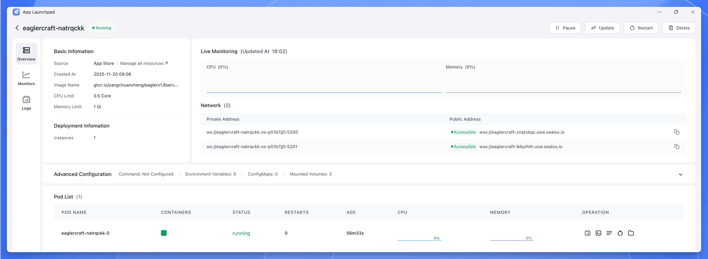
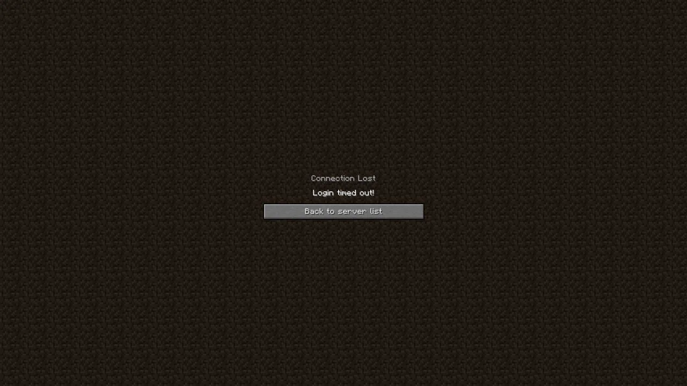
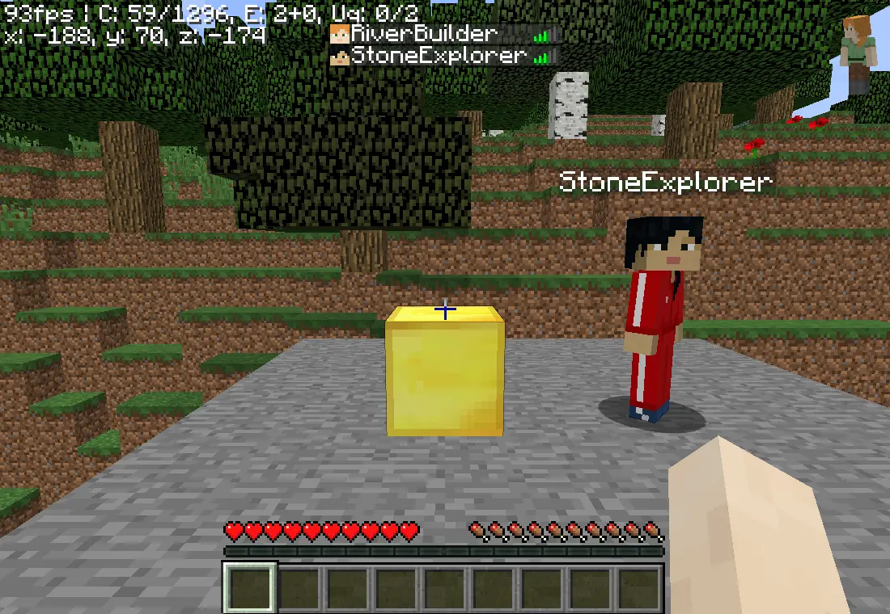

import { DeployButton } from '@/components/ui/button';

Friends can reach the Eaglercraft page while the multiplayer connection still fails. Diagnose the first boundary that breaks: **Client Reachability**, **WebSocket Handshake**, **Backend Session**, or **Game Login**. Each boundary has different evidence and a different repair.

This guide uses **Eaglercraft 1.8.8** as the primary evidence version and treats **Eaglercraft 1.12.2** as a compatibility smoke test. The examples cover a Sealos deployment, an Ubuntu VPS with Paper and Caddy, and a Windows or home-network host using a Tunnel. The [client, server, and WebSocket gateway overview](/blog/eaglercraft-client-server-gateway/) explains the same components before you start collecting logs.

## 60-Second Triage

| Symptom                                     | First boundary                         | Check first                                                      | Likely next action                              |
| ------------------------------------------- | -------------------------------------- | ---------------------------------------------------------------- | ----------------------------------------------- |
| Browser Play Link does not load             | Client Reachability                    | DNS, TLS certificate, public URL, browser Console                | Repair the public HTTPS route.                  |
| Page loads, friend sees `502 Bad Gateway`   | WebSocket Handshake                    | Proxy or Tunnel upstream, listener, readiness, and proxy log     | Restore the route to the gateway.               |
| Network shows `101`, then the socket closes | Backend Session                        | Gateway, proxy, version, and server logs at the same timestamp   | Continue from transport into session diagnosis. |
| Browser reports close code `1006`           | WebSocket Handshake or Backend Session | Browser Network/Console plus proxy, Tunnel, and gateway evidence | Correlate the first missing or closed hop.      |
| Page and socket work, login fails           | Game Login                             | Client version, server version, plugin name, and command syntax  | Use the correct authentication path.            |
| Local join works and a friend fails         | External reachability                  | NAT, double NAT, CGNAT, firewall, Tunnel, and public DNS         | Test from an independent network.               |

Record the client version, server version, public URL, WebSocket Server Address, browser, timestamp, network scope, status code, close code, and the matching server log lines. A report with those fields lets an operator locate the first failed boundary without repeating every setup step.

## Symptom → Check → Fix

| What you see                                             | Check                                                                                          | Fix                                                                                                   |
| -------------------------------------------------------- | ---------------------------------------------------------------------------------------------- | ----------------------------------------------------------------------------------------------------- |
| Browser page is blank or returns a certificate error     | Open the HTTPS URL in a private window; inspect DNS and certificate hostname                   | Correct DNS, certificate coverage, or the public Browser Play Link.                                   |
| Browser page loads but the configured server entry fails | Compare the WebSocket Server Address with the public host and path shown by the deployment     | Use the exact WSS address generated for the current application.                                      |
| `502 Bad Gateway`                                        | Check proxy upstream, gateway listener, required `X-Real-IP` forwarding, and service readiness | Point the proxy at the live gateway and reload it after validation.                                   |
| `101 Switching Protocols` followed by a close            | Match browser, proxy, gateway, and Game Server timestamps                                      | Fix the first component that closes the session, then retest with the same client.                    |
| Close code `1006`                                        | Capture the request, Console event, Tunnel/proxy log, and gateway log together                 | Repair the missing route, timeout, process exit, or compatibility mismatch indicated by the evidence. |
| Server list appears but login fails                      | Confirm Eaglercraft and Paper versions, plugin, player name, and command                       | Follow the installed plugin's registration and login syntax.                                          |
| Local-only success                                       | Join on the host, then from LAN, then from a separate network                                  | Move through the network scopes and repair the first scope that fails.                                |

## The Four Diagnostic Boundaries

### 1. Client Reachability

The **Browser Play Link** is an HTTPS page. It delivers the browser client and static assets. A successful page load establishes Client Reachability and leaves multiplayer connectivity to the next checks.

Check the following in the browser:

1. Open the exact public HTTPS URL in a private window.
2. In **Network**, confirm the document and static assets return expected responses.
3. In **Console**, record certificate, mixed-content, JavaScript, and WebSocket errors.
4. Confirm that the page-generated server entry uses the current public host.

An HTTPS page that loads while the WebSocket URL points at `127.0.0.1`, a private address, an old application host, or the wrong path gives a false sense of readiness. Share the Browser Play Link with a second device only after the page works from the host.

### 2. WebSocket Handshake

The **WebSocket Server Address** carries game traffic. For a TLS-protected deployment it begins with `wss://`; an existing compatible Eaglercraft client uses it in its Multiplayer server field. A browser Network entry with `101 Switching Protocols` proves the HTTP upgrade reached a server that accepted the handshake.

The handshake check is complete when the socket remains open long enough to receive the server list and the client can begin a game session. A `101` followed by a close moves the investigation forward to the gateway, backend, version, and authentication boundaries.

For a proxy, verify the public site block, upstream host and port, WebSocket upgrade support, TLS certificate, and forwarded client-IP header. The Ubuntu guide uses Caddy in front of a gateway on `127.0.0.1:5200` and forwards `X-Real-IP`; the [Ubuntu VPS guide](/blog/eaglercraft-server-ubuntu-vps/) contains the full service and firewall path.

For a Tunnel, verify that the connector is running, its public hostname maps to the correct local service, the local gateway is listening, and the Tunnel log records the same connection time as the browser request. A Tunnel can publish the route while the local process is stopped, so public DNS alone does not establish backend readiness.

### 3. Backend Session

The **Eaglercraft Gateway** accepts the WebSocket stream and forwards it to the **Game Server**. Inspect the gateway and Game Server logs when the browser reports a close after a successful `101`.

| Evidence                    | Question it answers                                                                         |
| --------------------------- | ------------------------------------------------------------------------------------------- |
| Browser Network and Console | Did the browser request the expected WSS host, status, and close event?                     |
| Proxy or Tunnel log         | Did the public route connect to the intended local upstream, and did the upstream close it? |
| Gateway log                 | Did the Eaglercraft gateway accept the client protocol and open the backend connection?     |
| Game Server log             | Did Paper accept the session, reject a version, stop, or report a plugin error?             |
| Sealos application logs     | Was the template Ready, and did the gateway and Paper processes remain healthy?             |

Keep the **Client Website**, **Runtime Bundle**, **Eaglercraft Gateway**, and **Game Server** responsibilities separate while reading logs. A page served by the Client Website can succeed while the Gateway is stopped. A Gateway can accept the handshake while Paper is still starting. A ready application can still reject a client with an incompatible protocol or plugin state.

### 4. Game Login

Once the page and socket remain usable, inspect the login boundary. Keep player credentials, the administrator password, and RCON credentials separate. An administrator or RCON password belongs to the management path; players use their own accounts in the game.

The Sealos template path uses LoginSecurity. Run the command inside the game chat within the plugin's login window:

```text
/register <player-password>
/login <player-password>
```

The generic AuthMe path commonly uses a confirmation argument during registration:

```text
/register <password> <password>
/login <password>
```

Treat these as two separately labeled paths. Plugin configuration, aliases, password rules, and login windows can change. Read the running server's plugin documentation or prompt, verify the command on the execution day, and never place an administrator or RCON password in a player command.

## Network Scope: Local, LAN, and External

Use three explicit labels in every retest:

| Scope                    | Definition                                                  | What it proves                                                                         |
| ------------------------ | ----------------------------------------------------------- | -------------------------------------------------------------------------------------- |
| Local-only success       | The host reaches its own Browser Play Link or local gateway | The local process and part of the local route work.                                    |
| LAN success              | A second device on the same private network joins           | Local routing and host firewall permit the path.                                       |
| External-network success | A friend joins from a separate ISP or mobile network        | Public DNS, TLS, NAT/firewall, proxy or Tunnel, and the public WSS path work together. |

Local-only success can coexist with external failure under NAT, double NAT, CGNAT, an inbound firewall, a cloud security group, or a Tunnel configured for a different local port. Run the final check from the user's actual network scope. A second browser tab on the same host is a useful comparison and cannot prove external reachability.

## Environment Branches

### Sealos template

Open the [Eaglercraft template on Sealos](/products/app-store/eaglercraft-server/) and wait for the application to report **Ready**. Inspect application logs, the generated Browser Play Link, the WebSocket Server Address, and the management panel's Paper readiness before asking a friend to join. The [first-join walkthrough](/blog/eaglercraft-server/) records the 1.8 path, LoginSecurity commands, public entry points, and retained-world check.




Use this sequence:

1. Select Eaglercraft 1.8 for the primary check and record the server and application release.
2. Confirm the application is Ready and Paper is ready.
3. Open the Browser Play Link and inspect the generated WSS entry.
4. Join as one player, register or log in, then ask a friend on an independent network to join.
5. Capture application logs at the time of any `502`, `101` close, `1006`, or login failure.
6. Run the Eaglercraft 1.12.2 compatibility smoke test separately and record whether page load, handshake, backend session, and game login each pass.

The recorded local 1.12.2 smoke test served the Eaglercraft page with HTTP `200`, completed a raw WebSocket upgrade with `101 Switching Protocols`, and reported Paper `ready` through the management API. LoginSecurity failed to initialize its SQLite database on the macOS arm64 test host because the bundled library had no `Mac/aarch64` native binary. Page reachability, the WebSocket Handshake, and Backend Session passed in this run; Game Login requires a Linux/amd64 runtime check before the result applies to a production deployment.

The template packages the Client Website, Gateway, Game Server, management panel, and Persistent World into one application. The management surface simplifies readiness and log checks; the same four diagnostic boundaries still apply.

### Ubuntu, Paper, and Caddy

The [Ubuntu VPS guide](/blog/eaglercraft-server-ubuntu-vps/) runs the gateway, Paper, management panel, and backup timer under systemd. Its tested service layout uses the gateway on `127.0.0.1:5200`, Paper on `127.0.0.1:25565`, RCON on `127.0.0.1:25575`, and the panel on port `5201`. Caddy terminates the public route and forwards `X-Real-IP`.

Use these checks when a page or WSS connection fails:

```bash
sudo systemctl is-active eaglercraft-gateway eaglercraft-paper eaglercraft-panel
sudo ss -tlnp | grep -E ':(5200|5201|25565|25575)\b'
sudo caddy validate --config /etc/caddy/Caddyfile
sudo journalctl -u eaglercraft-gateway -u eaglercraft-paper --since '10 minutes ago'
```

For a `502`, compare the Caddy upstream with the gateway listener, check that the gateway process is active, and verify the required forwarded header. For a local success with external failure, check UFW, the cloud firewall, DNS, certificate coverage, and whether the router or provider uses CGNAT. The [Docker Compose guide](/blog/eaglercraft-server-docker/) shows the equivalent container and Caddy overlay path.

### Windows or home network with a Tunnel

On Windows, confirm the Java version, `PATH`, launch directory, gateway port, Windows Defender Firewall rule, and the Tunnel connector's target. A process can run successfully from PowerShell while a service, scheduled task, or Tunnel starts from a different directory and reads different configuration.

For the containerized Tunnel path, use the [Docker Compose guide](/blog/eaglercraft-server-docker/) and its Cloudflare Tunnel section. Keep the same browser, gateway, and external-network checks when the host is Windows or a home network.

For a home-network deployment, label each result Local-only, LAN, or External-network. Check router port forwarding, double NAT, CGNAT, firewall scope, Tunnel status, and the public hostname. Capture the Tunnel log beside the browser Network request; the first timestamp where the path disappears identifies the next boundary.

The same sequence applies through a Tunnel:

1. Verify the local Browser Play Link or gateway from the host.
2. Verify the route from a second device on the LAN.
3. Verify the public hostname from a mobile network.
4. Compare the browser, Tunnel, and Game Server logs for one failed request.
5. Repeat the external check after repair and record the new result.

## Four Minimum Failure Cases

### Case 1: `502 Bad Gateway`

Reproduce this case by routing the proxy or Tunnel to a stopped process, an incorrect port, or an incomplete upstream path in a controlled test environment. Save the browser response, proxy or Tunnel log, listener state, and service status. A 502 is evidence that the public intermediary did not complete a valid upstream exchange; it leaves the exact cause to the matching logs.

Repair the first broken hop: start the gateway, correct the upstream host or port, restore the forwarded header required by the gateway, reload the proxy, or correct the Tunnel target. Repeat the Browser Play Link check, the WSS handshake, and the External-network retest.

### Case 2: `101 Switching Protocols` followed by a close

Capture the `101` response and the close event from the same browser request. Inspect the gateway and Game Server log lines at the same timestamp. Common boundaries include a backend that is still starting, a gateway-to-Paper failure, a version mismatch, a proxy timeout, or a plugin rejection.

Repair the first component that closes the session, then repeat with the same Eaglercraft and server versions. The success condition includes a stable socket, a server list or game session, a clean login, and an External-network retest.

### Case 3: close code `1006`

`1006` is an abnormal-close signal reported to the browser. Record the request URL, browser Console event, Network timing, proxy or Tunnel status, gateway log, Game Server log, and network scope. Correlation separates a process exit from a route interruption, a firewall drop, a timeout, or a protocol mismatch.

Repair the evidence-backed boundary. Repeat the check from Local-only, LAN, and External-network scopes. Preserve the successful retest and the matching logs so future reports can compare the same failure shape.

### Case 4: page load succeeds and game login fails

When the Browser Play Link loads and the WebSocket session reaches the server list, record the client version, server version, plugin name, player name, login prompt, exact command, and server response. Confirm that the player is using a player password and that the administrator or RCON credential remains separate.

For LoginSecurity, use the Sealos path shown above. For AuthMe, use the generic path shown above only after checking the installed plugin's prompt and configuration. A successful repair ends with a player entering the world, a second-network join, and Recovery Proof that the Persistent World remains available after the approved restart or recovery check.



## Practice Evidence Record

For each test, keep one small record with this shape:

| Field             | Example value                                                |
| ----------------- | ------------------------------------------------------------ |
| Environment       | Sealos, Ubuntu/Paper/Caddy, or Windows/home-network + Tunnel |
| Client and server | Eaglercraft 1.8.8 primary; 1.12.2 smoke test result          |
| Network scope     | Local-only, LAN, or External-network                         |
| Browser evidence  | Request URL, status, Console event, close code, timestamp    |
| Route evidence    | DNS, TLS, proxy or Tunnel log, upstream, listener            |
| Runtime evidence  | Gateway, Paper, plugin, and application logs                 |
| Repair            | The first failed boundary and exact change                   |
| Retest            | External-network success and Recovery Proof                  |

Use screenshots of the actual Network or Console state, Sealos readiness or application logs, proxy or Tunnel output, and successful game entry. Give every screenshot a descriptive alternative so a keyboard or mobile reader can follow the same check.

## Clean External-Network Retest

After a repair, close stale browser tabs and clear saved server entries that point at an old host. Start from a separate ISP or mobile connection. Open the current Browser Play Link, confirm the generated WebSocket Server Address, join with a compatible client, complete the correct login command, and ask a second player to join.

Record the exact time, network, client version, server version, public host, status, close code, player name, and server response. Re-enter the same Persistent World after the approved restart or recovery check and confirm a recognizable marker. This Recovery Proof closes the loop between a transport repair and a usable server.



## Choose the Next Path

Use the managed path when DNS, TLS, NAT, Tunnel, readiness, storage, or recurring maintenance is the main constraint:

<DeployButton
  deployUrl="https://sealos.io/products/app-store/eaglercraft-server/"
  alt="Deploy the Eaglercraft troubleshooting path on Sealos"
/>

Open the [Sealos Eaglercraft template](/products/app-store/eaglercraft-server/) after identifying the failed boundary. Use the [setup and first-join guide](/blog/eaglercraft-server/) for the managed deployment sequence, the [Ubuntu VPS guide](/blog/eaglercraft-server-ubuntu-vps/) for systemd and Caddy, and the [Docker Compose guide](/blog/eaglercraft-server-docker/) for containers, bind mounts, Caddy, and backups. The [Docker Compose to Kubernetes migration guide](/blog/from-docker-compose-to-kubernetes-a-simple-migration-path-with-sealos/) gives a broader migration path when the current host has become the operational constraint.
