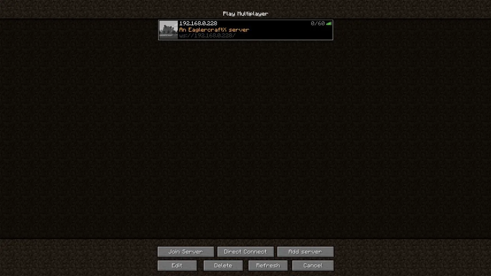
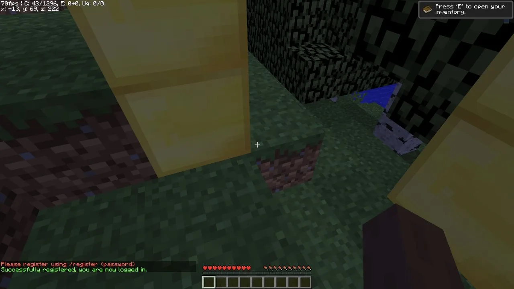
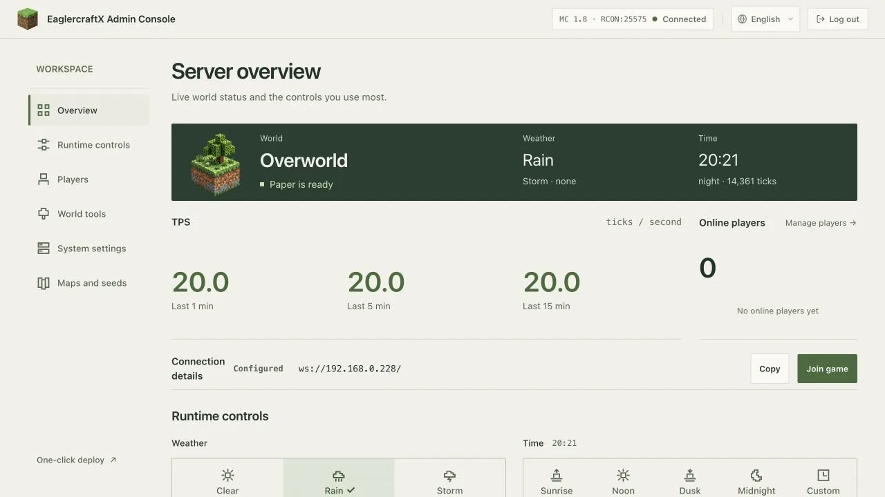
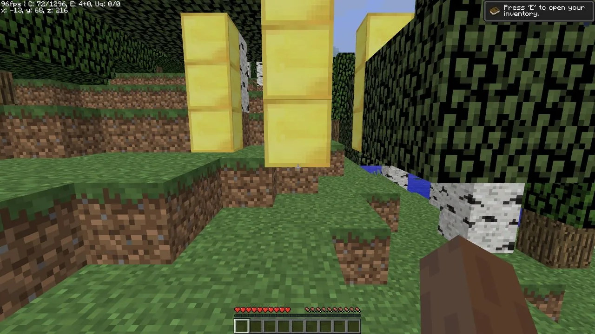

import { DeployButton } from '@/components/ui/button';

An Ubuntu VPS you already rent can run a full Eaglercraft world: the browser client, the WebSocket gateway, a Paper 1.8.8 game server, and the Server Management Panel. This walkthrough installs [yangchuansheng/eaglerXserver](https://github.com/yangchuansheng/eaglerXserver) release **2.2.7** on Ubuntu 24.04, runs four systemd units, terminates HTTPS with Caddy, and finishes with a backup and a restore rehearsal.

The upstream README documents the Docker deployment, leaving the bare-metal path open. Every command, version, and measurement below comes from one recorded run on September 16, 2026; the sections that follow mark what that run did not exercise.

<DeployButton
  deployUrl="https://sealos.io/products/app-store/eaglercraft-server/"
  alt="Deploy on Sealos: open the Eaglercraft template in a new tab"
/>

Opens the Eaglercraft template in a new tab to start with a managed deployment.

## What This Guide Builds

```text
Browser client
    | HTTPS on 443, secure WebSocket
    v
Caddy (TLS termination, X-Real-IP header)
    | HTTP and WebSocket on the loopback interface
    v
Eaglercraft gateway on 127.0.0.1:5200
    | game connection
    v
Paper 1.8.8 on 127.0.0.1:25565
    | world and player data
    v
/opt/eaglercraft/server, snapshotted to /var/backups/eaglercraft
```

One Java process serves both the browser client page and the game WebSocket on port `5200`. The Server Management Panel runs as a separate Python process on `5201`, communicating with the game server over RCON on `127.0.0.1:25575`.

The recorded machine used 2 vCPU, 3,911 MiB of memory, and a 51 GiB root disk. After startup the gateway held 233.3 MiB, Paper 429.4 MiB, and the panel 15.7 MiB, so plan on roughly 1 GiB of memory for the game stack plus room for the operating system. A world snapshot of the starting map came to 4,794,045 bytes.

## Before You Start

- An Ubuntu 22.04 or 24.04 server with `sudo` privileges. The recorded run used Ubuntu 24.04.4 LTS with kernel `7.0.0-31-generic`.
- Two vCPU and at least 4 GiB of memory for a small group.
- Java 21, `tmux`, `unzip`, and `caddy` from the distribution repositories.
- A domain with an `A` record you can point at the server when you want access from outside your network.
- Agreement to the [Minecraft EULA](https://www.minecraft.net/en-us/eula). The runtime requires `eula=true` before Paper starts.

## Install the Runtime

Install the packages the runtime needs:

```sh
sudo apt update
sudo apt install -y openjdk-21-jre-headless tmux unzip caddy
java -version
```

Create a dedicated account. The service needs no login shell, so the account gets `/usr/sbin/nologin` and `/opt/eaglercraft` as its home directory:

```sh
sudo useradd --system --create-home \
  --home-dir /opt/eaglercraft --shell /usr/sbin/nologin eaglercraft
```

Release 2.2.7 publishes a source archive and no binary assets, so the install downloads the tag archive. It measured 269,503,344 bytes in the recorded run:

```sh
curl -L -o /tmp/eaglercraft-2.2.7.tar.gz \
  https://github.com/yangchuansheng/eaglerXserver/archive/refs/tags/v2.2.7.tar.gz
sudo tar -xzf /tmp/eaglercraft-2.2.7.tar.gz -C /opt/eaglercraft --strip-components=1
```

The archive carries both game versions and both browser clients. Publish the 1.8 pair through the symlinks the runtime reads, accept the EULA, and hand the tree to the service account:

```sh
cd /opt/eaglercraft
sudo ln -sfn web-1.8 web
sudo ln -sfn server-1.8 server
echo 'eula=true' | sudo tee /opt/eaglercraft/server/eula.txt
sudo mkdir -p /opt/eaglercraft/bin /opt/eaglercraft/server-data \
  /etc/eaglercraft /var/backups/eaglercraft
sudo chown -R eaglercraft:eaglercraft /opt/eaglercraft /var/backups/eaglercraft
```

## Configure the Environment File

Every unit reads `/etc/eaglercraft/eaglercraft.env`. Create it with mode `0640` so the service account can read it and other local accounts cannot:

```sh
sudo install -m 0640 -o root -g eaglercraft /dev/null /etc/eaglercraft/eaglercraft.env
sudo tee /etc/eaglercraft/eaglercraft.env >/dev/null <<'EOF'
MINECRAFT_VERSION=1.8
RCON_PASSWORD=replace-with-a-long-random-password
PERSISTENT_DATA_ROOT=/opt/eaglercraft/server-data
PUBLIC_GAME_URL=https://play.example.com/
TMUX_TMPDIR=/run/eaglercraft
TMUX_SESSION=mcserver
TMUX_SERVER_PANE=mcserver:paper.0
EOF
sudo chmod 0640 /etc/eaglercraft/eaglercraft.env
sudo chown root:eaglercraft /etc/eaglercraft/eaglercraft.env
```

Generate a random RCON password and write it to `server.properties`:

```sh
PASSWORD=$(openssl rand -hex 24)
sudo sed -i "s/^rcon.password=.*/rcon.password=${PASSWORD}/" \
  /opt/eaglercraft/server/server.properties
```

`PUBLIC_GAME_URL` carries the public address friends will use. The Server Management Panel reads it to build the Overview connection card, and the difference is visible in the recorded run: with the variable unset the API answered `{"source": "inferred", "game_url": ""}` and the card offered `ws://127.0.0.1:5200/`; with `PUBLIC_GAME_URL` set to the LAN address the API answered `{"source": "configured", "game_url": "http://192.168.0.228/"}` and the card offered that address. An empty value leaves every visitor with a loopback address, so set it before you invite anyone.

## Run the Services Under systemd

Four units run the stack. The gateway holds the WebSocket listener, the game server runs inside a tmux pane so the panel can restart it, the panel serves the admin interface, and a timer snapshots the world each night.

| Unit                                      | Process                                        | Recorded footprint                             |
| ----------------------------------------- | ---------------------------------------------- | ---------------------------------------------- |
| `eaglercraft-gateway.service`             | `bungee/run.sh` and its Java process           | 233.3 MiB memory, 8.9 s CPU after five minutes |
| `eaglercraft-paper.service`               | `bin/paper-tmux.sh` supervising the Paper pane | `KillMode=mixed`, `TimeoutStopSec=60`          |
| `eaglercraft-panel.service`               | `python3 script/http_server.py`                | 15.7 MiB memory                                |
| `eaglercraft-backup.service` and `.timer` | `bin/backup.sh` once a day                     | 252 ms CPU for one snapshot                    |

The gateway unit ships in full here because it holds the security settings worth reading before you enable it:

```ini
[Unit]
Description=Eaglercraft gateway
After=network-online.target
Wants=network-online.target

[Service]
User=eaglercraft
Group=eaglercraft
WorkingDirectory=/opt/eaglercraft/bungee
EnvironmentFile=/etc/eaglercraft/eaglercraft.env
ExecStart=/opt/eaglercraft/bungee/run.sh
Restart=on-failure
RestartSec=5
NoNewPrivileges=true
PrivateTmp=true

[Install]
WantedBy=multi-user.target
```

The remaining units, the tmux configuration, the backup script, and the environment template live in the upstream [`deploy/ubuntu-vps/`](https://github.com/yangchuansheng/eaglerXserver/tree/main/deploy/ubuntu-vps) directory.

Because the `eaglercraft` account uses `/usr/sbin/nologin` as its login shell, `bin/tmux.conf` pins the shell for spawned panes and keeps a crashed process addressable for the panel:

```text
set -g default-shell /bin/bash
setw -g remain-on-exit on
```

`bin/paper-tmux.sh` starts the tmux server with `-f bin/tmux.conf`. `bin/backup.sh` and the panel then send keys over the socket path in `TMUX_TMPDIR`. Without this configuration, the pane exits immediately upon spawning and the panel reports the game server as offline.

Install the units and start them in order:

```sh
sudo systemctl daemon-reload
sudo systemctl enable --now eaglercraft-gateway eaglercraft-paper eaglercraft-panel
sudo systemctl enable --now eaglercraft-backup.timer
systemctl status eaglercraft-gateway --no-pager
```

Confirm the intended exposure before you put anything in front of the server:

```sh
ss -tlnp | grep -E '5200|5201|25565|25575'
```

The recorded run showed the gateway on `127.0.0.1:5200`, Paper on `127.0.0.1:25565`, RCON on `127.0.0.1:25575`, and the panel on `0.0.0.0:5201`. The listener block in `bungee/plugins/EaglercraftXBungee/listeners.yml` sets `address: 127.0.0.1:5200`, while line 1955 of `script/http_server.py` binds the panel to `0.0.0.0` with no environment override. Treat the host firewall as the control that keeps `5201` off the network.

## Point a Domain at the Server with Caddy

Caddy answers the browser and forwards both the client page and the WebSocket upgrade to the gateway. Write the site block with your own hostname:

```text
play.example.com {
	encode zstd gzip
	reverse_proxy 127.0.0.1:5200 {
		header_up X-Real-IP {remote_host}
	}
}
```

Check the file before you load it, then reload:

```sh
sudo caddy validate --config /etc/caddy/Caddyfile
sudo systemctl reload caddy
```

The gateway relies on the `header_up` line. The shipped listener sets `forward_ip: true` together with `forward_ip_header: X-Real-IP`, so the gateway reads that header on every connection and drops a request that arrives without it. In the recorded run, a direct request to `127.0.0.1:5200` without the header returned no response, whereas the request through Caddy returned `200` with `2158` bytes and the title `EaglercraftX 1.8`.

Caddy requests a certificate for the site address on its first start, which requires a public DNS record pointing at the server and inbound access on ports 80 and 443. Then `https://play.example.com/` serves the browser client and `wss://play.example.com/` carries the game traffic over the same connection. The recorded run validated this configuration with `caddy validate`, which reported `Valid configuration` along with the TLS policy and the automatic HTTP-to-HTTPS redirect; certificate issuance and a browser `wss://` session stayed outside that run and appear in [What This Guide Did Not Test](#what-this-guide-did-not-test).

## Open the Firewall

Allow SSH, HTTP, and HTTPS, and let the default deny policy cover the rest:

```sh
sudo ufw allow OpenSSH
sudo ufw allow 80/tcp
sudo ufw allow 443/tcp
sudo ufw enable
sudo ufw status verbose
```

The recorded ruleset allowed `22/tcp`, `80/tcp`, and `443/tcp` under `deny (incoming)`. From a second machine on the same network, `tcp/80` reported `OPEN`, and `tcp/5200`, `tcp/5201`, `tcp/25565`, and `tcp/25575` all reported `BLOCKED`.

## Join From a Browser

Open `https://play.example.com/` and press a key when the client asks for input. Release 2.2.7 preconfigures the server, so the entry appears in **Multiplayer** with the message of the day from `listeners.yml`.



The recorded listener allows 60 connections. Set a stable player name of 3 to 16 characters in **Edit Profile**, keep the exact capitalization for later visits, and select the entry to connect.

Registration expects a command within 30 seconds of connecting. Press **T**, enter `/register <player-password>`, and press Enter. Each player picks a separate password, and the RCON password from the environment file stays on the server.



Later visits use `/login <player-password>` with the same name and password.

## Reach the Server Management Panel Through an SSH Tunnel

The panel answers on `0.0.0.0:5201`, and its bind address has no environment override. Forward the port over an SSH tunnel to keep it private:

```sh
ssh -N -L 5201:127.0.0.1:5201 root@your-server
```

Leave that command running and open `http://127.0.0.1:5201/admin`. Enter the RCON password from `/etc/eaglercraft/eaglercraft.env`.



The recorded panel answered `200` with `42,459` bytes and the title `EaglercraftX Admin Console`. Once connected it reported `Paper is ready`, TPS `20.0` across the one, five, and fifteen minute windows, and its player count. The **Connection details** card on the same page is the one `PUBLIC_GAME_URL` drives.

Two log lines appear on every start and come from the packaged plugins: dynmap raises `NoClassDefFoundError: org/bukkit/attribute/Attribute`, and SimpleTpa runs an update check. The recorded world ran normally with both.

## Back Up the World and Rehearse a Restore

`bin/backup.sh` asks the running server to save, writes a timestamped archive of `world`, `world_nether`, and `world_the_end`, and prunes snapshots older than seven days. The timer runs it at midnight and catches up after downtime because `Persistent=true`.

Run one snapshot by hand and check the result:

```sh
sudo systemctl start eaglercraft-backup.service
sudo systemctl show eaglercraft-backup.service -p Result -p ExecMainStatus
ls -lh /var/backups/eaglercraft/
```

The recorded snapshot finished with `Result=success` and produced a `4,794,045` byte archive. A backup you have never restored is a guess, so rehearse the restore on a marker you can recognize:

1. Place a distinctive block and note its coordinates.
2. Save through RCON and start `eaglercraft-backup.service`.
3. Stop the game server with `sudo systemctl stop eaglercraft-paper`.
4. Move the three world directories aside, unpack the newest archive into `/opt/eaglercraft/server`, and start the game server again.
5. Return to the coordinates and confirm the block is there.

The recorded drill used an emerald block at `-11 72 222` beside three gold blocks at `-15 70 222`, `-11 71 222`, and `-13 71 224`. After removing the emerald, deleting all three world directories, and unpacking the snapshot, the emerald returned along with the gold blocks.



The first version of `bin/backup.sh` sent `save-all flush` to the console. On Java 21 with Paper 1.8.8 that wedged the chunk I/O thread: the console printed `All chunks are saved` without stopping, RCON stopped answering, and the active log grew to `4,374,236,066` bytes in about five minutes, holding `49,147,793` copies of that message. Plain `save-all` reports `Saving...Saved the world` and returns within a second, which is what the shipped script uses now.

## Reboot and Confirm Recovery

Every unit carries an `[Install]` section, so a reboot restores the whole stack without manual steps. The recorded run rebooted the machine and had SSH back after roughly 30 seconds, all four units `active`, all four ports listening under new process IDs, `curl http://127.0.0.1/` returning `200`, and the pre-reboot markers still in the world.

```sh
sudo reboot
```

Once the machine answers again:

```sh
systemctl is-active eaglercraft-gateway eaglercraft-paper eaglercraft-panel
systemctl list-timers eaglercraft-backup.timer
```

## Upgrade to a New Release

Keep the versioned directories the archive creates and repoint the two symlinks:

```sh
curl -L -o /tmp/eaglercraft-next.tar.gz \
  https://github.com/yangchuansheng/eaglerXserver/archive/refs/tags/<next-tag>.tar.gz
sudo tar -xzf /tmp/eaglercraft-next.tar.gz -C /opt/eaglercraft --strip-components=1
sudo ln -sfn <next-version-dir> /opt/eaglercraft/server
sudo systemctl restart eaglercraft-gateway eaglercraft-paper eaglercraft-panel
```

Take a snapshot first and keep the previous directory in place, so the change reverses by pointing the symlink back. The recorded run installed 2.2.7 on a clean machine and did not exercise a release-to-release upgrade.

## Troubleshoot the First Join

| What you see                                 | Next check                                                                                             |
| -------------------------------------------- | ------------------------------------------------------------------------------------------------------ |
| The page loads and the game connection fails | Confirm `header_up X-Real-IP {remote_host}` is in the Caddy block, then `sudo systemctl reload caddy`. |
| The entry disappears from the server list    | Check `sudo systemctl status eaglercraft-gateway` and the listener address in `listeners.yml`.         |
| Nothing answers on the domain                | Check the `A` record, then `sudo ufw status` and the Caddy journal for a certificate error.            |
| The client reports `Login timed out!`        | Reconnect and submit `/register <player-password>` within 30 seconds.                                  |
| The Overview card offers a loopback address  | Set `PUBLIC_GAME_URL` in `/etc/eaglercraft/eaglercraft.env` and restart `eaglercraft-panel`.           |
| The panel is unreachable                     | Confirm the SSH tunnel is running and that `5201` stays closed in `ufw`.                               |
| A save never returns                         | Use `save-all` and avoid `save-all flush` on Java 21 with Paper 1.8.8.                                 |


## What This Guide Did Not Test

The recorded run covered loopback and private-network access plus the reboot, backup, restore, panel, and browser-join paths on one machine. These surfaces stayed outside it, and treat them as needing your own check:

- Public DNS resolution for a real hostname.
- Certificate issuance and renewal through Let's Encrypt.
- A `wss://` game connection over TLS from a browser.
- Inbound reachability from the public internet, including any provider firewall or security group in front of the machine.
- A second machine joining the server, and player capacity beyond one session.
- Upgrade and rollback of the runtime from one release to the next.

## Where Sealos Fits

The steps above hand you the runtime, the gateway, the certificate, the world data, and the update path. Running them yourself suits a server you already pay for and control.

The [Eaglercraft template on Sealos](/products/app-store/eaglercraft-server/) packages the same client, gateway, Paper, and admin console behind one deployment form, with a persistent volume for the world and no package management on your side. The [setup walkthrough](/blog/eaglercraft-server/) covers that path from deployment to a friend joining, and [Eaglercraft Hosting Costs](/blog/eaglercraft-hosting-cost/) compares what each path costs to run and maintain.

<DeployButton
  deployUrl="https://sealos.io/products/app-store/eaglercraft-server/"
  alt="Deploy on Sealos: open the Eaglercraft template in a new tab"
/>

Opens the Eaglercraft template in a new tab.
