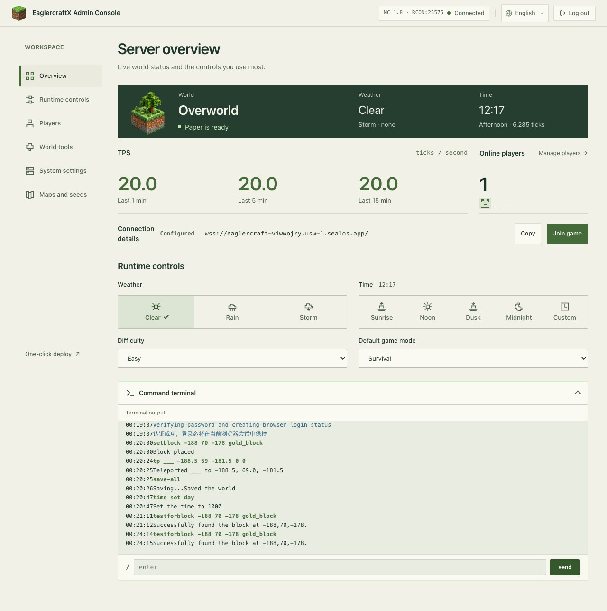
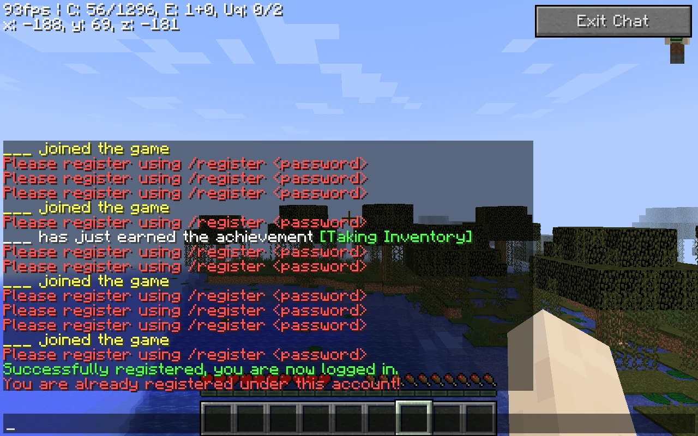
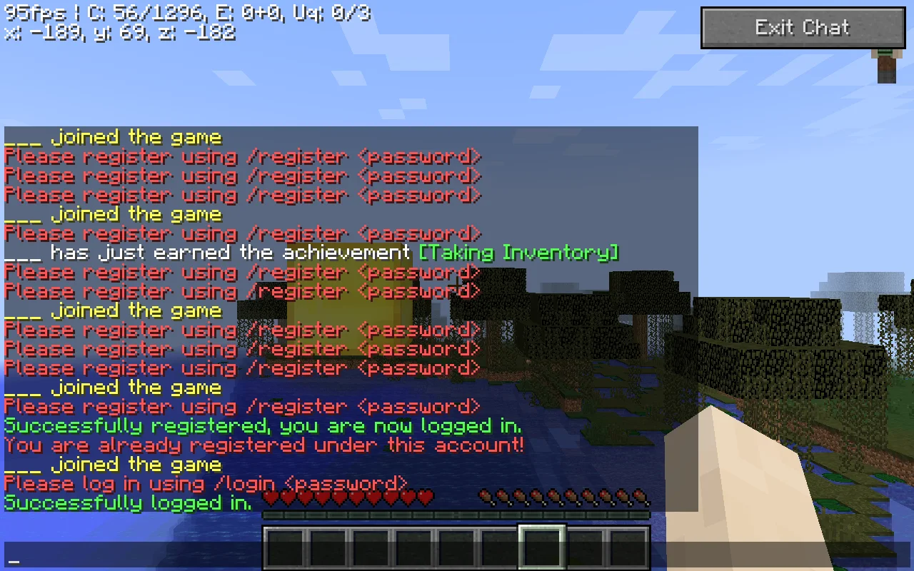
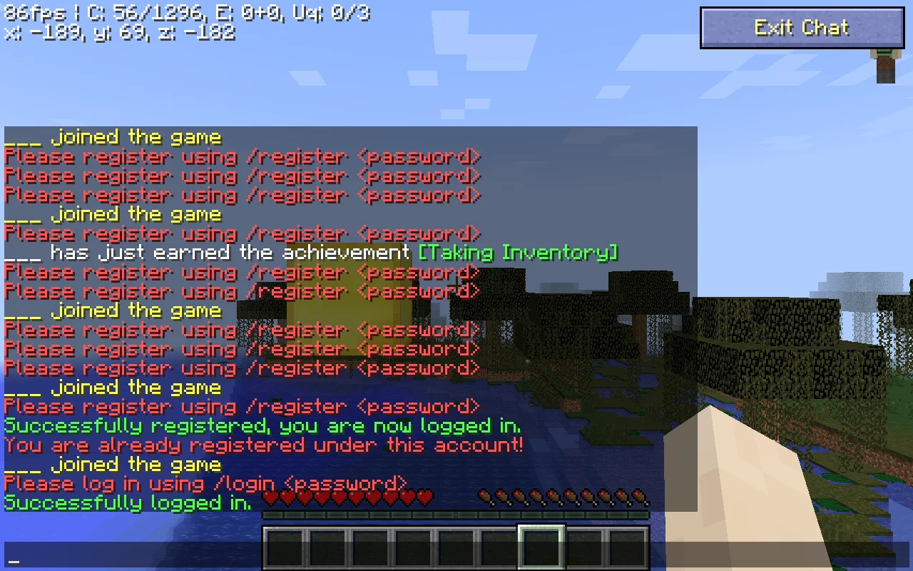

Create a world that you and a friend can enter in your browsers, then return with the same player identities and saved progress. This guide follows the Sealos template from deployment to your **First Join**, a friend's arrival, and a restart check. The main example uses **Eaglercraft 1.8 / Paper 1.8.8**, with template release **2.2.7**.

## Choose a Hosting Path

| Path                 | Choose it when                                                            | What you maintain                                                      |
| -------------------- | ------------------------------------------------------------------------- | ---------------------------------------------------------------------- |
| Shared World         | You want a session hosted from a compatible client's single-player world. | The host's browser session and that client's sharing setup.            |
| Your computer or VPS | You want direct control over server files and networking.                 | Runtime, gateway, updates, public connectivity, and saved data.        |
| Sealos template      | You want a hosted world with a browser client and admin console together. | Your resource allocation, Player Accounts, world, and recovery copies. |

For the walkthrough below, [open the Eaglercraft server template](https://sealos.io/products/app-store/eaglercraft-server/). Keep this guide open in another tab while you deploy.

## Before You Deploy

Prepare these items:

- A Sealos account and a browser with WebGL support. The recorded gameplay checks used Chrome on a Mac with a keyboard and mouse.
- A game-version choice shared by all participants. Select **1.8** to follow the demonstrated path.
- A strong **Administrator Password**, stored privately, for the server management console.
- A stable player name and a separate personal password for each **Player Account**.
- Agreement to the upstream deployment's terms, including the [Minecraft EULA](https://www.minecraft.net/en-us/eula). The template's startup configuration accepts that EULA.

A Resource Plan covers a monthly pool of compute, memory, storage, and traffic. On **September 12, 2026**, [Sealos pricing](https://sealos.io/pricing/) lists Starter at **$7/month for eligible first paid-plan purchases**, with a **$34/month listed regular price**. Eligible new users can receive a seven-day trial. Open **Cost Center** in the Sealos desktop to review your offer, available resources, taxes, optional services, and actual charge before deploying; the [pricing FAQ](https://sealos.io/pricing/) explains plan limits and billing.

The checked template allocates 0.2 vCPU and 1 GiB memory to the main container, with a 1 GiB persistent volume. These are application allocations within your Resource Plan. Monitor memory, storage, and world growth as you play; player capacity depends on activity and resource availability.

**Version labels describe different things:** 1.8 is the game option, Paper 1.8.8 is the game-server version, and 2.2.7 is the packaged application release. The template also offers 1.12 / Paper 1.12.2. That option reached admin readiness and retained a storage marker in the earlier check; a truncated browser asset download left its full browser join unverified. Use 1.8 for the complete demonstrated workflow.

## Deploy Your Eaglercraft Server on Sealos

### 1. Choose the version and Administrator Password

On the template page, choose **Deploy Eaglercraft** and sign in when prompted. In the deployment form, select `1.8` for `minecraft_version`, then set `rcon_password`: this is your **Administrator Password**. Keep it private and save it before continuing.

Review the application resources and storage, then deploy. **Completion state:** the deployment opens in **Canvas**, where you can see your application's resource card. Keep the assigned application name so you can find this same instance later.

### 2. Open the admin console and wait for Paper

Open the application's link from its Canvas card. It leads to `/admin` on your application's public host. Enter the saved Administrator Password and choose **Confirm**.

The management interface can open while the game server is still starting. On **Overview**, wait for **Paper is ready** before joining. Initial world generation and available resources affect the wait; readiness is the useful completion signal. If it stays in startup, inspect the application's logs from Canvas.



### 3. Open the browser client and set your player name

Choose **Join game** from the console's Overview page. The hosted browser client opens; press a key when prompted to enable sound and complete any client information screen.

Before connecting, open **Edit Profile**, enter a stable player name of **3–16 characters**, and choose **Done**. Use letters, numbers, and underscores, and keep the exact spelling and capitalization for future visits. The September 12 friend-join check used `RiverBuilder` and `StoneExplorer`. Choose your own available name. Quick join can initially assign a random name, so check the profile first.

The supplied Join game link can connect automatically after profile setup. To join from the menu, open **Multiplayer**. Release 2.2.7 preconfigures this deployment in the server list. Select that server and choose **Join Server**. **Completion state:** the world loads and the game asks you to register or log in. The authentication step below completes your First Join.

### 4. Register your Player Account

Have a private **6–32 character** player password ready. Within **30 seconds** of connecting, press **T** to open chat and enter:

```text
/register <player-password>
```

Replace `<player-password>` with your own password, typed once, and press Enter. Keep the password as one argument. The selected template uses LoginSecurity with password confirmation disabled. Each player chooses their own password; the Administrator Password stays in the management console.

**Completion state:** chat shows **“Successfully registered, you are now logged in.”** You can move through and interact with the hosted world. If the registration window expires, select the same multiplayer server again and submit the command promptly.



The earlier captured player is named `___`. Keep that identity in mind when comparing the original screenshots; your profile will show the name you chose.

### 5. Leave and return with the same identity

Open the game menu and disconnect. Reopen the Browser Play Link, confirm your exact player name in **Edit Profile**, and join the preconfigured server again. Press **T** and enter:

```text
/login <player-password>
```

Use the personal password you registered. **Completion state:** **“Successfully logged in.”** appears, and you return as the existing player. A fresh browser profile may need its player name set again. Changing the name selects a different identity on this server.



## Invite a Friend to the Same World

On the admin console's **Overview** page, use **Join game** to obtain the **Browser Play Link**. Copy that link's address, including any supplied query string, and send it privately to your friend. It opens the hosted browser client. The friend's Player Account gives them their own game identity.

| Address                                                                    | Where it goes                                                     |
| -------------------------------------------------------------------------- | ----------------------------------------------------------------- |
| Browser Play Link: `https://your-app-host/` with any supplied query string | Browser address bar.                                              |
| WebSocket Server Address: `wss://your-app-host/`                           | An existing compatible client's multiplayer server address field. |
| Admin console: `https://your-app-host/admin`                               | The owner's browser for management.                               |

Your friend should open the Browser Play Link, set a **different stable player name**, select **Multiplayer**, and join the preconfigured server. They then register their own password using `/register <player-password>` within 30 seconds. On later visits, they use `/login <player-password>` with that same identity.

To confirm **Friend Join**, stay online together, meet at a recognizable landmark, and check both names in the admin console's player list. A message in game chat or a shared block placement helps confirm that you are interacting in the same world. Players with an existing client can instead add the displayed WSS address, using a client compatible with the selected game version.


Both players registered with separate credentials and were online together through the public HTTPS/WSS entry point. The server console also reported both names. This check used two isolated browser contexts on the same Mac and network; access from a second physical device or independent network remains outside the recorded test.

Friends can continue playing while your browser is closed, provided the hosted application stays running and reachable with an active plan or eligible trial. Your own browser controls your player session; the hosted application runs the shared world.

## Restart and Check Your Saved World

A **Persistent World** lives on the application's persistent storage. Check it with a change you can recognize:

1. Place a distinctive block or small structure. Record its location and take a screenshot so you can compare it after restart.
2. In the admin console, use **World tools** to save the world, or run `save-all` in **Command terminal** and wait for the save confirmation.
3. Disconnect players. Restart the existing application through its Canvas resource controls, **preserving the original persistent volume**. Keep the same application, game version, and storage attached. Removing the volume removes the data that this check depends on.
4. Wait for **Paper is ready**, reopen the same Browser Play Link, and sign in with the same player name and `/login <player-password>`.
5. Return to the recorded location. **Completion state:** the recognizable change remains and your existing player can access it.

The original 1.8 check saved a gold block at `-188 70 -178`, restarted the application with its original volume retained, and signed in as `___`. Both the browser view and the server's block check confirmed the retained gold block.



Keep a **Recovery Copy** separately from the active world storage so you have a source for recovery after accidental deletion or storage loss. The restart check proves continuity with retained storage. Exporting a copy, restoring it independently, and checking the **Restored World** are a separate recovery procedure. See the [persistent storage guide](/docs/guides/app-deploy/persistent-volume/) for volume behavior and retention planning.

## Understand the Client, Gateway, and Game Server

```text
Browser client
    | secure WebSocket (WSS)
    v
WebSocket gateway
    | game connection
    v
Paper game server
    | saves world and player data
    v
Persistent storage
```

The **browser client** displays the game and receives your keyboard and mouse input. The **gateway** accepts the browser's WebSocket connection and forwards game traffic. **Paper** runs the shared world. This template packages the client, gateway, Paper, administration interface, and player-login support in one deployment; LoginSecurity stores accounts on its persistent volume.

A client's single-player world is stored by that browser. Joining the hosted multiplayer server uses the server's Persistent World. Use **Multiplayer** and the deployment's server entry to reach the world your friend is playing in.

## Fix Common Join Problems

| What you see                         | Next check                                                                                                                               |
| ------------------------------------ | ---------------------------------------------------------------------------------------------------------------------------------------- |
| Console opens, game connection fails | Wait for **Paper is ready**; inspect Canvas logs if startup stalls.                                                                      |
| Address fails in Add Server          | Paste the **WSS** address into a compatible client's multiplayer field. Open the **HTTPS** Browser Play Link in the browser address bar. |
| Registration or login times out      | Rejoin, press **T**, and submit the appropriate command within 30 seconds.                                                               |
| Existing player is asked to register | Restore the exact original player name, including capitalization, then reconnect and log in.                                             |
| Friend sees a different world        | Compare the host in both Browser Play Links and check that both players selected the same multiplayer server.                            |
| Public page fails to open            | Check the application's status and follow the [public URL troubleshooting guide](/docs/guides/app-deploy/public-url-does-not-open/).     |

## Continue with Manual Hosting

For your computer or VPS, start with the maintained [EaglerXserver implementation](https://github.com/yangchuansheng/eaglerXserver) and the [2.2.7 release documentation](https://github.com/yangchuansheng/eaglerXserver/tree/v2.2.7). Plan the game version, persistent data location, HTTPS/WSS access, and update procedure together. The [current Sealos template documentation](https://github.com/labring-actions/templates/blob/kb-0.9/template/eaglercraft-server/README.md) records how the hosted package connects those components. Existing Compose users can consult the [Docker Compose migration guide](/docs/guides/app-deploy/docker-compose-migration/).

Once you have checked the first player, your friend's connection, and the retained world, keep the Browser Play Link and your private credentials for the next session. [Deploy your shared world from the Eaglercraft template](https://sealos.io/products/app-store/eaglercraft-server/).
