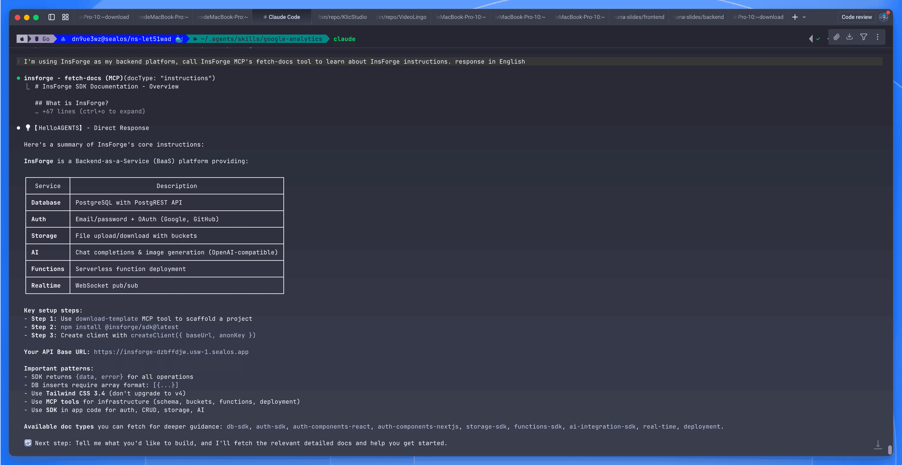
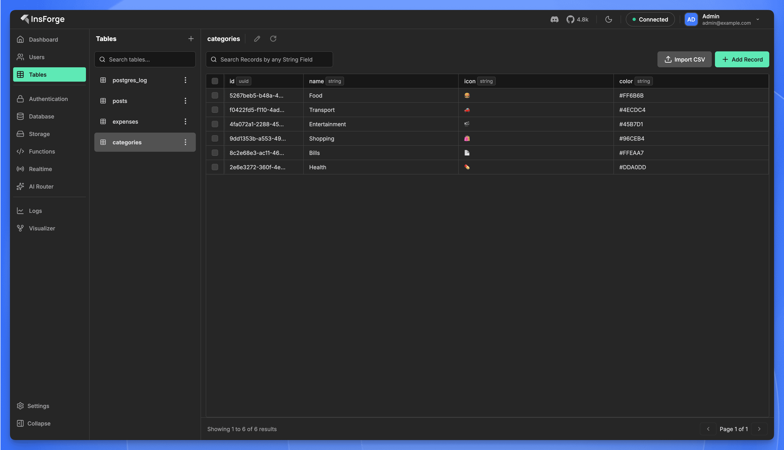
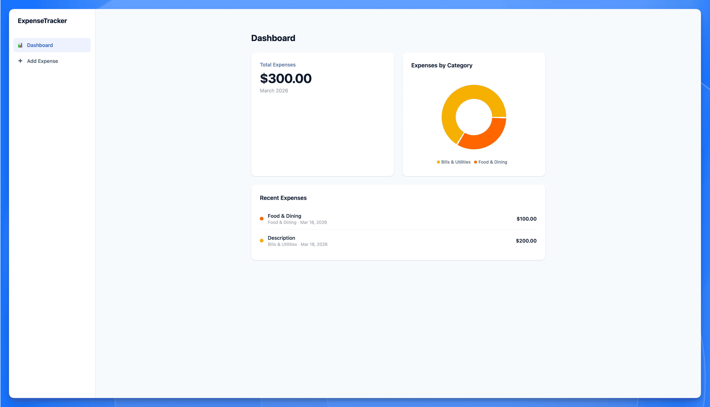

import { DeployButton } from '@/components/ui/button'


Here's what happens every time. Your AI coding agent spits out a React dashboard in a few minutes, and then you spend the next two hours wiring up a database, auth, and API routes yourself. The frontend writes itself. The backend doesn't.

This tutorial fixes that. You'll deploy [InsForge](https://insforge.dev) on [Sealos](https://sealos.io), hook it up to Claude Code through MCP, and build a working Expense Tracker from start to finish. Everything happens in your terminal, through prompts. You won't write any backend code.

## The problem: AI builds frontends, but backends are still on you

AI coding agents are genuinely good at generating UI code now. Tell Claude Code to build you a dashboard with a sidebar, charts, and a data table, and you'll have something working in minutes.

But the moment you need a real backend, things slow down. Database schemas, authentication, row-level security, file storage, API endpoints. You're back to writing migrations by hand, configuring auth providers, setting environment variables, and wondering why CORS is rejecting everything.

The frontend is automated. The backend still isn't. That's the gap.

Platforms like Supabase and Firebase help, but they were built for humans to operate. Your agent can call their APIs, sure, but it can't actually understand what your backend does, look at its current state, or figure out how to set things up from scratch. It's making API calls blind.

InsForge was built to fix that.

## What is InsForge?

[InsForge](https://github.com/insforge/insforge) is an open-source backend platform designed for AI coding agents. Think "Supabase, but your agent actually understands the backend instead of just calling endpoints."

The idea: the platform puts a **semantic layer** between your agent and the backend. Instead of handing agents a pile of REST endpoints and hoping for the best, it gives them structured context. Documentation, schemas, state inspection, available operations. The agent can look at what exists, reason about what to do, and then do it.

What's included:

- **PostgreSQL database** with PostgREST. Define a schema, get a full CRUD API automatically.
- **Authentication.** Email/password, OAuth, JWT sessions. Works out of the box.
- **File storage.** S3-compatible. Upload, download, serve files.
- **Edge functions.** Serverless functions on Deno. Run custom logic without managing a server.
- **Model gateway.** OpenAI-compatible API that routes to multiple LLM providers through OpenRouter.
- **Realtime.** WebSocket pub/sub for collaborative features.

The thing that actually matters: it ships with an **MCP (Model Context Protocol) server**. Claude Code, Cursor, VS Code, or any MCP-compatible client can connect to your backend and operate it through natural language. Your agent doesn't just call APIs. It reads the docs, inspects the schema, and makes changes directly.

## Deploy InsForge on Sealos in 30 seconds

No Docker. No Kubernetes. No SSH.

[Sealos](https://sealos.io) runs it as a managed template. The whole deployment looks like this:

### Step 1: Open the template

Go to the [template on the Sealos App Store](https://sealos.io/products/app-store/insforge/) and click **"Deploy on Sealos"**.

<DeployButton deployUrl="https://sealos.io/products/app-store/insforge" />

### Step 2: Configure

The deploy dialog has a few fields:

- `admin_password` (required). This is your dashboard login.
- OAuth settings (optional). Google/GitHub OAuth for your app's users.
- OpenRouter API key (optional). Only needed if you want the built-in model gateway.

For this tutorial, just set the password. Everything else you can configure later.


### Step 3: Deploy

Click Deploy. Sealos spins up:

- The app core
- PostgreSQL 16.4
- PostgREST (auto-generated REST API)
- Deno runtime (for edge functions)
- SSL certificate
- Persistent storage

Give it 2-3 minutes.

> **Heads up on first deploy:**
> - If deployment seems stuck past 3 minutes, the PostgreSQL extension init job is probably still running. Give it up to 5 minutes before troubleshooting.
> - Default resource limits are conservative: Postgres gets 500m CPU / 512Mi RAM, other services get 200m / 256Mi each. Fine for this tutorial, but bump these up for anything beyond demos.
> - Default storage is small: Postgres gets 1Gi, other PVCs ~103Mi each. Resize through the Sealos Canvas if you're storing real data.
> - The Sealos template currently pins InsForge v1.5.0. Upstream is at v2.0.1 (March 2026). Check the template for updates if you need newer features.

### Step 4: Open the dashboard

Sealos gives you an HTTPS URL for your instance. Click it, log in with your admin password.


Done. You've got a self-hosted backend with a database, auth, storage, and serverless functions. Sealos handles scaling, backups, SSL, and failover. You pay for what you use.

> What you just got: A full backend stack on [Sealos](https://sealos.io)' Kubernetes infrastructure. Postgres for data, PostgREST for instant APIs, Deno for serverless functions, S3-compatible storage for files. Everything behind one HTTPS endpoint with automatic SSL.

## Connect Claude Code to InsForge via MCP

Now you're going to give Claude Code direct access to your backend.

### Step 1: Install the MCP server

From your terminal:

```bash
npx add-mcp https://mcp.insforge.dev/mcp
```

This registers InsForge's hosted MCP endpoint with your local configuration. It creates (or updates) a `.mcp.json` file:

```json
{
  "mcpServers": {
    "insforge": {
      "type": "http",
      "url": "https://mcp.insforge.dev/mcp"
    }
  }
}
```

### Step 2: Authenticate

Start Claude Code and run the MCP auth command:

```bash
claude /mcp
```

This opens a browser window for OAuth authentication. Sign in with your InsForge account (the one tied to your Sealos deployment), and the MCP connection binds to your project.

### Step 3: Verify it works

In Claude Code, send this:

```text
Call InsForge MCP's fetch-docs tool to learn about InsForge instructions.
```

If it comes back with a summary of what the backend can do, you're connected. The agent now has full context about your backend and the tools to work with it.



> **Self-hosted MCP note:** The URL above (`mcp.insforge.dev`) is InsForge's hosted endpoint. If you're running a self-hosted instance on Sealos, check your InsForge dashboard's **Connect** tab for the MCP configuration specific to your deployment. The hosted MCP authenticates via browser OAuth and binds to your InsForge project.

> **Using Cursor or Codex?** The MCP server works with any MCP-compatible client. For Cursor, put the config in `.cursor/mcp.json`. For Codex, use the MCP integration in the desktop app. The prompts below work the same way regardless of which tool you use.

## Build the app: let the agent do the work

We're building an **Expense Tracker**. Simple enough to follow along, but it covers the important stuff: database, auth, row-level security, file storage, and a frontend that ties everything together.

Set up a project directory however you like (`npm create vite@latest expense-tracker -- --template react-ts` works). Then start Claude Code:

```bash
cd expense-tracker && claude
```

Everything from here is prompts.

### Prompt 1: Set up the database

```text
I'm building an expense tracker app. Using InsForge as my backend, create the database schema:

1. A "categories" table with: id (uuid, primary key, default gen_random_uuid()), name (text, not null), icon (text), color (text). This is a shared lookup table — do NOT enable RLS on it.
2. An "expenses" table with: id (uuid, primary key, default gen_random_uuid()), user_id (uuid, not null, references auth.users on delete cascade), category_id (uuid, references categories on delete set null), amount (numeric, not null), description (text), date (date, not null, default current_date), created_at (timestamptz, default now()). Enable RLS on this table only.
3. Add RLS policies on "expenses" so authenticated users can only select/insert/update/delete their own rows (where auth.uid() = user_id).
4. Grant table permissions: categories SELECT to anon, authenticated, and project_admin; expenses full CRUD to authenticated and project_admin.
5. Grant USAGE ON SCHEMA public and USAGE ON ALL SEQUENCES to anon, authenticated, and project_admin.
6. Seed the categories table with: Food (🍔, #FF6B6B), Transport (🚗, #4ECDC4), Entertainment (🎬, #45B7D1), Shopping (🛍️, #96CEB4), Bills (📄, #FFEAA7), Health (💊, #DDA0DD).
7. After all changes, run NOTIFY pgrst, 'reload schema' to refresh PostgREST cache.
```

Claude Code calls the MCP tools, creates both tables, configures RLS on expenses only, grants the right permissions, seeds categories with icons and colors, and reloads the PostgREST schema cache. No migration file. No SQL editor.



### Prompt 2: Configure authentication

```text
Set up email/password authentication in InsForge for this app. Enable user signup and login. Make sure new users get a default session duration of 7 days.
```

Auth is live. Email/password signup, JWT sessions, 7-day duration. One prompt.

### Prompt 3: Build the frontend

```text
Build a React + TypeScript expense tracker frontend that connects to my InsForge backend:

1. Login/signup page with email and password
2. Dashboard showing:
   - Total expenses this month
   - Expenses by category (pie chart)
   - Recent expenses list
3. "Add Expense" form with amount, category dropdown, description, and date
4. Use the InsForge TypeScript SDK (@insforge/sdk) for all backend calls
5. Style with Tailwind CSS — clean, modern, minimal

The InsForge API base URL is stored in VITE_INSFORGE_URL env var and the anon key in VITE_INSFORGE_ANON_KEY.
```

Claude Code generates the full React app: components, routing, state management, API calls. Because it just created the database schema, it already knows the types and table structure. The API integration code is correct from the start.

Under the hood, the generated code uses the InsForge SDK. Here's what a typical query looks like:

```ts
import { createClient } from '@insforge/sdk';

const insforge = createClient({
  baseUrl: 'https://your-app.sealos.run',
  anonKey: 'your-anon-key'
});

// Query expenses for the current user
const { data, error } = await insforge.database
  .from('expenses')
  .select('*')
  .eq('user_id', userId)
  .order('date', { ascending: false });
```

You don't have to write this yourself. The agent generates it. But it's worth seeing what the integration actually looks like.

### Prompt 4: Add receipt uploads

```text
Add a receipt upload feature to the expense tracker:

1. Create a "receipts" storage bucket in InsForge with a 5MB file size limit
2. Add an "Upload Receipt" button to each expense entry
3. When a user uploads an image, store it in the receipts bucket with the path: {user_id}/{expense_id}/{filename}
4. Show a thumbnail of the receipt next to the expense in the list
5. Set bucket policy so users can only access their own receipts
```

The agent creates the storage bucket through MCP, configures access policies, and generates the upload/display components. What would normally be an afternoon of S3 configuration takes one prompt.

### Prompt 5: Run it

```text
Create a .env file with my InsForge URL and anon key, then give me the commands to run this app locally.
```

Run `npm run dev`, open `localhost:5173`:



Sign up, add some expenses, upload a receipt. Everything persists. Auth works. Files are stored.

Five prompts, no backend code, and you've got a working app with auth, a database, and file storage.

## Why InsForge over Supabase?

If you've used Supabase, InsForge will feel familiar. Same primitives: Postgres, Auth, Storage, Edge Functions. The difference is how your agent works with the backend.

**Supabase gives your agent APIs.** Your agent can call them, but it doesn't have context about what's configured, what the schema looks like, or what state things are in. It's making calls without seeing the full picture.

**InsForge gives your agent context.** Through the MCP server, the agent can read documentation, inspect schemas, check service state, and configure things directly. It operates the backend rather than just calling it.

A few other things worth noting:

- It's MCP-native. Connect Claude Code, Cursor, or any compatible client. No SDK wiring needed.
- It's fully self-hosted on Sealos. Your data, your infrastructure, pay-as-you-go pricing.
- It's open source, Apache 2.0. [Source on GitHub](https://github.com/insforge/insforge).

Honest caveat: it's newer than Supabase. Smaller community, fewer integrations. If you need a battle-tested ecosystem with thousands of tutorials, Supabase is still the safer pick. But if your workflow is "describe what I want, let the agent build it," this is specifically built for that.

## What's next

You've got a running app. Some places to go from here:

- [Docs](https://docs.insforge.dev/introduction) cover edge functions, realtime, the model gateway, and more.
- [GitHub repo](https://github.com/insforge/insforge) ⭐ if you want to follow development or contribute.
- [One-click template on Sealos](https://sealos.io/products/app-store/insforge/) to deploy your own instance.
- [Discord](https://discord.com/invite/MPxwj5xVvW) for help and project showcases.
- [Sealos App Store](https://sealos.io/products/app-store/) has other one-click templates worth browsing.

Coming soon on this blog: a deep-dive comparison of InsForge and Supabase for AI-agent workflows, plus a series on building real projects (SaaS MVPs, internal tools, AI-powered apps) with this stack.

**[→ Deploy InsForge on Sealos](https://sealos.io/products/app-store/insforge/)**

