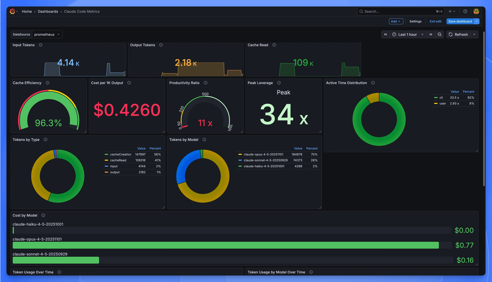
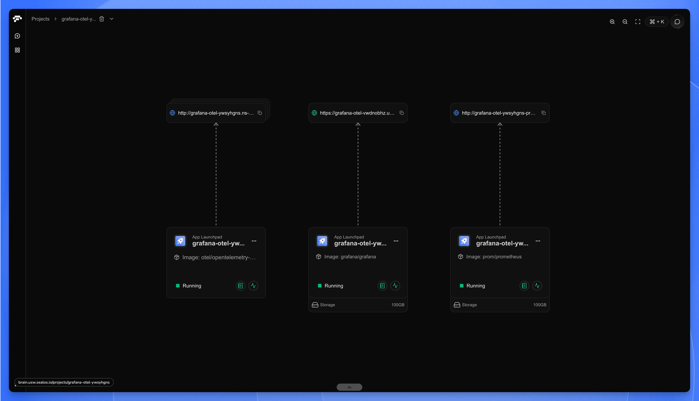

import { DeployButton } from '@/components/ui/button'

## Why Claude Code Metrics Matter for Cost Control

Claude Code metrics reveal exactly where your API costs go. Last month, my API bill tripled. I had no idea why—and without claude code metrics, I had no way to find out.

I'd been using Claude Code heavily—refactoring a legacy codebase, generating tests, debugging production issues at 2 AM. It felt productive. Then the invoice arrived.

$847.

I stared at it. Tried to remember what I'd even done that week. The big refactor? The test generation marathon? That one night I kept re-running prompts because the output wasn't quite right? No way to tell. The tokens were gone, the money was spent, and I couldn't point to a single task and say *that's where it went*. When my manager asked, I had nothing.

Here's what I didn't know: [Claude Code](https://docs.anthropic.com/en/docs/claude-code) telemetry already tracks everything. Token counts, costs, cache efficiency, session durations—all exportable through OpenTelemetry. The data existed. I just wasn't looking at it.

So I built a claude code metrics dashboard.



OpenTelemetry Collector, Prometheus, Grafana. All running locally via Docker Compose. No managed services, no third-party accounts, no vendor lock-in. Ten minutes from `git clone` to working graphs.

What you get at the end: panels showing which projects burn tokens fastest, whether your prompt restructuring actually saved money, what your real cost-per-commit looks like. The questions I couldn't answer? You'll have answers.

### What You'll Learn in This Guide

1. **Understanding Claude Code telemetry** — The 8 metrics and 5 event types you can track
2. **Setting up the monitoring stack** — OpenTelemetry Collector, Prometheus, and Grafana via Docker Compose
3. **Enabling metric export** — Environment variables and configuration for Claude Code
4. **Building your dashboard** — Pre-built panels for cost tracking, cache efficiency, and usage patterns
5. **Production best practices** — Data persistence, security, backups, and resource management
6. **Troubleshooting common issues** — Diagnostic steps when metrics don't appear

---

**What are Claude Code metrics?** Claude Code metrics are telemetry data points—exported via OpenTelemetry—that track token usage, API costs, cache efficiency, session duration, and code changes. These metrics enable developers to monitor spending, identify inefficient prompts, and optimize their Claude Code workflows through visualization tools like Grafana.

## Understanding Claude Code Telemetry Data

Claude Code telemetry is the automatic recording of every API interaction—tokens in, tokens out, cache hits, response time—all reduced to exportable numbers. Every time you hit Enter, Claude Code can capture what happened and send it to your monitoring stack via OpenTelemetry.

Claude Code exports two types of telemetry data: metrics and events. Metrics are counters and gauges—running totals like token usage, total cost, and session count that answer "how much" questions. Events are snapshots of individual moments—this API call succeeded, that tool took 3.2 seconds—answering "what exactly happened" questions.

Both speak [OTLP—OpenTelemetry's wire protocol](https://opentelemetry.io/docs/specs/otlp/). Any backend that understands OTLP can ingest them. Prometheus, Datadog, Honeycomb, whatever. No lock-in.

One thing worth knowing: telemetry ships disabled. You opt in. And even then, your actual prompts stay private—what gets exported is metadata about usage, not the text itself.

### The Metrics

Eight counters. Here's what each one tracks:

| Metric | What It Counts |
|--------|----------------|
| `claude_code.session` | Session starts |
| `claude_code.token.usage` | Tokens, split by type: `input`, `output`, `cacheRead`, `cacheCreation` |
| `claude_code.cost.usage` | Estimated cost in USD |
| `claude_code.lines_of_code` | Lines added or removed when you accept edits |
| `claude_code.commit` | Git commits made through Claude Code |
| `claude_code.pull_request` | PRs created |
| `claude_code.code_edit_tool.decision` | Your accept/reject choices on suggested edits |
| `claude_code.active_time` | Time spent—yours vs. Claude's |

Cache read tokens cost 90% less than regular input tokens in Claude Code. This makes cache efficiency one of the most important metrics to monitor. If your* `cacheRead` *stays low while* `input` climbs, you're paying full price for context that could have been cached. I'll show you how to spot this in the dashboard section.

### The Events

Events catch what counters miss: the texture of individual interactions.

| Event | When It Fires | What It Records |
|-------|---------------|-----------------|
| `claude_code.user_prompt` | You submit a prompt | Length (content redacted) |
| `claude_code.api_request` | Each API call completes | Model, cost, latency, token breakdown |
| `claude_code.api_error` | An API call fails | Error type, status code, retry attempt |
| `claude_code.tool_result` | A tool finishes | Tool name, success/failure, duration |
| `claude_code.tool_decision` | Permission granted or denied | Tool, decision, source |

When things go sideways—error spikes, weird latency, a cost jump you can't explain—events are where you dig. Metrics tell you *that* something changed. Events tell you *what*.

### Common Attributes

Every metric and event carries labels you can filter on:

- `model` — which Claude model handled the request
- `session.id` — ties data points to a specific coding session
- `user.account_uuid` — your account identifier
- `organization.id` — for team accounts
- `app.version` — Claude Code version

These matter when you start asking targeted questions. "Show me token usage for Sonnet only." "Compare Tuesday's costs to Wednesday's." "Which session burned through $12 in an hour?" The labels make those queries possible.

### Why This Matters

Numbers without context are just noise. Knowing you spent $47 last week tells you nothing. Knowing you spent $47, mostly on Tuesday, mostly on Opus, mostly during that three-hour refactoring session where you kept regenerating the same function—that's actionable.

The dashboard turns the first kind of knowledge into the second.

## OpenTelemetry Collector Architecture for Claude Code

The Claude Code metrics pipeline uses three components: OpenTelemetry Collector, Prometheus, and Grafana. Claude Code exports telemetry over OTLP (OpenTelemetry's standard protocol), which the Collector translates into a format Prometheus can scrape. Grafana then visualizes the stored time-series data. This architecture is vendor-neutral—you can swap any component without re-instrumenting your setup.

The setup has three pieces:

```
┌─────────────────┐     OTLP        ┌─────────────────────┐
│   Claude Code   │ ──────────────► │  OpenTelemetry      │
│   (Telemetry    │  gRPC (:4317)   │  Collector          │
│    Producer)    │  HTTP (:4318)   │                     │
└─────────────────┘                 └──────────┬──────────┘
                                               │
                                               │ Prometheus
                                               │ Scrape (:8889)
                                               ▼
┌─────────────────┐    PromQL       ┌─────────────────────┐
│    Grafana      │ ◄────────────── │    Prometheus       │
│  (Visualization)│    Queries      │  (Time-Series DB)   │
└─────────────────┘                 └─────────────────────┘
```

The **Collector** translates protocols. Claude Code pushes OTLP to port 4317 (gRPC) or 4318 (HTTP). The Collector batches it, converts the format, and exposes a Prometheus-compatible endpoint on 8889. Two systems that don't speak the same language, one adapter in between.

[Prometheus](https://prometheus.io/docs/introduction/overview/) stores everything. It pulls from the Collector every few seconds, timestamps each data point, writes to disk. Its query language—PromQL—is where the real power lives. Sum by model. Filter by session. Average over the last hour. The dashboards you'll build are just PromQL with a visual layer on top.

**Grafana** displays the results. It holds no data itself. You could run every query from a terminal and get the same numbers. Grafana just makes them readable without squinting at JSON.

Why these three? I've run this stack on personal projects and at work. Prometheus and Grafana have been around long enough that when something breaks, someone on Stack Overflow already fixed it five years ago. The Collector earns its place by making future changes cheap—add an exporter, ship to a second backend, no re-instrumentation required.

### A Note on Timing

I wasted twenty minutes once, convinced my setup was broken. Dashboard showed nothing. Logs looked fine. Turned out I just wasn't waiting long enough.

Claude Code exports metrics every 60 seconds by default. Prometheus scrapes every 15. Best case, you're looking at 75 seconds before anything appears. Worst case—when the cycles don't align—closer to 90.

If you're testing and the dashboard is empty: wait. A full ninety seconds. Then refresh.

You can speed this up for debugging:

```bash
export OTEL_METRIC_EXPORT_INTERVAL=5000  # 5 seconds
```

Reset it when you're done. Aggressive polling wastes CPU and buys you nothing in normal use.

Events are different—they export every 5 seconds. Logs show up fast. Metrics take their time.

### When This Stack Isn't Enough

Prometheus works until it doesn't. A few situations where you'll hit walls:

High-cardinality data—thousands of unique session IDs, daily active user counts—gets expensive to store and slow to query. ClickHouse handles that shape better.

Full-text search on logs isn't what Prometheus does. If you need to grep through event payloads, add Loki or Elasticsearch.

Enterprise compliance sometimes mandates specific vendors. The Collector helps here too—Datadog, Honeycomb, Splunk all accept OTLP. Switching backends means changing exporter config, not ripping out instrumentation.

For one developer watching their API bill, Prometheus and Grafana are plenty. Add complexity when the problem forces you to, not before.

## Docker Compose Monitoring Setup (Step-by-Step)

> **Quick Overview: 6 Steps to a Working Dashboard**
> 1. Check prerequisites (Docker, ports, disk space)
> 2. Create project directory structure
> 3. Configure OpenTelemetry Collector
> 4. Configure Prometheus scrape jobs
> 5. Set up Grafana data source
> 6. Launch and verify the stack
>
> ⏱️ **Total time: 10-15 minutes**

Time to build.

Docker Compose gets the whole stack running locally—Collector, Prometheus, Grafana—without touching Kubernetes or signing up for anything. Containers talk to each other on your machine. That's it.

Works well for solo developers, local testing, or small teams who'd rather own their data than rent dashboard space from a vendor.

### Step 1: Check Prerequisites

Before you start:

| Requirement | Minimum Version | Check Command |
|-------------|-----------------|---------------|
| Docker | 20.10+ | `docker --version` |
| Docker Compose | 2.0+ | `docker compose version` |
| Free Ports | 3000, 4317, 4318, 8889, 9090 | `netstat -tuln` |
| Disk Space | 1GB+ | `df -h` |

New to Docker? See the [official installation guide](https://docs.docker.com/get-docker/) and [Docker Compose documentation](https://docs.docker.com/compose/).

### Step 2: Create Project Structure

Create a working directory and the folder skeleton:

```bash
mkdir claude-code-metrics-stack && cd claude-code-metrics-stack

mkdir -p config/grafana/provisioning/datasources
mkdir -p data/prometheus data/grafana
```

You'll end up with:

```
claude-code-metrics-stack/
├── docker-compose.yml
├── config/
│   ├── otel-collector-config.yaml
│   ├── prometheus.yml
│   └── grafana/
│       └── provisioning/
│           └── datasources/
│               └── datasources.yml
└── data/
    ├── prometheus/
    └── grafana/
```

### Step 3: Configure OpenTelemetry Collector

The Collector sits between Claude Code and Prometheus. It takes OTLP metrics, batches them, and re-exposes them in a format Prometheus understands.

```bash
cat > config/otel-collector-config.yaml << 'EOF'
receivers:
  otlp:
    protocols:
      grpc:
        endpoint: 0.0.0.0:4317
      http:
        endpoint: 0.0.0.0:4318
        cors:
          allowed_origins:
            - "*"

processors:
  batch:
    timeout: 10s
    send_batch_size: 1024

extensions:
  zpages:
    endpoint: 0.0.0.0:55679
  health_check:
    endpoint: 0.0.0.0:13133

exporters:
  prometheus:
    endpoint: 0.0.0.0:8889
    const_labels:
      source: otel-collector
  debug:
    verbosity: detailed

service:
  extensions: [zpages, health_check]
  pipelines:
    metrics:
      receivers: [otlp]
      processors: [batch]
      exporters: [prometheus, debug]
EOF
```

**Ports 4317 and 4318** are where Claude Code sends data—gRPC and HTTP respectively. **Port 8889** is where Prometheus pulls the converted metrics.

The `debug` exporter prints incoming data to container logs. Useful while you're testing. Remove it later if the noise gets annoying.

### Step 4: Configure Prometheus

Prometheus scrapes the Collector every few seconds and stores everything as time-series data.

```bash
cat > config/prometheus.yml << 'EOF'
global:
  scrape_interval: 15s
  evaluation_interval: 15s

alerting:
  alertmanagers:
    - static_configs:
        - targets: []

rule_files: []

scrape_configs:
  - job_name: "prometheus"
    static_configs:
      - targets: ["localhost:9090"]
        labels:
          app: "prometheus"

  - job_name: "otel-collector"
    static_configs:
      - targets: ["otel-collector:8889"]
        labels:
          app: "otel-collector"
          source: "claude-code-metrics"
    scrape_interval: 10s
    scrape_timeout: 5s
EOF
```

The 10-second scrape interval is intentional. Claude Code sessions can be short. A default 30-second interval would smooth over usage spikes you might actually want to see.

### Step 5: Set Up Grafana Data Source

This file tells Grafana where to find Prometheus. Drop it in the provisioning folder and Grafana wires itself up on first boot—no clicking through setup wizards.

```bash
cat > config/grafana/provisioning/datasources/datasources.yml << 'EOF'
apiVersion: 1

prune: false

datasources:
  - name: Prometheus
    type: prometheus
    access: proxy
    orgId: 1
    uid: prometheus_claude_metrics
    url: http://prometheus:9090
    basicAuth: false
    editable: false
    isDefault: true
    jsonData:
      timeInterval: "10s"
      httpMethod: "POST"
EOF
```

### Step 6: Create Docker Compose File

The main file. It pulls three images, wires them onto a shared network, and sets up health checks so each service waits for its dependencies before starting.

```yaml
cat > docker-compose.yml << 'EOF'
version: "3.8"

services:
  # ============================================
  # OpenTelemetry Collector
  # ============================================
  otel-collector:
    image: otel/opentelemetry-collector:0.99.0
    container_name: otel-collector
    command: ["--config=/etc/otel-collector-config.yaml"]
    volumes:
      - ./config/otel-collector-config.yaml:/etc/otel-collector-config.yaml:ro
    ports:
      - "4317:4317"   # OTLP gRPC
      - "4318:4318"   # OTLP HTTP
      - "8889:8889"   # Prometheus scrape endpoint
      - "55679:55679" # zPages (debugging)
      - "13133:13133" # Health check
    restart: unless-stopped
    healthcheck:
      test: ["CMD", "wget", "--spider", "-q", "http://localhost:13133"]
      interval: 10s
      timeout: 5s
      retries: 3
    networks:
      - claude-metrics-network

  # ============================================
  # Prometheus
  # ============================================
  prometheus:
    image: prom/prometheus:v3.8.0
    container_name: prometheus
    command:
      - "--config.file=/etc/prometheus/prometheus.yml"
      - "--storage.tsdb.path=/prometheus"
      - "--storage.tsdb.retention.time=90d"
      - "--web.console.libraries=/usr/share/prometheus/console_libraries"
      - "--web.console.templates=/usr/share/prometheus/consoles"
      - "--web.enable-lifecycle"
      - "--web.enable-remote-write-receiver"
    volumes:
      - ./config/prometheus.yml:/etc/prometheus/prometheus.yml:ro
      - ./data/prometheus:/prometheus
    ports:
      - "9090:9090"
    restart: unless-stopped
    depends_on:
      otel-collector:
        condition: service_healthy
    healthcheck:
      test: ["CMD", "wget", "--spider", "-q", "http://localhost:9090/-/healthy"]
      interval: 10s
      timeout: 5s
      retries: 3
    networks:
      - claude-metrics-network

  # ============================================
  # Grafana
  # ============================================
  grafana:
    image: grafana/grafana:12.3.0
    container_name: grafana
    environment:
      - GF_SECURITY_ADMIN_USER=admin
      - GF_SECURITY_ADMIN_PASSWORD=admin
      - GF_USERS_ALLOW_SIGN_UP=false
      - GF_SERVER_ROOT_URL=http://localhost:3000
      - GF_INSTALL_PLUGINS=grafana-clock-panel,grafana-piechart-panel
    volumes:
      - ./config/grafana/provisioning:/etc/grafana/provisioning:ro
      - ./data/grafana:/var/lib/grafana
    ports:
      - "3000:3000"
    restart: unless-stopped
    depends_on:
      prometheus:
        condition: service_healthy
    healthcheck:
      test: ["CMD", "wget", "--spider", "-q", "http://localhost:3000/api/health"]
      interval: 10s
      timeout: 5s
      retries: 3
    networks:
      - claude-metrics-network

networks:
  claude-metrics-network:
    driver: bridge
    name: claude-metrics-network
EOF
```

90-day retention is a middle ground. Long enough to spot monthly trends. Short enough to keep storage under 5 GB for most solo users. Need a year of history? Change it to `365d` and keep an eye on disk usage.

### Step 7: Launch the Stack

```bash
# The data folders need write access
chmod -R 777 data/

# Bring everything up
docker compose up -d

# Tail the logs to watch startup
docker compose logs -f
```

Give it 10–20 seconds. You should see lines like:

```
otel-collector  | ... Everything is ready. Begin running and processing data.
prometheus      | ... Server is ready to receive web requests.
grafana         | ... HTTP Server Listen ... 3000
```

### Step 8: Verify All Services

Open these URLs:

| Service | URL |
|---------|-----|
| Grafana | http://localhost:3000 (login `admin` / `admin`) |
| Prometheus | http://localhost:9090 |
| Collector health | http://localhost:13133 |

If any of them won't load, check `docker compose ps` first. A container in "Restarting" state usually means a config typo.

### Smoke Test

Before hooking up Claude Code, push a fake metric through the pipeline. This confirms data actually flows end-to-end.

```bash
curl -X POST http://localhost:4318/v1/metrics \
  -H "Content-Type: application/json" \
  -d '{
    "resourceMetrics": [{
      "resource": {
        "attributes": [{
          "key": "service.name",
          "value": {"stringValue": "claude-code-test"}
        }]
      },
      "scopeMetrics": [{
        "metrics": [{
          "name": "test_metric",
          "gauge": {
            "dataPoints": [{
              "asInt": "42",
              "timeUnixNano": "'$(date +%s)000000000'"
            }]
          }
        }]
      }]
    }]
  }'
```

Now query Prometheus:

```bash
curl -s 'http://localhost:9090/api/v1/query?query=test_metric' | jq '.data.result'
```

You should see a result with value `42`. Empty response? Wait 15 seconds—Prometheus scrapes on an interval—and try again.

### Commands You'll Use

```bash
# Start
docker compose up -d

# Stop (keeps data)
docker compose down

# Follow logs
docker compose logs -f [service-name]

# Restart one service
docker compose restart otel-collector

# Nuke everything and start fresh
docker compose down -v && rm -rf data/* && docker compose up -d
```

## How to Enable Claude Code Telemetry Export

**Claude Code telemetry is disabled by default.** Follow these 4 steps to enable metric export to your monitoring stack:

### Step 1: Set Required Environment Variables

```bash
# Enable telemetry
export CLAUDE_CODE_ENABLE_TELEMETRY=1
export OTEL_METRICS_EXPORTER=otlp
export OTEL_LOGS_EXPORTER=otlp

# Point to your collector
export OTEL_EXPORTER_OTLP_PROTOCOL=http/protobuf
export OTEL_EXPORTER_OTLP_ENDPOINT=http://localhost:4318

# Identify the service
export OTEL_SERVICE_NAME=claude-code
```

Here's what got me the first time: **environment variables are read at startup**. I set everything, ran a prompt, checked Grafana—nothing. Spent twenty minutes checking configs before realizing Claude Code was still running from before I exported anything. Restart it. Then it works.

### Step 2: Choose the Right Protocol

| Port | Protocol | When to Use |
|------|----------|-------------|
| `:4318` | `http/protobuf` | **Default choice.** Works in most setups. |
| `:4317` | `grpc` | High-throughput scenarios where every millisecond counts. |

Stick with HTTP unless you have a reason not to.

### Step 3: Persist Configuration in Shell Profile

You'll forget to export these variables. I did, repeatedly—opened a new terminal, started a session, wondered why the dashboard went flat.

Put them in your shell profile and stop thinking about it:

```bash
# ~/.bashrc or ~/.zshrc
export CLAUDE_CODE_ENABLE_TELEMETRY=1
export OTEL_METRICS_EXPORTER=otlp
export OTEL_LOGS_EXPORTER=otlp
export OTEL_EXPORTER_OTLP_PROTOCOL=http/protobuf
export OTEL_EXPORTER_OTLP_ENDPOINT=http://localhost:4318
export OTEL_SERVICE_NAME=claude-code
```

Reload:

```bash
source ~/.bashrc  # or ~/.zshrc
```

### Step 4: Verify Data Is Flowing

Start Claude Code. Ask it anything—a one-liner is fine, as long as it hits the API. Then check if data is flowing.

Collector logs first:

```bash
docker compose logs otel-collector | grep -i "metrics"
```

Or ask Prometheus directly:

```bash
curl -s 'http://localhost:9090/api/v1/query?query=claude_code_token_usage_tokens_total' | jq '.data.result'
```

Data shows up? You're done. Empty response? Wait. Seriously—60 to 90 seconds. That's the default export interval doing its thing. Then try again.

One more trick. If you want to *watch* metrics stream through your terminal while they're also going to the Collector:

```bash
export OTEL_METRICS_EXPORTER=console,otlp
```

Useful for debugging. Less useful for your scrollback buffer.

## Grafana Dashboard Setup for Claude Code Metrics

Numbers in a terminal don't stick. I'd run PromQL queries, get back perfectly accurate results, and forget them thirty seconds later. A dashboard changes that—patterns jump out when you can see them.

### How to Import the Claude Code Metrics Dashboard

**Step 1:** Log into Grafana at `http://localhost:3000`
- Default credentials: `admin` / `admin`

**Step 2:** Navigate to Import
- Click the **+** icon in the sidebar
- Select **Import dashboard**

**Step 3:** Load the Dashboard JSON
- Option A: Paste JSON from [this gist](https://gist.github.com/yangchuansheng/dfd65826920eeb76f19a019db2827d62)
- Option B: Upload the `.json` file directly

**Step 4:** Connect to Prometheus
- Select the `Prometheus` data source when prompted
- If using Docker Compose setup, choose the auto-provisioned source

**Step 5:** Save and View
- Click **Import**
- Your dashboard is now ready at **Dashboards → Claude Code Metrics**

If you followed the Docker Compose setup, pick the auto-provisioned `Prometheus` source. Done.

### How the Dashboard Is Organized

Top row shows vital signs—sessions, commits, cost. The middle row has efficiency gauges. Bottom row tracks trends over time.

#### Top Row: The Numbers That Matter

Six stat panels. These are the ones I glance at with my morning coffee.

| Panel | What It Answers |
|-------|-----------------|
| **Sessions** | How many times have I fired up Claude Code? |
| **Commits Made** | Tangible output—code that shipped |
| **Lines of Code** | Volume of accepted suggestions |
| **Total Cost** | The bill. In dollars. |
| **Active Time (You)** | Time you spent typing prompts |
| **Active Time (CLI)** | Time Claude spent thinking and generating |

That last pair—your time versus Claude's time—reveals something important. A 10:1 ratio means Claude works ten minutes for every minute you spend prompting. That's multiplication, not addition. If the ratio creeps toward 1:1, you're probably over-directing. Give Claude more room.

#### Token Breakdown

Four counters split by type:

- **Input** — what you send
- **Output** — what Claude generates
- **Cache Read** — tokens served from cache (cheaper)
- **Cache Creation** — tokens written to cache

The cache numbers deserve attention. If `cacheRead` stays tiny compared to `input`, you're paying full price for everything. I learned this the hard way. Restructured my prompts—static context at the top, variable parts at the bottom—and watched my cache hit rate climb from 30% to 75%.

### Key Gauges to Monitor Daily

These panels earn their screen real estate. I look at them before anything else.

#### Cache Efficiency

```
sum(claude_code_token_usage_tokens_total{type="cacheRead"})
/ (sum(claude_code_token_usage_tokens_total{type="cacheRead"})
   + sum(claude_code_token_usage_tokens_total{type="input"}))
* 100
```

Color thresholds:
- **Red (< 50%)** — money is leaking
- **Yellow (50–80%)** — decent, room to improve
- **Green (> 80%)** — prompt engineering is paying off

#### Productivity Ratio

```
sum(claude_code_active_time_seconds_total{type="cli"})
/ sum(claude_code_active_time_seconds_total{type="user"})
```

For every second you spend prompting, how many seconds does Claude work?

10x is solid. 50x or higher means you're handing over meaningful chunks of work. Below 5x? You might be micromanaging. Try stepping back.

#### Cost per 1K Output Tokens

```
sum(claude_code_cost_usage_USD_total)
/ sum(claude_code_token_usage_tokens_total{type="output"})
* 1000
```

When this number spikes, something changed. Maybe you switched models mid-project. Maybe a prompt is causing excessive back-and-forth. This gauge catches it.

### Distribution Charts

Three pie charts show where resources go:

- **Tokens by Type** — a healthy chart has a fat `cacheRead` slice
- **Tokens by Model** — are you using cheaper models for quick tasks?
- **Active Time** — CLI vs. user time, visualized

The model chart caught me once. I pulled up a week's data and saw 90% of tokens going to the most expensive model—for tasks that didn't need it. Simple stuff, like generating boilerplate tests. Switched those to a faster model. Bill dropped by a third.

### Cost by Model (Bar Gauge)

```
sum by (model) (claude_code_cost_usage_USD_total)
```

Horizontal bars, one per model. Color thresholds:
- Green: < $5
- Yellow: $5–$20
- Red: > $20

When a bar turns red, pause. Ask yourself: did those tasks actually need that model?

### Time Series Panels

Four panels track how things change over time. Useful for post-mortems.

#### Token Usage Over Time

```
sum by (type) (rate(claude_code_token_usage_tokens_total[5m]))
```

Spikes correlate with intensive sessions. That big refactor on Tuesday? This chart tells you what it cost.

#### Token Usage by Model

```
sum by (model) (rate(claude_code_token_usage_tokens_total[5m]))
```

Reveals model-switching patterns. If you're bouncing between models mid-session, it shows up here.

#### Cost Over Time

```
sum by (model) (rate(claude_code_cost_usage_USD_total[5m])) * 300
```

The `* 300` converts per-second rate to per-5-minute value. Watch for cost spikes that don't match productive output.

#### Active Time Over Time

```
sum by (type) (rate(claude_code_active_time_seconds_total[5m]))
```

Shows work rhythms. When are you prompting heavily? When is Claude doing autonomous work? Patterns emerge after a week or two.

### Making the Dashboard Your Own

The imported dashboard covers common cases. Here's how to extend it.

**Session-Level Table**

I wanted to find my most expensive sessions. Added a Table panel with:

```
sum by (session_id) (claude_code_token_usage_tokens_total)
```

Now I can drill into individual sessions and see which ones burned through tokens.

**Cost Alerts**

After one surprise bill, I set up alerts:

1. Click the **Total Cost** panel
2. Go to **Alert** tab
3. Add threshold: `sum(claude_code_cost_usage_USD_total) > 50`
4. Configure notification channel (Slack, email, whatever you use)

Mine fires when daily spend crosses $20. Caught a runaway script once. The alert paid for itself that day.

**Time Range Variables**

Dashboard variables let you switch between `5m`, `1h`, `1d` views without editing every query:

1. **Dashboard Settings** → **Variables**
2. Add an **Interval** variable
3. Replace hardcoded `[5m]` in queries with `[$interval]`

### PromQL Quick Reference

| What You Want | Query |
|---------------|-------|
| Total Sessions | `count(count by (session_id)(claude_code_token_usage_tokens_total))` |
| Total Cost | `sum(claude_code_cost_usage_USD_total)` |
| Input Tokens | `sum(claude_code_token_usage_tokens_total{type="input"})` |
| Output Tokens | `sum(claude_code_token_usage_tokens_total{type="output"})` |
| Cache Hit Rate | `sum(...{type="cacheRead"}) / (sum(...{type="cacheRead"}) + sum(...{type="input"})) * 100` |
| Productivity Ratio | `sum(...{type="cli"}) / sum(...{type="user"})` |
| Cost by Model | `sum by (model) (claude_code_cost_usage_USD_total)` |
| Token Rate (5m) | `sum by (type) (rate(claude_code_token_usage_tokens_total[5m]))` |

Copy, paste, adjust. These cover most questions you'll ask. For advanced queries, see the [official PromQL documentation](https://prometheus.io/docs/prometheus/latest/querying/basics/).

## Production Best Practices for Claude Code Monitoring

Your `docker compose up -d` worked. Grafana shows data. Now what?

I'll tell you what happened to me. Three weeks into using this setup, I ran `docker compose down -v` without thinking. The `-v` flag. Deletes volumes. I watched 21 days of metrics disappear in under a second. No backup. No warning. Just gone.

That's the gap between "it runs" and "it runs reliably." Most monitoring setups fail quietly in that gap. Here's what I learned—mostly by breaking things.

### Data Persistence

Named volumes are the default. They work until someone types the wrong command. Or until you migrate to a new machine and realize the data didn't come with you.

Bind to explicit host paths instead:

```yaml
volumes:
  prometheus_data:
    driver: local
    driver_opts:
      type: none
      o: bind
      device: /data/prometheus
  grafana_data:
    driver: local
    driver_opts:
      type: none
      o: bind
      device: /data/grafana
```

Now you know where your data lives. `/data/prometheus`. Right there. You can back it up. You can move it. You can't accidentally delete it with a flag you forgot about.

Retention is the other half of this. Ninety days is the default. Fine for most dev teams. But if you need to compare this quarter to last quarter:

```yaml
prometheus:
  command:
    - '--storage.tsdb.retention.time=365d'
    - '--storage.tsdb.retention.size=50GB'
```

That `retention.size` flag saved me once. Prometheus was eating 2GB a week. Without the cap, it would've filled my disk in a month. With it, old data gets dropped first. Not elegant, but predictable.

### Resource Limits

Here's a fun one. I was running a complex PromQL query—aggregating six months of data across multiple dimensions. Prometheus consumed all available memory on the host. My SSH session froze. Had to hard-reboot the machine.

Containers without limits will eventually surprise you. It's not a question of if.

```yaml
services:
  otel-collector:
    deploy:
      resources:
        limits:
          cpus: '0.5'
          memory: 512M
        reservations:
          cpus: '0.1'
          memory: 128M

  prometheus:
    deploy:
      resources:
        limits:
          cpus: '1.0'
          memory: 2G
        reservations:
          cpus: '0.2'
          memory: 512M

  grafana:
    deploy:
      resources:
        limits:
          cpus: '0.5'
          memory: 512M
        reservations:
          cpus: '0.1'
          memory: 128M
```

These numbers are for individual developers. Small teams. If you start seeing query timeouts under load, bump the limits—and add these flags:

```yaml
prometheus:
  command:
    - '--query.max-concurrency=20'
    - '--query.timeout=2m'
```

The timeout kills runaway queries before they kill your server.

### Network and Access Control

A colleague once asked to see my Grafana dashboard. I sent him the URL. He couldn't connect—my home IP had changed overnight, breaking the port forwarding. So I opened port 9090 directly. Prometheus. No auth. Exposed to the internet for about six hours before I realized.

Nothing bad happened. But it could have. A metrics system knows a lot about your operations. Treat it like it does.

Split your networks:

```yaml
networks:
  monitoring_internal:
    driver: bridge
    internal: true  # No external access
  monitoring_external:
    driver: bridge

services:
  otel-collector:
    networks:
      - monitoring_internal
      - monitoring_external
    ports:
      - "4317:4317"
      - "4318:4318"
      # Port 8889 stays internal—not exposed

  prometheus:
    networks:
      - monitoring_internal
    # No ports exposed

  grafana:
    networks:
      - monitoring_internal
      - monitoring_external
    ports:
      - "3000:3000"
```

Prometheus now lives in a locked room. Only the Collector and Grafana can reach it. The outside world can't.

And if your Grafana password is still `admin`/`admin`—change it. Now.

```yaml
grafana:
  environment:
    - GF_SECURITY_ADMIN_USER=admin
    - GF_SECURITY_ADMIN_PASSWORD=${GRAFANA_ADMIN_PASSWORD}
    - GF_USERS_ALLOW_SIGN_UP=false
    - GF_AUTH_ANONYMOUS_ENABLED=false
```

Put secrets in a `.env` file. Keep that file out of Git. Basic stuff, but I've seen production credentials in public repos more times than I'd like to admit.

For anything beyond localhost, encrypt:

```yaml
grafana:
  environment:
    - GF_SERVER_PROTOCOL=https
    - GF_SERVER_CERT_FILE=/etc/grafana/certs/grafana.crt
    - GF_SERVER_CERT_KEY=/etc/grafana/certs/grafana.key
  volumes:
    - ./certs:/etc/grafana/certs:ro
```

### Health Checks

Your monitoring system can fail without telling you. I learned this when Prometheus silently stopped scraping for two days. The container was "running." The health check passed. But the scrape target had become unreachable, and nobody noticed until the dashboard went blank.

Build in real checks:

```yaml
services:
  otel-collector:
    healthcheck:
      test: ["CMD", "wget", "--spider", "-q", "http://localhost:13133/"]
      interval: 30s
      timeout: 10s
      retries: 3
      start_period: 10s

  prometheus:
    healthcheck:
      test: ["CMD", "wget", "--spider", "-q", "http://localhost:9090/-/healthy"]
      interval: 30s
      timeout: 10s
      retries: 3
      start_period: 30s

  grafana:
    healthcheck:
      test: ["CMD", "wget", "--spider", "-q", "http://localhost:3000/api/health"]
      interval: 30s
      timeout: 10s
      retries: 3
      start_period: 30s
```

The `start_period` matters more than you'd think. Prometheus needs time to load its write-ahead log on startup. Without that grace period, Docker marks it unhealthy before it's had a chance to initialize. Then it restarts. Then it marks it unhealthy again. Loop.

### Backups

I mentioned losing three weeks of data. Here's what I do now.

Prometheus supports snapshots through its admin API:

```bash
#!/bin/bash
BACKUP_DIR="/backups/prometheus"
TIMESTAMP=$(date +%Y%m%d_%H%M%S)

curl -XPOST http://localhost:9090/api/v1/admin/tsdb/snapshot

SNAPSHOT=$(ls -td /data/prometheus/snapshots/* | head -1)
tar -czf "${BACKUP_DIR}/prometheus_${TIMESTAMP}.tar.gz" -C "${SNAPSHOT}" .

find ${BACKUP_DIR} -name "prometheus_*.tar.gz" -mtime +7 -delete
```

This runs nightly via cron. Keeps a week of snapshots. More than enough to recover from most disasters.

You'll need to enable the admin API first:

```yaml
prometheus:
  command:
    - '--web.enable-admin-api'
```

For Grafana, don't bother backing up the database. Export your dashboards as JSON. Version control them. Dashboards are configuration, not data—treat them that way.

### Log Rotation

Container logs grow forever. I found this out when a 12GB log file filled my disk.

```yaml
services:
  otel-collector:
    logging:
      driver: "json-file"
      options:
        max-size: "10m"
        max-file: "3"
```

Apply this to all three services. Thirty megabytes total per service. Enough for debugging. Not enough to cause problems.

Most of this work is invisible when things go well. You configure it once, forget about it, move on with your life.

Then something breaks at 2 AM. And you're either grateful you did this work, or you're restoring from nothing and explaining to your team why the metrics are gone.

I've been on both sides. The first side is better.

## Cloud Alternative: Deploying on Sealos

Docker Compose works well for local development. The trouble starts when your setup needs to outlive a single machine.

I hit this wall when a teammate asked to see my Grafana dashboard. Suddenly I was deep in Nginx configs, wrestling with Let's Encrypt renewals, and explaining why my home IP changed overnight. The monitoring stack that took 10 minutes to deploy took two days to make accessible.

Sound familiar? Here's the operational tax you're signing up for:

- **SSL certificates** — Certbot cron jobs, renewal failures at 3 AM, debugging why HTTPS stopped working
- **Persistent storage** — One wrong `docker-compose down -v` and your metrics history is gone
- **Public access** — Port forwarding, dynamic DNS, firewall rules, all for a dashboard URL
- **Scaling** — Prometheus gets OOM-killed, you SSH in, bump memory, restart, repeat

None of these problems are hard individually. But they stack up. And every hour spent on infrastructure is an hour not spent understanding your actual usage patterns.

And if you've ever been paged while away from your desk—debugging from a coffee shop, or worse, from your phone—you know the frustration compounds. Setting up remote access is one thing; actually using Claude Code from a mobile device is another challenge entirely. If that's a workflow you're considering, I wrote a separate guide on [using Claude Code on your phone](/blog/claude-code-on-phone), covering SSH setups and one-click cloud environments that make mobile coding less painful.

### What Sealos Offers

[Sealos](https://sealos.io) is an open-source cloud platform built on Kubernetes. The relevant part for us: it has a one-click template that deploys the exact same Grafana + Prometheus + OpenTelemetry stack—SSL, persistent volumes, public URL, all handled.

The architecture doesn't change:

```
┌─────────────────────────────────────────────────────────────┐
│                    Sealos Cloud Platform                    │
├─────────────────────────────────────────────────────────────┤
│  ┌─────────────────┐  ┌─────────────────┐  ┌─────────────┐ │
│  │ OpenTelemetry   │  │   Prometheus    │  │   Grafana   │ │
│  │   Collector     │──│   (StatefulSet) │──│ (StatefulSet)│ │
│  │                 │  │                 │  │             │ │
│  │ • OTLP gRPC:4317│  │ • 365-day       │  │ • Pre-wired │ │
│  │ • OTLP HTTP:4318│  │   retention     │  │   datasource│ │
│  │ • Metrics:8889  │  │ • Persistent    │  │ • SSL/HTTPS │ │
│  └─────────────────┘  │   storage       │  │ • Public URL│ │
│                       └─────────────────┘  └─────────────┘ │
└─────────────────────────────────────────────────────────────┘
```

Default resource allocations are small—100m CPU, 128Mi memory per component. Enough for one person. If you have a team hammering Claude Code simultaneously, bump these up from the dashboard.

### Deploying the Stack

Three clicks. I timed it once: 87 seconds from login to working Grafana URL.

1. Visit the pre-configured Grafana OpenTelemetry Stack template:

<DeployButton deployUrl="https://sealos.io/products/app-store/grafana-otel" />

2. Click the button above.
3. Click "Deploy Now" (no configuration required for basic deployment)

When it finishes, you get a URL like:

```
https://grafana-otel-xxxxxxxx.usw.sealos.io
```



Default credentials are `admin` / `admin`. Change them immediately—this thing is on the public internet now.

### Connecting Claude Code

One wrinkle: Grafana is public by default, but the OTLP receiver isn't. If Claude Code runs on your local machine and you need to push metrics to Sealos, you'll have to expose the collector endpoint separately.

For Claude Code running inside the same Sealos namespace (say, in a dev container):
```bash
export OTEL_EXPORTER_OTLP_ENDPOINT="http://<app-name>.<namespace>.svc.cluster.local:4318"
export OTEL_EXPORTER_OTLP_PROTOCOL="http/protobuf"
```

### When to Use Which

**Stick with Docker Compose** if you're working locally, don't need anyone else to see your dashboards, and enjoy having full control over every config file. Cost: zero dollars, some hours.

**Use Sealos** if you need a shareable URL by end of day, you're tired of debugging certificate renewals, or your time is worth more than a few dollars a month.

Same technology underneath. The question is just whether you want to run the infrastructure or let someone else do it.

## Troubleshooting Claude Code Metrics Issues

Something broke. The dashboard is empty, or the numbers look wrong, or nothing shows up at all.

I've been here. More than once. The good news: most failures cluster into a handful of patterns. Once you know where to look, fixes usually take minutes.

### "No Data" in Grafana

"No data" in Grafana usually means Claude Code isn't exporting metrics, not that your pipeline is broken. The most common cause: the `CLAUDE_CODE_ENABLE_TELEMETRY` variable wasn't set before Claude Code started. Environment variables are read once at launch—setting them afterward does nothing. Restart Claude Code after configuring your environment.

This one gets everyone. You followed the setup, fired off a prompt, waited—and Grafana stares back at you, blank.

The reflex is to poke at the dashboard. Wrong move. Start at the source and work forward.

**First question: is Claude Code even exporting?**

```bash
echo $CLAUDE_CODE_ENABLE_TELEMETRY
```

If that prints nothing, there's your answer. The variable wasn't set. Or it was set *after* Claude Code started—which does nothing. Environment variables are read once, at launch. Set it, restart, try again.

Still skeptical? Bypass the whole pipeline:

```bash
export OTEL_METRICS_EXPORTER=console
export OTEL_METRIC_EXPORT_INTERVAL=1000
```

Restart Claude Code. Do something. Metrics should print straight to your terminal now. If they do, the problem lives downstream. If they don't, Claude Code itself isn't instrumented correctly.

**Second question: is the Collector receiving anything?**

```bash
docker compose logs otel-collector | tail -50
```

You want to see batch sizes, connection attempts, something. Silence is the bad outcome—it means nothing's arriving.

I once spent an hour convinced my Collector config was wrong. Turned out the endpoint URL had a trailing slash that broke path resolution. Check the obvious things twice.

**Third: is Prometheus scraping?**

Open `http://localhost:9090/targets`. Look for `otel-collector`. Status should say `UP`. If it says `DOWN`, Prometheus can't reach the Collector. Network issue. Check your Docker Compose networking.

Direct query test:

```bash
curl 'http://localhost:9090/api/v1/query?query=claude_code_token_usage_tokens_total'
```

Data comes back? Good. Empty? The scrape job isn't working. Revisit `prometheus.yml`.

**Fourth: is Grafana wired to Prometheus?**

Configuration → Data Sources → Prometheus → Test.

Failure here usually means the URL is wrong. Inside Docker Compose, Grafana needs `http://prometheus:9090`—not `localhost`. Containers live in their own network namespace. `localhost` inside a container points to that container, not your host.

### Connection Refused Errors

Claude Code throws errors when exporting. The Collector is running. Ports look fine. What's happening?

Here's the trap—especially on macOS or Windows with Docker Desktop.

`localhost` on your host machine is not the same as `localhost` inside a container. Claude Code runs on your host. The Collector runs in Docker. For Claude Code to reach the Collector:

```bash
export OTEL_EXPORTER_OTLP_ENDPOINT=http://localhost:4318
```

This works because Docker Desktop maps container ports to your host. But if Claude Code were *also* containerized, you'd need the Docker network name instead:

```bash
export OTEL_EXPORTER_OTLP_ENDPOINT=http://otel-collector:4318
```

Quick check:

```bash
nc -zv localhost 4317 && echo "gRPC open"
nc -zv localhost 4318 && echo "HTTP open"
```

Both fail? Collector isn't running, or ports aren't mapped. `docker compose ps` will show you the port bindings.

### Metrics Lag Behind

You sent a prompt. A minute passes. Two minutes. Dashboard still shows nothing.

This might not be broken. This might just be the pipeline doing its job.

Claude Code batches metrics and exports every 60 seconds. Prometheus scrapes every 15 seconds. Add them together: 75–90 seconds before data appears. That's normal operation, not a bug.

If you need faster feedback while debugging:

```bash
export OTEL_METRIC_EXPORT_INTERVAL=5000
```

And in `prometheus.yml`:

```yaml
scrape_configs:
  - job_name: 'otel-collector'
    scrape_interval: 5s
```

Just revert these when you're done. Aggressive polling adds load for zero benefit once things work.

### Protocol Confusion

Collector running. Ports open. Still no data.

Check this:

```bash
echo $OTEL_EXPORTER_OTLP_PROTOCOL
```

The protocol has to match the port:

| Protocol | Port |
|----------|------|
| `grpc` | 4317 |
| `http/protobuf` | 4318 |

Using `grpc` but pointing to 4318? Nothing works. The error messages won't make it obvious either. I've seen people debug this for hours before noticing the mismatch.

### Auth Failures in Enterprise Setups

Getting 401s or 403s exporting to a secured backend?

One thing that bites people: OTLP fetches auth headers **once, at startup**. Token expires mid-session? Claude Code won't refresh it. Exports just start failing silently.

Workaround: put an OpenTelemetry Collector in front as a proxy. Let the Collector handle its own auth refresh:

```yaml
exporters:
  otlphttp:
    endpoint: https://your-backend.com
    headers:
      Authorization: ${env:AUTH_TOKEN}
```

Run a sidecar that periodically refreshes `AUTH_TOKEN` and restarts the Collector. Clunky. Works.

### Containers Keep Dying

Prometheus restarting? Collector evaporating mid-session?

Check for OOM kills:

```bash
docker compose logs otel-collector | grep -i "killed\|oom"
```

Memory limits too tight, container gets killed. No warning, no graceful shutdown. Just gone.

The defaults in our Docker Compose are conservative. If you're hitting limits:

```yaml
otel-collector:
  deploy:
    resources:
      limits:
        memory: 512M
```

Watch real-time usage while running a heavy session:

```bash
docker stats
```

### Cardinality Explosions

Prometheus complaining about too many time series. Queries crawling.

This happens when metrics have too many unique label combinations. Session IDs are often the culprit—every new session spawns new series, and Prometheus has to track them all.

If per-session breakdowns aren't essential:

```bash
export OTEL_METRICS_INCLUDE_SESSION_ID=0
```

You can also use metric relabeling in Prometheus to drop labels after the fact. But easier to not collect them in the first place.

### The Diagnostic Sequence

When you're stuck and don't know where to start, run through this:

```bash
# Containers alive?
docker compose ps

# Obvious errors?
docker compose logs --tail=50

# OTLP endpoint reachable?
curl -v http://localhost:4318/v1/metrics

# Prometheus healthy?
curl http://localhost:9090/-/healthy

# Any claude_code metrics exist?
curl 'http://localhost:9090/api/v1/query?query={__name__=~"claude_code.*"}'

# Environment set correctly?
env | grep -E "CLAUDE|OTEL"
```

One of these will usually surface the problem.

### When You're Still Stuck

Enable debug logging in the Collector:

```yaml
service:
  telemetry:
    logs:
      level: debug
```

Restart, reproduce the issue, read the output. The answer is almost always buried in there—somewhere in the wall of text.

If you're asking for help, grab three things: your docker-compose config, the Collector logs, and `env | grep OTEL`. That's what anyone debugging with you will need.

## Conclusion and Next Steps

You now have a working system that answers a simple question: where does the money go?

Before this setup, Claude Code usage was a mystery. Tokens vanished into API calls. Bills arrived without explanation. Now you can trace every dollar to a specific session, model, or task. That's the point of all this infrastructure—not dashboards for their own sake, but clarity.

The infrastructure itself is simple. Collector, Prometheus, Grafana—three containers, one `docker-compose up -d`. Nothing proprietary. Your data never leaves your machine unless you want it to.

But the value isn't in the tools. It's in what they reveal.

Watch your metrics for a week. You'll learn things. Which models you actually reach for. Whether your prompting habits are improving or just burning tokens in new ways. The sessions that cost $12 and the ones that cost $0.40—and why.

Some questions take longer to answer. Is the cost per commit trending down? Are there problem types where Claude Code consistently spins its wheels? Which projects justify heavy token spend, and which ones don't?

The dashboard won't answer those automatically. But it gives you the data to figure it out.

If you outgrow Docker Compose—need remote access, multiple developers, less babysitting—Sealos or similar platforms run the same stack with less friction. For teams tracking ROI seriously, Anthropic's [monitoring guide](https://github.com/anthropics/claude-code-monitoring-guide) shows how to tie these metrics to project outcomes.

Next month's invoice will still arrive. The difference is you'll see it coming—and you'll know exactly which decisions put those numbers there.