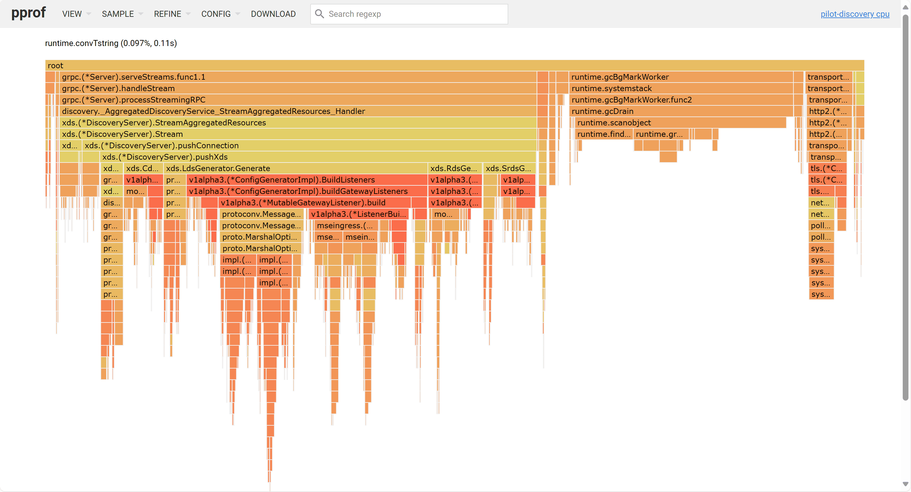
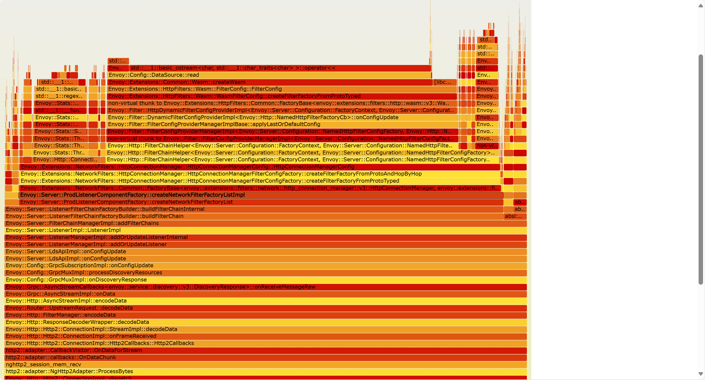
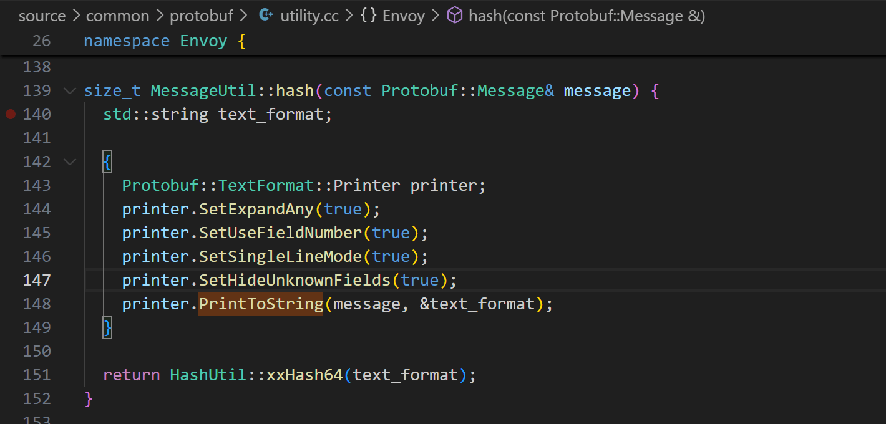
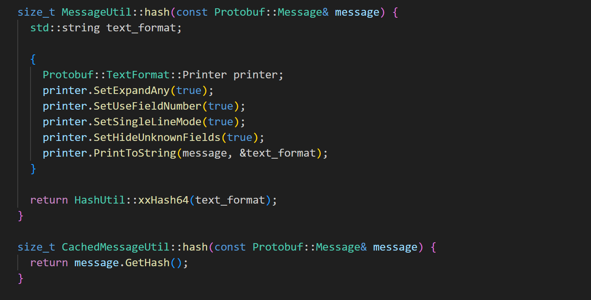
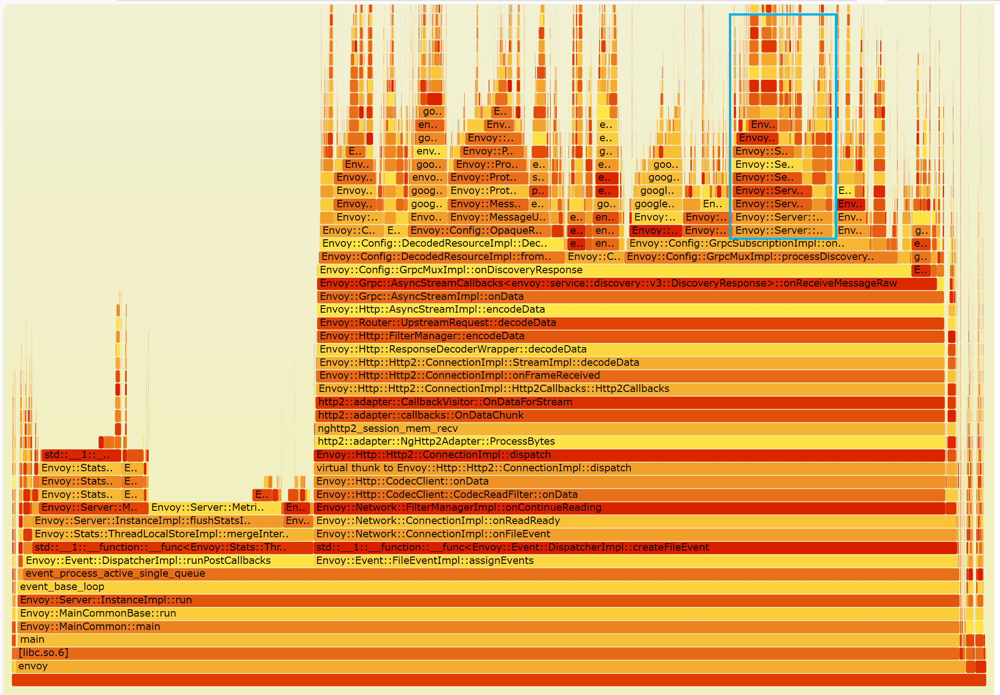
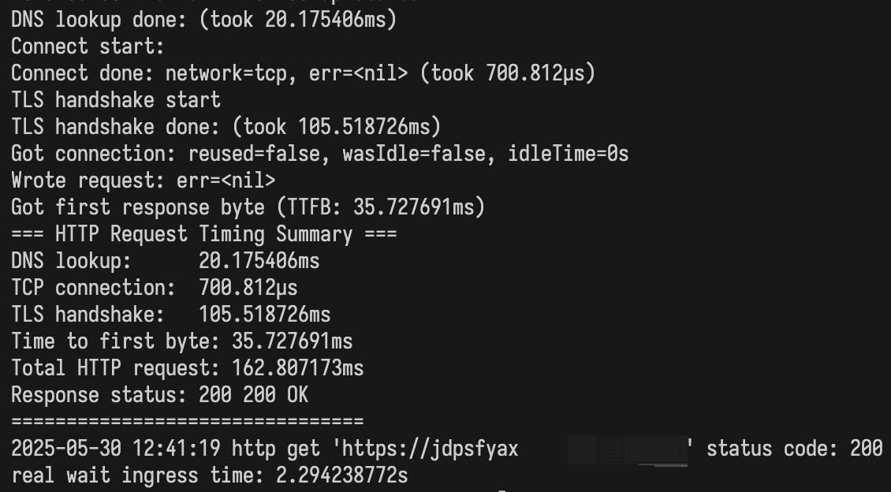
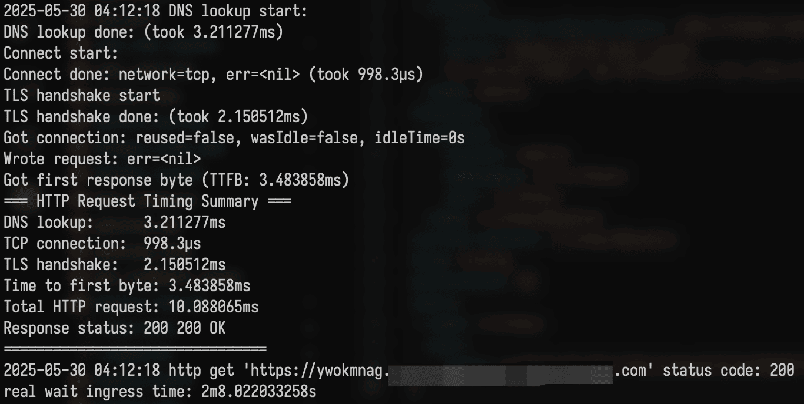

## The Crisis That Changed Everything

Picture this: You're running one of the world's most ambitious cloud platforms, serving nearly 200,000 users across 40,000 instances. Your users create applications, hit deploy, and then... wait. And wait. What should take seconds stretches into agonizing minutes - sometimes even half an hour - before their domains become accessible.

This was our reality at [Sealos Cloud](https://os.sealos.io/). Our Nginx Ingress had reached its breaking point, crushed under the weight of explosive growth. The migration to [Higress](https://higress.io/) initially promised relief, but as we scaled beyond 20,000 Ingress configurations on a single [Kubernetes cluster](https://kubernetes.io/docs/home/), a new nightmare emerged: our gateway was suffocating under its own success.

**The Brutal Numbers:**

- **20,000+ Ingress configurations** managing subdomains and custom domains
- **10+ minute delays** for new domain activation during peak times
- **Exponential degradation** as each additional thousand domains made everything slower
- **User frustration** mounting as their development workflows ground to a halt

Once a cluster exceeded 10,000 Ingress entries, each new gateway configuration triggered an avalanche of computational overhead. During traffic spikes, new domains could take over thirty minutes to go live - an eternity in the cloud-native world where speed is everything.

## Hunting the Performance Killer

Armed with profiling tools and unwavering determination, we embarked on a forensic investigation that would take us deep into the heart of modern service mesh architecture. Our journey would lead us through four critical layers:

1. **Higress** - The gateway orchestrator showing symptoms
2. **Istio** - The control plane harboring hidden inefficiencies
3. **Envoy** - The data plane choking on complexity
4. **Protobuf** - The serialization protocol creating unexpected bottlenecks

### Anatomy of a Gateway Crisis

Understanding the problem required dissecting how Higress processes Ingress changes. The architecture reveals two critical components:

**The Control Plane (The Brain):** When users modify an Ingress, Higress's embedded [Istio](https://istio.io/) fetches the cluster's complete configuration, patches in the changes, and transmits the updated gateway configuration. This orchestration layer seemed like the obvious culprit.

**The Data Plane (The Muscle):** [Envoy](https://www.envoyproxy.io/) receives these configurations and performs the actual traffic routing. It intelligently updates only what has changed, but this "intelligence" came with a devastating cost we were about to discover.

The core challenge? Every domain requires its complete TLS configuration embedded in a filterchain. Even when thousands of domains share identical TLS settings, the system cannot reuse configurations. As domain counts exploded, configuration files became monstrous, creating cascading performance disasters.

Armed with Go's built-in [pprof tool](https://pkg.go.dev/net/http/pprof) and flame graphs, we began our systematic investigation.

## Act I: Taming the Control Plane Beast

Our initial investigation focused on Istio's control plane, where flame graphs revealed two performance villains:

### The GetGatewayByName Catastrophe

Deep within Istio's lds cache lurked a function with an innocent name but devastating impact. `GetGatewayByName` was performing O(n²) enumeration comparisons across all filterchains - essentially checking every filterchain against every other filterchain in a computational death spiral.


The solution was elegantly simple: replace brute-force enumeration with preprocessed hashmaps. What had been a quadratic nightmare became a constant-time lookup.


```go
// Before: O(n²) enumeration disaster
for _, chain := range filterChains {
    for _, existing := range existingChains {
        if chain.Name == existing.Name { /* match found */ }
    }
}

// After: O(1) hashmap lookup salvation
gatewayMap := make(map[string]*FilterChain)
// Preprocessing creates instant lookups
```

### The Protobuf Serialization Trap

Istio's configuration patching process revealed another performance killer. The system converted configuration data to `protobuf.Message`, performed merges, then converted everything back - a process that constantly allocated memory and performed expensive string operations.


Rather than rewriting Istio's entire merge system (an impractical endeavor), we implemented strategic caching. Our breakthrough: ensure each object is serialized and deserialized only once, regardless of how many merge operations occur.

The results were immediate - controller performance improved by over 50%, with flame graphs showing our former bottlenecks had virtually disappeared.



The complete implementation can be found in our optimized codebase:
<https://github.com/luanshaotong/istio/compare/istio-1.19...luanshaotong:istio:test>

## Act II: The Data Plane Revelation

Despite our control plane victories, end-to-end performance remained stubbornly slow. The real monster was lurking in Envoy's data plane, where single-threaded processing created a devastating bottleneck.

Envoy is an open-source service mesh proxy written in C++ ([optimized version by Higress](https://github.com/higress-group/envoy)). To analyze its performance, we employed [perf and FlameGraph.pl tools](https://www.brendangregg.com/flamegraphs.html) to generate comprehensive flame graphs during data plane startup.



### The Filterchain Serialization Nightmare

Envoy's flame graphs revealed a shocking truth: the vast majority of processing time was consumed by protobuf serialization. To understand why, we dove deep into Envoy's change detection mechanism.


Here's the elegant problem: How does Envoy identify which filterchains have changed among 10,000 entries when:

- Each filterchain lacks a dedicated key field
- Complete content comparison is necessary to detect modifications
- The controller-gateway system provides no predictable ordering

The original Envoy implementation serializes the entire filterchain configuration and uses that as a hashmap key for lookups. For the hash function, they chose [xxhash](https://github.com/Cyan4973/xxHash) because of its speed - but even fast hashing becomes expensive when applied to massive serialized configurations.



### The Hash Function Horror Show

The situation was worse than we initially realized. Envoy's use of [`absl::flat_hash_map`](https://abseil.io/docs/cpp/guides/container#hash-tables) meant hash functions were called repeatedly - not just for lookups, but for assignments and updates. With 20,000+ filterchains, these seemingly innocent operations multiplied into performance armageddon.


## Act III: The Breakthrough Solution

Our solution required surgical precision across multiple system layers:

### Revolutionary Recursive Hashing

We abandoned serialization entirely, implementing recursive hashing where a type's hash value is calculated from its subfields' hash values. This eliminated expensive string formatting and memory allocation cycles.

### Strategic Hash Caching

We implemented comprehensive hash caching, even modifying [`Protobuf::Message`](https://protobuf.dev/) to enable cache copying. This prevented redundant hash calculations across system layers.

### The CachedMessageUtil Innovation

Our `CachedMessageUtil` class, built upon Protobuf foundations, minimized Envoy modifications while maximizing performance gains. This approach reduced maintenance overhead for future upgrades while delivering dramatic improvements.




The transformation was remarkable. Post-optimization flame graphs showed that our targeted bottlenecks now consumed only a fraction of total processing time.



## The Triumph: Performance Transformation

### Laboratory Results

Testing with 7,000 active Ingresses revealed stunning improvements:

| Metric                | Before Optimization | After Optimization | Improvement    |
| --------------------- | ------------------- | ------------------ | -------------- |
| Ingress Response Time | 47 seconds          | 2.3 seconds        | **20x faster** |




### Production Reality

The production results were even more spectacular:

- **Domain activation time:** From 10+ minutes to under 5 seconds
- **Peak traffic handling:** No more 30-minute delays during traffic spikes
- **Scalability:** Nearly consistent performance regardless of domain count
- **Resource efficiency:** Dramatically reduced computational overhead

Our current production statistics demonstrate the scale we're operating at:


The before-and-after production performance tells the complete story:




Our Hangzhou cluster, previously plagued by multi-minute domain activation delays, now delivers sub-5-second response times consistently. The improvements scale beautifully - what used to become unusable at large scales now maintains peak performance.

## The Engineering Victory

These optimizations represent more than performance improvements - they demonstrate the power of systematic investigation and surgical optimization. By understanding the deep architecture of modern service mesh systems, we transformed a scaling disaster into a competitive advantage.

### Key Innovations:

- **Istio Control Plane:** Hashmap-based gateway lookups and intelligent Protobuf caching
- **Envoy Data Plane:** Recursive hashing algorithms and comprehensive hash caching
- **System-wide:** Zero-API-impact optimizations ensuring seamless deployment

### The Broader Impact:

- **User Experience:** From frustrating delays to instant gratification
- **Operational Excellence:** Predictable performance at any scale
- **Resource Optimization:** Dramatic reduction in computational waste
- **Engineering Confidence:** Bulletproof gateway performance under extreme loads

## Looking Forward: The Next Chapter

This optimization victory marks just the beginning of our performance journey. Sealos now confidently serves 200,000 users across 40,000 instances, with our gateway handling 20,000+ Ingress configurations without breaking a sweat.

Our experience has generated invaluable expertise in:

- Advanced [Protobuf](https://protobuf.dev/) optimization techniques
- High-performance hashing algorithms using [xxhash](https://github.com/Cyan4973/xxHash) and beyond
- Strategic caching implementations
- Large-scale service mesh performance tuning with [Istio](https://istio.io/) and [Envoy](https://www.envoyproxy.io/)

The lessons learned extend far beyond our specific use case. Any organization wrestling with [Kubernetes](https://kubernetes.io/docs/home/) Ingress performance at scale can benefit from these deep optimization techniques. As cloud-native adoption accelerates and single-cluster multi-tenancy becomes the norm, these performance patterns will prove increasingly crucial.

## The Power of Deep Optimization

This story illustrates a fundamental truth about modern distributed systems: surface-level optimizations often miss the real performance killers lurking in complex system interactions. By diving deep into the architecture of [Higress](https://higress.io/), [Istio](https://istio.io/), and [Envoy](https://www.envoyproxy.io/), we discovered that the most devastating bottlenecks existed at the intersection of well-designed components.

Our journey from 10-minute delays to 5-second responsiveness wasn't just about fixing code - it was about understanding the intricate dance between control planes and data planes, serialization and caching, algorithms and architecture. The result? A gateway system that scales beautifully and performs consistently, no matter how ambitious our users' demands become.

_Follow the [Sealos Blog](https://sealos.io/blog) for more deep dives into cloud-native performance optimization and architectural innovations._
