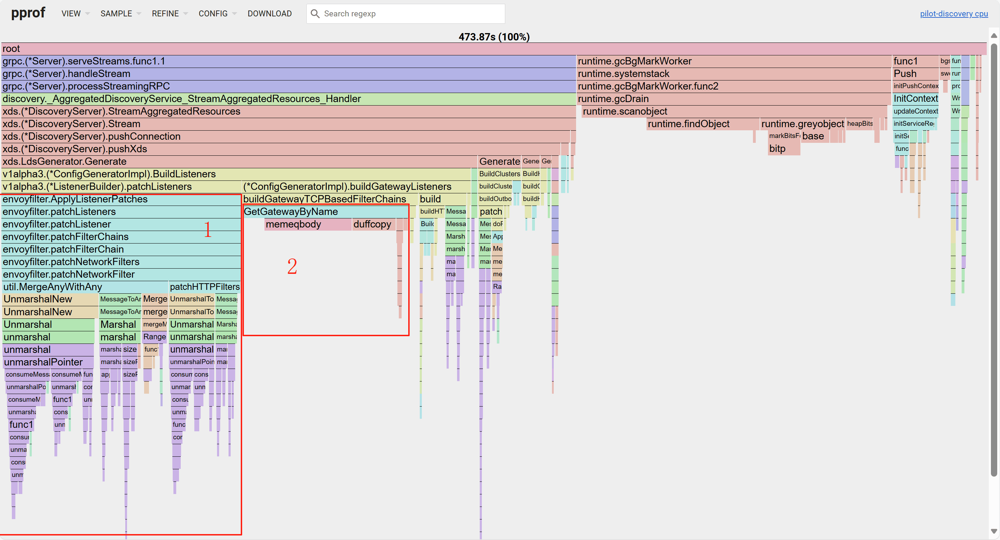
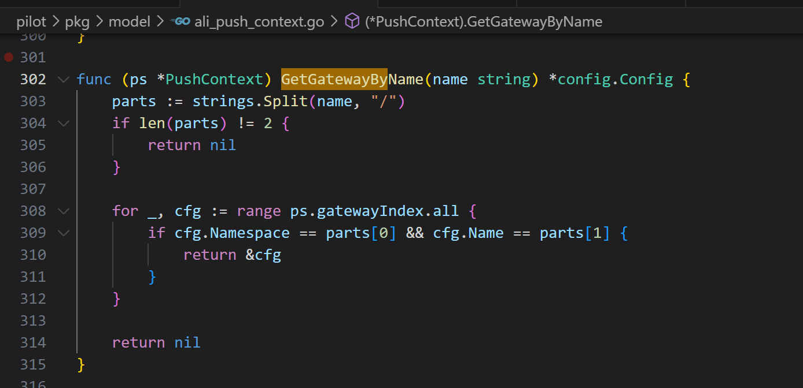
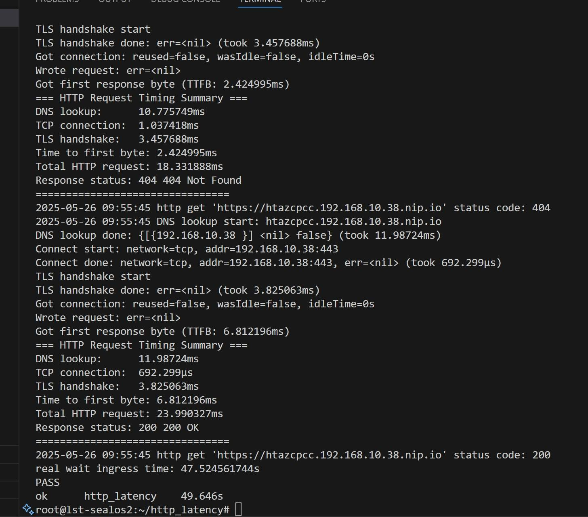
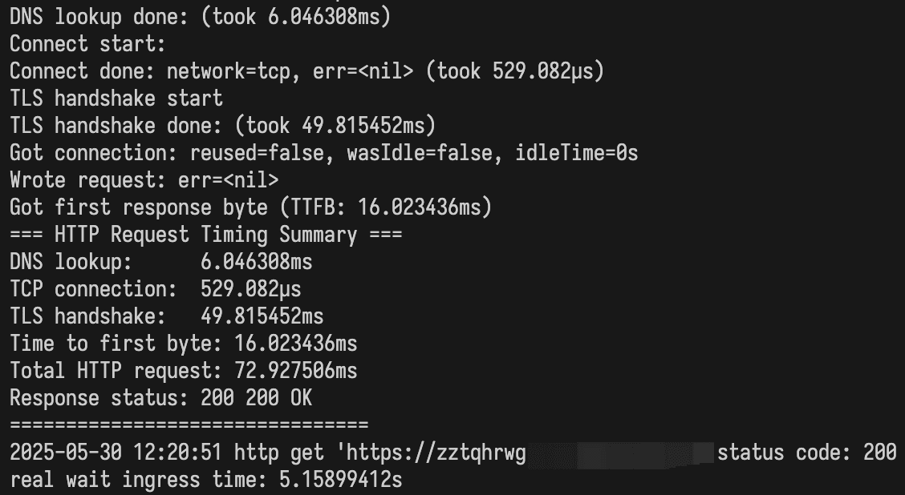

[书接前文](/blog/sealos-envoy-vs-nginx-2000-tenants)，Sealos 公有云用户暴增后，原有的 Nginx Ingress 已经支撑不住了，在经过多方调研之后，我们选择了 [Higress](https://higress.io/)。

但随着 [Sealos 公有云](https://os.sealos.io/)用户量的持续上升，新的问题接踵而至，我们的网关逐渐遇到了性能瓶颈。

现在 Sealos 上跑着将近 **4 万个实例**，服务着快 **20 万的用户**，Ingress 数量也突破了 **2 万**！

单个集群当 ingress 数量超过 1w 条时，新的网关条目生效速度线性下降，业务高峰时新的域名生效需要十几分钟甚至半小时以上。

这个问题一直困扰着我们，影响了许多用户体验，也花费了我们许多精力。直到今天，我们对 Higress istio 和 Envoy 底层进行优化成功地解决了这个问题，将十几分钟级的等待时间降低到了秒级。

本文将详细阐述我们如何通过对 Higress 及其依赖的 [Istio](https://istio.io/)、[Envoy](https://www.envoyproxy.io/) 甚至 [Protobuf](https://protobuf.dev/) 进行深度性能优化，成功将分钟级的配置同步等待时间降低到了秒级的，希望能给正在或将来可能踩到类似坑的朋友们一点启发，特别是那些关注 **K8S Ingress 优化** 和 **网关性能瓶颈** 的企业和开发者。

## 从未有人遇到过的难题

作为公有云服务提供商，我们会分配基于主站域名的二级域名方便用户开发与测试，同时为保证安全，从用户端 (公网) 到集群网关的链路流量采取了 TLS 加密。此外，我们也支持用户自定义域名 CNAME 解析到其业务的需求，且支持自动签名与续签。这些产品优势与策略导致在同一可用区出现海量二级域名与用户自定义域名共存的情况。

我们是第一个做到用同一个 [K8S 集群](https://kubernetes.io/docs/home/)支撑如此海量用户的公有云厂商，但也需要着手解决一个从未有人遇到过难题，即**海量域名 Ingress**场景下的**网关性能瓶颈**。

目前所有开源生态的产品都没有很好适配单集群海量租户海量应用网关条目的场景，在我们的观察下，**随着域名数量的上升，Ingress 配置同步的时间会非线性劣化，创建 Ingress 后，用户业务需要等待很长一段时间才能从公网访问。**

## 从 Higress 到 Istio 再到 Envoy 和 Protobuf

整个的优化流程我们探索了非常多的内容，随着优化的进度，我们的关注点也从最开始的 Higress 本身，逐渐深入到了所依赖 **Istio (流量治理)**，最后甚至深入到了底层的 **Envoy (网关)** 和其依赖的 **Protobuf**。

### Higress 工作流程

在用户变更 Ingress 后，Higress 会进行一系列处理，当处理完毕后，则可以通过 Ingress 中的域名进行访问。Higress 分为 **controller** 和 **gateway** 两个组件，其中：

- controller 是全局管控组件，称为**控制面**，在收到 Ingress 的变更请求后，controller 中的 Istio 首先会获取集群当前最新的 Ingress 配置，并将 Ingress 变更 patch 到网关配置中，然后将完整的 Ingress 配置发送给 gateway。
- gateway 是严格意义上的网关，称为**数据面**，用于管理本节点的路由规则，进行流量代理或转发。当接收到 controller 发送的网关配置后，会在 envoy 中解析，并更新有变化的部分。更新完成后用户即可通过 gateway 访问新的服务域名。

在整个工作流程中，配置同步耗时的主要原因是，在 envoy 完整的网关配置中，对于一个域名必须将完整的 TLS 配置信息 (包含加密方式、证书信息等) 写入配置文件中与域名相关联的部分，称为 filterchain。**即便可能有复数个域名的 TLS 配置相同，但域名的 TLS 配置目前无法复用**，因此当域名增多后，具有 TLS 配置的域名就会导致整个配置文件很大，配置生成、解析的过程就会非常慢，直接影响了**TLS 配置性能**和整体**网关性能瓶颈**。

### 控制面优化

因为我们线上的 controller 总是处于高负载状态，最初我们以为热点在 controller 生成新的网关配置的过程中，因此初期尝试通过优化控制面来加速配置同步。

controller 使用 Istio 进行配置的生成和下发，这部分对应了 <https://github.com/higress-group/istio> 的代码。

通过 go 语言自带的 [pprof 工具](https://pkg.go.dev/net/http/pprof)抓取火焰图：

我们发现其中有两部分花费较多：

1. protobuf 的序列化和反序列化
2. GetGatewayByName，一个未知函数

#### GetGatewayByName

这个函数是官方引入的 lds cache 中调用的一个函数，它从所有的 filterchain 中找到对应的 filterchain 名字，但原本的实现是枚举比较，我们每个 filterchain 都匹配时实际的效率是 O(n^2) 的，非常耗时。

解决方法也很简单，改为预处理一个 hashmap 进行匹配即可。

#### protobuf 的序列化和反序列化

istio 在做配置文件 patch 时采取了一个非常不优雅的实现，即将配置信息转换为 `protobuf.Message`，merge 后再转换回原类型。因为转换时使用的 unmarshal 和 marshal 会重新申请内存并写入字符串，耗费大量时间。这正是 **Protobuf 序列化优化** 的关键点。

istio 这样实现的原因笔者也能理解，这样可以不用为不同的配置类型写多个合并操作的实现，代码会较为整洁。

顺着这个思路，我们第一时间想到的解决方案是不进行序列化和反序列化，而为每个合并操作写单独的函数实现。但这个方案很快被否定了，因为要实现合并的类过多，工作量非常大。而且对于优化团队来说，我们并不是为了开发网关功能，深入了解 envoy 的配置类成员实现是一项收益很低的工作。

我们观察到 patch 分为多个阶段，在不同的阶段可能会多次序列化和反序列化同一个对象。由此我们想到了另一个思路，为所有需要合并的数据进行缓存，保留反序列化后的对象，这样可以保证每个对象只序列化和反序列化一次。

优化完 controller 的性能提升了 50%+，最终的实现代码可以参考：

<https://github.com/luanshaotong/istio/compare/istio-1.19...luanshaotong:istio:test>

### 数据面优化

完成控制面的优化后，但是在测试中我们发现配置同步的性能提升不明显，因此我们把关注点转移到了数据面上，推测数据面才是核心耗时的原因。数据面使用了 Envoy 进行配置解析、管理和实际的流量转发，目前它采取了单线程的处理模式，同时间只能处理一个配置变更请求。

Envoy 是一个 C++语言实现的开源网格服务代理 (fork 版本：<https://github.com/higress-group/envoy>)，所以我们首先用 [perf + FlameGraph.pl 工具](https://www.brendangregg.com/flamegraphs.html)抓取了数据面启动时，envoy 的火焰图：

可以观察到主要的时间花费就是构建 filterchain 的实例，目前我们的目标还不是优化这启动时间 (可以期待下次分享)，不过这提示了我们可能可以使用缓存来记录未修改的 filterchain。

接着我们抓取了 ingress 变更时 envoy 的火焰图：

通过火焰图我们发现绝大多数时间依然花在了 protobuf 的序列化函数上，具体是什么原因呢？我们对源码进行了深入的分析，最终找到了问题所在。

原来 envoy 本身已经对配置文件实现了缓存功能，每次更新整体配置后，envoy 会比对每个 filterchain 配置是否变更，如果没有变更，则不会重新生成新的 filterchain 的实例，这样在每次用户变更 Ingress 后，envoy 只需要**从 10000 个 filterchain 中找到变更过的同步变更，不需要将所有 filterchain 实例重新同步一次。**

细心的小伙伴应该已经发现重点了，“从 10000 个 filterchain 中找到变更过的” 这件事情是怎么实现的呢？对，就是用序列化和 hash 来实现的。

#### 如何找到变更的域名

如何从 10000 个 filterchain 中找到变更过的那一个，看起来是一个很简单的问题。但这里有一些限制：

1. 每个 filterchain 是一个基于 `Protobuf::Message` 的配置文件，但没有特定的 key 域来检索这个 filterchain。
2. 除非全文对比，否则无法确定旧的 filterchain 是否被修改过。
3. 整体的 controller-gateway 架构仅保证数据的最终一致性，所以无法按顺序来查找对应的 filterchain。

基于以上原因，只能将 filterchain 的配置内容完整的进行比对，排除掉与旧配置相同的未修改 filterchain，才能确保找到新变更的 filterchain。

原版 envoy 选择了将整个 filterchain 配置内容序列化后作为 hashmap 的 key 来检索，同时 hash 函数选择了速度最快的 [xxhash](https://github.com/Cyan4973/xxHash) (见下图)。

但是配置内容序列化是非常耗时的，因为对数据进行格式化会做非常多的字符串处理 (可以参考 ACM 竞赛中使用 cout、printf 和手写输出的性能差异十分明显)。同时 C++ 的 string 会频繁分配和回收内存，也会浪费大量性能。这是**解决 Higress 配置同步耗时长的问题**所必须攻克的难点之一。

envoy 不仅仅会对 filterchain 进行 hash，还会父类型的 listener 和其他子类型进行 hash，导致多次的重复比较操作，会放大序列化的性能影响。

更严重的是，hashmap 除了检索外，还会在赋值、变更等操作时多次调用 hash 函数，极大增加了这部分的时间消耗 (这里用的 [`absl::flat_hash_map`](https://abseil.io/docs/cpp/guides/container#hash-tables))。

#### 极限性能优化

具体的探索思路不赘述了，讲一下最终实现的优化点：

1. 我们抛弃了序列化方法，直接使用 hash 函数进行递归 hash，即一个类型的 hash 值等于对该类型子域的 hash 值之和进行 hash。这大量减少了格式化和申请内存的时间。
2. 由于递归 hash 操作，我们可以直接重复利用多层级的 hash 值，不用分别计算，节约了许多时间。
3. 针对 hash_map 多次调用 hash 函数的问题，我们实现了 hash 值的缓存。为此我们甚至修改了 `Protobuf::Message` 的赋值方法，得以实现 hash 值缓存的拷贝。

图中为继承原版的 `MessageUtil` 类实现了 `CachedMessageUtil` 类的接口，由于具体的实现放在了 Protobuf 中，使得我们对于 envoy 的改动非常小，在未来 envoy 升级时修改的代价也很低。

## 最终的效果

### 性能

#### 测试环境

我们测试了存在 7000 个有效 Ingress (带 TLS 配置) 的情况下，从 Ingress 创建到域名可访问的时间，结果提升了 5 倍：

| 对比项               | 原版 | 优化后 |
| -------------------- | ---- | ------ |
| Ingress 变更响应时间 | 47s  | 2.3s   |

原版：

优化后：

这里展示的是单次测试性能提升。由于 envoy 的单线程处理方式，实际使用时会出现多次请求叠加造成累计等待的问题。

我们在线上集群的性能提升更加明显。原本在 hzh 集群，公网域名需要几十分钟才能就绪，目前仅需不到 5s 就可以就绪了。

#### 线上环境

线上资源数量：

线上原始响应时间：

优化后的响应时间：

线上环境与测试环境比例差异较大，主要原因目前我们推测是因为线上环境有大量的业务流量请求负载，在优化了 envoy 的响应性能之后收益更大。

### 兼容性

我们本次对网关组件的修改不涉及任何 API 层面的改动，也没有影响内部的业务逻辑，可以实现无损升级。

## 总结 & 未来计划

总而言之，通过对 Higress 控制面和数据面的深度性能优化，特别是对 Istio 的配置处理和 Envoy 的 filterchain 同步机制进行了优化和改进，Sealos 总算把海量域名下 Ingress 配置同步这个老大难问题从分钟级给降低到了秒级。用户体验上去了，我们心里也踏实了。这里面涉及到了 Protobuf 序列化、哈希算法、缓存机制，也算是积累了不少经验。

当然，这次优化只是我们提升 Sealos 网关优化能力路上的一小步。将来，我们还会继续优化 Higress 网关和其他核心组件的性能问题（欢迎关注 [Sealos 博客](https://sealos.io/blog) 获取最新进展），努力解决大规模域名 Ingress 方案里的各种挑战，给 Sealos 集群未来更大规模的增长保驾护航。