**TL;DR**: We built an SSH Gateway that routes all Devbox SSH traffic through port 2233, eliminating Kubernetes NodePort exhaustion. Two routing modes: (1) public key fingerprint lookup, (2) username-encoded destination with Agent Forwarding. [Source code →](https://github.com/labring/sealos/tree/main/service/sshgate)

---

## What Is an SSH Gateway?

An **SSH Gateway** routes SSH connections to multiple backend servers through one port. In Kubernetes, it prevents NodePort exhaustion by multiplexing SSH traffic.

Instead of allocating one [NodePort](https://kubernetes.io/docs/concepts/services-networking/service/#type-nodeport) per SSH destination, a gateway multiplexes connections through a shared port. SSH uses zero NodePorts, and configurations stay stable across restarts.

**What you'll learn:**

- Why one-port-per-Devbox SSH doesn't scale in Kubernetes
- How SSH's three-layer design enables single-port routing
- Two routing methods: public key fingerprint lookup and username encoding
- How SSH Agent Forwarding authenticates users without exposing private keys
- Implementation details with open-source code

We built this for **[Sealos Devbox](/docs/overview/intro)**, our [cloud development environment](/blog/what-is-cloud-development-environment) where each workspace needs SSH access. The architecture applies to any multi-tenant [Kubernetes](/blog/what-is-kubernetes) platform facing port constraints.

It started with a support ticket.

## The Problem: Kubernetes NodePort Limits Breaking Developer Workflows

A support ticket hit our queue:

> I'm on the Starter plan. 4 NodePorts max. I have 3 Devboxes, and each one eats a port just for SSH. That leaves me one port for everything else. Normal shutdown won't release the port—it just sits there, holding my quota hostage. Cold shutdown frees it up, but when I restart, the port number changes and my SSH config breaks. What am I supposed to do?

We pulled the logs. Searched for similar complaints. One became ten. Ten became fifty.

Then enterprise teams started writing in. "We run 100 Devboxes for 50 engineers. Even on our plan, the port quota runs out fast. We forced cold shutdowns to reclaim ports—but reconfiguring SSH after every restart is killing our productivity."

Same story, over and over. We had forced users into a choice that should never have existed.

### How Kubernetes NodePort Allocation Works

**NodePort** is a Kubernetes service type that exposes applications to external traffic. When you create a NodePort service, Kubernetes allocates a port from a fixed range (typically 30000–32767) and opens it on every node. Traffic arriving at that port gets routed to the correct Pod.

In our original architecture, every Devbox got its own NodePort for SSH access—port 30123 for Alice, port 30124 for Bob, and so on.


This approach doesn't scale. **NodePorts are finite**, and cloud platforms enforce quotas per tenant to prevent exhaustion.

On Sealos Cloud, each [subscription tier](/pricing) has a cap:

| Plan | NodePort Limit |
|------|----------------|
| Starter | 4 |
| Hobby | 8 |
| Standard | 16 |
| Pro | 32 |

The math doesn't work. One Devbox, one SSH port. Three Devboxes on a Starter plan uses 75% of your quota just to log in.

### The Quota Trap: Normal Shutdown vs. Cold Shutdown

We introduced two shutdown modes to address port exhaustion. Each created its own problem.

**Normal shutdown** keeps the Devbox suspended but preserves its port assignment. Your SSH config stays valid, but the port still counts against your quota even while the Devbox sleeps. You're paying for resources you aren't using.

**Cold shutdown** releases the port back to the pool. Your quota is available again, but when you restart, Kubernetes assigns a new port number and your SSH config breaks. Every restart means reconfiguring your local `~/.ssh/config`, updating scripts, and notifying teammates.

```mermaid
flowchart TD
    Start([User wants to shut down Devbox]) --> Decision{Which shutdown mode?}

    Decision -->|Normal Shutdown| Normal[Port reserved<br/>Config unchanged]
    Decision -->|Cold Shutdown| Cold[Port released<br/>Quota freed]

    Normal --> NormalCost[💰 Still billed]
    Cold --> ColdSave[💰 Billing stops]

    NormalCost --> Restart1[Next startup]
    ColdSave --> Restart2[Next startup]

    Restart1 --> SamePort[✅ Same port<br/>Works immediately]
    Restart2 --> NewPort[❌ Port changed<br/>30123 → 30456]

    NewPort --> Pain[😫 Reconfigure everything<br/>• Update ~/.ssh/config<br/>• Update IDE settings<br/>• Update CI/CD scripts]

    style Decision fill:#4a4a3a,stroke:#d4a574,stroke-width:2px
    style NormalCost fill:#5a4a4a,stroke:#d47474,stroke-width:2px
    style ColdSave fill:#3a5a4a,stroke:#74d4a4,stroke-width:2px
    style NewPort fill:#5a4a4a,stroke:#d47474,stroke-width:2px
    style Pain fill:#5a3a3a,stroke:#d46a6a,stroke-width:2px
```



We'd turned an infrastructure constraint into a daily headache. Users shouldn't need to know what a NodePort is, or have to choose between hoarding quota and staying productive.

This wasn't a feature request. It was a trap we'd built ourselves.

## Understanding the SSH Protocol Architecture

We were stuck for a week. Every fix we tried hit the same wall: ports are finite, and we couldn't create more quota.

During a Friday review, our architect stopped us mid-sentence.

"Wait. Why does each Devbox need its own port? SSH can multiplex connections. One port should be enough."

Silence. Someone pulled up the RFC.

**[SSH (Secure Shell)](https://www.ssh.com/academy/ssh)** has been around since 1995—Tatu Ylönen built it at Helsinki University of Technology to replace Telnet and other insecure protocols. We all use SSH every day. But reading the spec? That's different.

We started reading, and found our answer in the protocol's three-layer architecture.


### SSH Transport Layer: Key Exchange and Host Authentication

The **SSH Transport Layer** is the protocol's foundation. It handles encryption negotiation and server identity verification before any user credentials are exchanged.

When you type:

```bash
$ ssh ubuntu@gateway.sealos.io -p 2233
```

...the transport layer kicks in immediately. Here's what happens:


1. **Protocol version exchange.** Client and server agree on SSH-2.0.
2. **Algorithm negotiation.** Both sides agree on encryption ciphers, MAC algorithms, and key exchange methods.
3. **Key exchange.** The [Diffie-Hellman](https://en.wikipedia.org/wiki/Diffie%E2%80%93Hellman_key_exchange) exchange establishes a shared session key without transmitting it.
4. **Server authentication.** The server sends its **Host Key**, a public key that uniquely identifies this server.

That last step caught our attention. You've seen this prompt:

```
The authenticity of host '[gateway.sealos.io]:2233' can't be established.
ED25519 key fingerprint is SHA256:abc123...
Are you sure you want to continue connecting (yes/no)?
```

Type `yes`, and the key gets saved to `~/.ssh/known_hosts`:

```bash
$ cat ~/.ssh/known_hosts
[gateway.sealos.io]:2233 ssh-ed25519 AAAAC3NzaC1lZDI1NTE5AAAAIxxx...
```

If the Host Key changes unexpectedly on subsequent connections, SSH throws a warning. Possible man-in-the-middle attack.

This raised our first design constraint. If we ran multiple Gateway replicas behind a load balancer, each replica would generate its own Host Key. Users would hit different replicas on different connections and see that warning every time.

**Solution: deterministic key generation.** Every Gateway replica derives the same Ed25519 Host Key from a shared seed stored in Kubernetes Secrets. Same key, every replica, every time.

### SSH Authentication Layer: Public Key Verification Flow

Once the transport layer establishes a secure channel, the **SSH Authentication Layer** proves the user's identity.

SSH supports several authentication methods—password, keyboard-interactive, public key. Sealos Devbox uses **public key authentication**.

Here's how it works:


1. **Client sends public key.** The client offers its public key to the server.
2. **Server checks authorized_keys.** If the key matches an entry in `~/.ssh/authorized_keys`, the server proceeds.
3. **Challenge-response.** The server generates a random challenge and asks the client to prove it has the private key.
4. **Client signs with private key.** The client uses its private key to create a signature and sends it back.
5. **Server verifies.** The server checks the signature against the public key. Match? Access granted.

**The private key never crosses the wire.** The server verifies possession without ever seeing the secret.

We stared at this flow. Then it clicked.

The server *sees the public key during authentication*. Not after—during. That's our routing hook.

If our Gateway intercepts the authentication handshake, we can extract the public key, look it up in a database, and determine which Devbox the user wants—before the connection is fully established.

One key, one Devbox. No port numbers. No user configuration.

### SSH Connection Layer: Channel Multiplexing Explained

After authentication, the **SSH Connection Layer** takes over. This is where **channel multiplexing** happens.

A single TCP connection can carry multiple independent **channels**—separate logical data streams that don't interfere with each other.


You've used this without realizing. Open an SSH session, run a command, transfer a file with `scp`, forward a port with `-L`—all over one connection, each in its own channel.

The most common channel type is the **session channel**, which provides your interactive shell. When you run `ls -la`:

1. Client requests a new session channel (type: "session")
2. Server allocates the channel and confirms
3. Client requests a pseudo-terminal (PTY) for interactive use
4. Client sends the "exec" or "shell" request
5. Command output flows back through the channel
6. Channel closes when the command completes or the shell exits


Each channel manages its own flow control using a sliding window protocol. Multiple channels operate in parallel without collision.

That's when the architecture clicked.

We'd been thinking about this wrong. We didn't need to route users at the **port level**. We could route them at the **channel level**.

- **Authentication** tells us *who* (which public key, which user)
- **The connection layer** handles *where* (multiplexing to the right Devbox)

One port, many Devboxes, no collision.

The protocol had the answer all along. We just needed to build the Gateway.

## Building the SSH Gateway: One Port for All Devboxes

A traditional SSH server is a destination. You connect to it, and it runs your commands locally.

Our **SSH Gateway** is a relay. You connect to it, and it forwards you somewhere else—your actual Devbox, running in a different Pod, in a different namespace, with a different IP.


From the outside, the topology looks similar to before. One connection, one Devbox. But the resource accounting is different.

**Old architecture:** One NodePort per Devbox. A hundred Devboxes for your team? A hundred ports consumed—before you expose a single real service.

**New architecture:** One NodePort. Port 2233. Every Devbox, every user, every connection—all through that single entry point.

SSH no longer competes for quota. Those 4 or 8 or 32 NodePorts in your plan? They're yours again—for databases, APIs, web servers, the things that need external exposure.

But we'd traded one problem for another.

When everyone enters through the same door, how do you know where each person is headed? A thousand users hit port 2233 simultaneously. Which Devbox does each one want?

We found two answers, each rooted in a different layer of the SSH protocol.

### Routing by Public Key Fingerprint

The simplest approach: use the SSH key itself as the routing identifier.

Every Devbox already has a key pair. When you create a Devbox, we automatically generate an [Ed25519](https://ed25519.cr.yp.to/) key pair, which is faster and more compact than RSA. The public key stays on the Devbox in `~/.ssh/authorized_keys`. The private key gets downloaded to your local machine.

One key, one Devbox. The mapping already exists. We just had to use it.

The Gateway maintains a lookup table:

```
Public Key Fingerprint  →  Devbox Location
─────────────────────────────────────────────
SHA256:abc123...        →  ns-alice / workspace-1 / 10.0.42.15
SHA256:def456...        →  ns-bob / dev-env / 10.0.87.22
SHA256:ghi789...        →  ns-alice / workspace-2 / 10.0.42.16
```

When a user connects, the Gateway intercepts the authentication handshake, extracts the offered public key, computes its fingerprint, and queries the routing table.


1. User initiates SSH connection to `gateway.sealos.io:2233`
2. Transport layer completes (encryption established)
3. Authentication begins—client offers its public key
4. **Gateway extracts the public key before forwarding**
5. Gateway queries: "Which Devbox owns this key?"
6. Match found → Gateway opens a new SSH connection to that Devbox's internal IP
7. Gateway relays all subsequent traffic between user and Devbox

No match? Connection rejected. The key isn't registered to any Devbox.

From the user's perspective, the experience works:

```bash
# First time: download your Devbox key via CLI
$ sealos devbox ssh my-workspace
Downloading SSH key to ~/.ssh/sealos/my-workspace...
Connecting to my-workspace...
Welcome to Ubuntu 22.04 LTS
ubuntu@my-workspace:~$

# The CLI auto-generates your SSH config
$ cat ~/.ssh/config
Host my-workspace
    HostName gateway.sealos.io
    Port 2233
    User ubuntu
    IdentityFile ~/.ssh/sealos/my-workspace

# After that, just use standard SSH
$ ssh my-workspace
ubuntu@my-workspace:~$
```

Shut down the Devbox. Restart it a week later. Cold boot it after a month of vacation. **The key stays the same. The config stays the same. SSH works.**

This approach works because of what we discovered in the authentication layer: the Gateway sees the public key *during* the handshake, before the connection is fully established. Each public key fingerprint is cryptographically unique, so there's no ambiguity. No collisions, no guessing.

For most Sealos users, this is the only mode they'll ever need. But not everyone wants to use our generated keys.

### Routing by Username Encoding (bring your own key)

Some developers have their own SSH keys—keys they've used for years, backed up properly, integrated into their workflows. Some teams manage keys centrally through identity providers and don't want per-Devbox credentials scattered across employee laptops. Some security-conscious users rely on hardware tokens like [YubiKey](https://www.yubico.com/), where the private key is generated on-device and never leaves.

For these users, the public-key-as-identifier approach breaks down. **The Gateway has never seen their key. There's nothing to look up.**

We needed a different routing signal. Something explicit. Something the user controls.

The answer was obvious once we saw it: **encode the destination in the SSH username**.

Standard SSH usernames are strings. The protocol doesn't care what's in them. Nobody said we couldn't embed routing information.

We settled on a format: `user@namespace-devbox`

Instead of:

```bash
$ ssh ubuntu@gateway.sealos.io -p 2233
```

You write:

```bash
$ ssh "ubuntu@ns-alice-my-workspace"@gateway.sealos.io -p 2233
```

The Gateway parses `ubuntu@ns-alice-my-workspace` and extracts:

| Component | Value |
|-----------|-------|
| Actual username | `ubuntu` |
| Namespace | `ns-alice` |
| Devbox name | `my-workspace` |

Now the Gateway knows where to route—no key lookup required.


But authentication still needs to work. The Devbox's `authorized_keys` contains the user's personal public key. To complete the connection, the Gateway needs to authenticate to the Devbox on the user's behalf.

Here's the problem: **the only credential that will unlock that door is the user's private key. And we don't have it. We can't have it.**

Asking users to upload private keys to a third-party service? Non-starter. Security teams would reject it. Compliance frameworks would flag it. Users would refuse.

The Gateway sat in an impossible position: a valid connection from the user on one side, a locked Devbox door on the other, and no key for either.


We needed a way to borrow the user's signing capability without possessing their private key.

The answer had been in SSH all along. We just hadn't realized it.

## SSH Agent Forwarding: Authenticating Without Exposing Keys

Someone on the team spoke up during a late-night debugging session.

"What about Agent Forwarding?"

We'd all used it before. Bastion hosts. Jump boxes. Hopping between servers without copying private keys around. Standard ops practice. Been in OpenSSH since the early days.

But how did it *actually* work? None of us could explain the mechanics.

We pulled up the docs. And found exactly what we needed.

### What Is SSH Agent and How It Works

You've probably used SSH Agent without thinking about it.

Every time you type `ssh user@server` and *don't* get prompted for your key's passphrase, that's the agent at work. It's a daemon running on your laptop, holding your private keys in memory, ready to sign authentication challenges.

```bash
# Start the agent (most systems do this automatically at login)
$ eval $(ssh-agent)
Agent pid 12345

# Load a private key into the agent
$ ssh-add ~/.ssh/id_ed25519
Enter passphrase for /home/alice/.ssh/id_ed25519: ****
Identity added: /home/alice/.ssh/id_ed25519 (alice@laptop)

# Check which keys are currently loaded
$ ssh-add -l
256 SHA256:abc123... alice@laptop (ED25519)
```

The agent does two things:

1. **Stores your private keys** (encrypted in memory, unlocked by passphrase)
2. **Signs data when asked** (without revealing the key)

Here's what happens when you connect to a server:


The SSH client never touches your private key file directly. It asks the agent: "Sign this." The agent signs it.

**The private key never leaves the agent's memory.** Servers only see signatures—never the key itself.

What does this buy you? Even if a remote server is compromised, attackers can't steal your private key. They might hijack your agent connection while you're logged in and request signatures for their own purposes, but they can't extract the key for later use. The moment you disconnect, their access ends.

Hardware tokens like YubiKey take this further. The private key is generated *inside* the device and cannot be exported. The token acts as its own agent, requiring a physical tap for each signature.

### How Agent Forwarding Relays Authentication

Your agent can sign things locally. But what happens when you're on a remote server and need to authenticate to *another* server?

You could copy your private key to the remote machine. Don't. That defeats the entire point.

**SSH Agent Forwarding** solves this. It extends your local agent's reach through the SSH connection, across networks, into remote servers without moving the key.

```bash
# Connect with agent forwarding enabled
$ ssh -A user@jump-server
```

Or in your SSH config:

```
Host jump-server
    HostName jump.example.com
    ForwardAgent yes
```

That `-A` flag (or `ForwardAgent yes`) tells the server: "I have an agent running locally. If you need signatures, ask me."

But *how* does a remote server talk to a daemon on your laptop? The mechanics are worth understanding, especially since our Gateway exploits them.

#### Step 1: Establish the Primary Connection

First, the normal SSH handshake:


Nothing special yet. Just a regular SSH connection with a flag set.

#### Step 2: Client Requests Agent Forwarding

Once the session is established, the client opens a session channel and sends a special request:


The server acknowledges the capability.

#### Step 3: Server Opens a Reverse Channel

When the server needs a signature, it opens a channel *back* to the client:

```mermaid
sequenceDiagram
    participant C as Client
    participant S as Server

    Note over S: Server needs to authenticate<br/>to another host

    S->>C: SSH_MSG_CHANNEL_OPEN<br/>type: auth-agent@openssh.com

    Note over C: Client accepts the reverse channel
    C->>S: SSH_MSG_CHANNEL_OPEN_CONFIRMATION

    rect rgb(60, 110, 70)
        Note over C,S: Agent channel established<br/>Direction: Server → Client
    end
```



This is a **reverse channel**—initiated by the server, pointing back to the client. Most SSH traffic flows client-to-server. Agent forwarding reverses that.

On the server side, SSH creates a Unix domain socket (something like `/tmp/ssh-XXXX/agent.12345`) and sets `SSH_AUTH_SOCK` to point to it. Any process that writes to this socket is talking through the SSH connection, back to your laptop's agent.

#### Step 4: Sign Through the Tunnel

Suppose the server tries to SSH somewhere else—an internal database, a Git server, another jump host. The remote target demands authentication. The server doesn't have a key. But it has your forwarded agent.


The signature travels: Agent → Client → Server → Target. The key travels: nowhere.

This is the classic jump-host pattern. SSH into a bastion, forward your agent, hop to internal servers. Authenticate everywhere with your personal key—even though that key exists only on your laptop.

#### The Security Trade-off

Agent forwarding isn't free. While your connection is active, anyone with root on the server can hijack your forwarded agent. They can't steal the key—but they can *use* it. Request signatures. Authenticate as you. Access whatever your key unlocks.

The moment you disconnect, their access ends. But the window exists.

Mitigations:

- Only forward to servers you trust
- Use `ssh-add -c` to require confirmation for each signature
- Prefer `ProxyJump` (`-J`) when possible—it avoids forwarding altogether

For our Gateway, the trade-off works. We control the infrastructure. The forwarding window is limited to each connection's duration, and the alternative—asking users to upload private keys—is worse.

### Implementing Agent Forwarding in the Gateway

All the pieces were on the table. We just had to wire them together.

The Gateway sits in the middle of two SSH connections: one from the user, one to the Devbox. The user's connection carries an agent channel. The Devbox connection needs signatures. Our job: bridge the two.

Here's the complete flow for BYOK (Bring Your Own Key) routing:

```mermaid
sequenceDiagram
    participant A as SSH Agent<br/>(user's laptop)
    participant U as User
    participant G as Gateway
    participant D as Devbox

    Note over U: User runs command
    U->>U: ssh -A ubuntu@myteam-workspace@gateway.sealos.io -p 2233

    rect rgb(60, 80, 110)
        Note over U,G: Phase 1: Connect to Gateway
        U->>G: SSH connection (with ForwardAgent)
        G->>G: Parse username:<br/>user=ubuntu, namespace=ns-myteam, devbox=workspace
        G->>U: Authentication successful
    end

    rect rgb(110, 80, 60)
        Note over U,G: Phase 2: Establish Agent Channel
        U->>G: Request agent forwarding
        G->>U: Open agent channel
        U->>G: Agent channel confirmed
    end

    rect rgb(60, 110, 70)
        Note over G,D: Phase 3: Connect to Devbox
        G->>D: SSH connection (user: ubuntu)
        D->>G: Prove your identity—sign this challenge

        Note over G: Gateway has no private key!<br/>But it has the user's agent channel...

        G->>U: Request signature via agent channel
        U->>A: Forward to local agent
        A->>A: Sign (key never leaves memory)
        A->>U: Signature
        U->>G: Return signature
        G->>D: Submit signature
        D->>D: Verify against authorized_keys
        D->>G: Authentication successful
    end

    rect rgb(80, 60, 110)
        Note over U,D: Phase 4: Transparent Relay
        U->>G: Open session channel
        G->>D: Open session channel
        U->>G: User commands
        G->>D: Forward
        D->>G: Output
        G->>U: Forward
    end
```



Four phases, two connections, zero key exposure.

**Phase 1**: User connects. Gateway parses the encoded username to determine their destination. No key lookup needed—the destination is in the connection request.

**Phase 2**: Sets up the agent channel. The user's SSH client says "I can forward my agent." The Gateway accepts. A reverse channel opens, pointing back to the user's laptop.

**Phase 3**: The Gateway opens a new SSH connection to the Devbox. The Devbox demands authentication. The Gateway doesn't have that key. But it has a tunnel to someone who does.

The authentication challenge travels backward—Gateway to user, user to agent. The agent signs. The signature travels forward—agent to user, user to Gateway, Gateway to Devbox. Door opens.

**Phase 4**: Two session channels, one on each side, stitched together. Keystrokes flow in, output flows out. The Gateway becomes invisible.

The private key never touches the Gateway. The Gateway sees signatures—cryptographic proof that the key exists—but the key itself stays locked in the user's agent.

Hardware tokens work without modification. YubiKey, smart cards, TPM-backed credentials—if your agent supports it, this flow works too. The signing happens on your device. Tap to confirm.

### Gateway Configuration Example

For BYOK mode, users configure their SSH client once:

```
# ~/.ssh/config

Host my-workspace
    HostName gateway.sealos.io
    Port 2233
    User ubuntu@ns-alice-my-workspace
    IdentityFile ~/.ssh/id_ed25519
    ForwardAgent yes
```

Breaking down each directive:

| Directive | Purpose |
|-----------|---------|
| `HostName gateway.sealos.io` | Connect to the Gateway, not the Devbox directly |
| `Port 2233` | The Gateway's single shared port |
| `User ubuntu@ns-alice-my-workspace` | Encodes both the target user (`ubuntu`) and routing info (`ns-alice`, `my-workspace`) |
| `IdentityFile ~/.ssh/id_ed25519` | Your personal key (also in the Devbox's `authorized_keys`) |
| `ForwardAgent yes` | Enable agent forwarding so the Gateway can authenticate to the Devbox |

After this one-time setup:

```bash
$ ssh my-workspace
Welcome to Ubuntu 22.04 LTS
ubuntu@my-workspace:~$
```

Cold shutdown the Devbox, restart it next week, spin up new Devboxes in different namespaces. **The Gateway config never changes.** Add a new entry to `~/.ssh/config`, and you're done.

For teams managing many Devboxes, the pattern scales:

```
# ~/.ssh/config

Host workspace-dev
    HostName gateway.sealos.io
    Port 2233
    User ubuntu@ns-myteam-dev
    IdentityFile ~/.ssh/team_key
    ForwardAgent yes

Host workspace-staging
    HostName gateway.sealos.io
    Port 2233
    User ubuntu@ns-myteam-staging
    IdentityFile ~/.ssh/team_key
    ForwardAgent yes

Host workspace-prod
    HostName gateway.sealos.io
    Port 2233
    User ubuntu@ns-myteam-prod
    IdentityFile ~/.ssh/team_key
    ForwardAgent yes
```

Same key, same config structure, different destinations. The Gateway handles routing, the user's agent handles authentication.

## Results: Zero Port Consumption, Stable SSH Config

Remember the support ticket that started this?

> I'm on the Starter plan. 4 NodePorts max. I have 3 Devboxes, and each one eats a port just for SSH. That leaves me one port for everything else.

**NodePorts consumed by SSH now: zero.**

The Gateway runs on port 2233. That's one port for the entire cluster, not one per Devbox or per user. A hundred developers with a hundred Devboxes each? Still one port.

Those 4 NodePorts on the Starter plan? They're available again for databases, web servers, APIs—services that need external exposure.

> "Cold shutdown frees up the port, but when I restart, the port number changes and my SSH config breaks."

**SSH configuration changes after restart: zero.**

The Gateway's address never changes. The routing happens by key fingerprint or username encoding, not by port number. Restart your Devbox after a month of vacation. Your `~/.ssh/config` still works. Your IDE's remote development extension still connects. Your deployment scripts still run.

The choice that shouldn't have existed (quota versus productivity) is gone.

### What we shipped

The SSH Gateway is now the default for all Sealos Devbox SSH access. Both routing modes are production-ready:

| Mode | Best For | Configuration |
|------|----------|---------------|
| **Key fingerprint routing** | Most users; simple setup | Use the auto-generated Devbox key |
| **Username encoding + Agent Forwarding** | BYOK users, hardware tokens, team-managed keys | Encode destination in username, enable `ForwardAgent` |

The Gateway handles thousands of concurrent connections, routing them through a single port to Devboxes across the cluster.

### Open source

We didn't build proprietary magic. The Gateway combines SSH protocol fundamentals (transport, authentication, connection multiplexing, agent forwarding) with routing logic.

The source code is available:

**[github.com/labring/sealos/tree/main/service/sshgate](https://github.com/labring/sealos/tree/main/service/sshgate)**

If you're building a cloud development platform, a multi-tenant Kubernetes environment, or any system where SSH port sprawl is becoming a problem, the code is available to fork, deploy, or learn from.

We didn't add a feature. We removed a trap by reading the protocol spec and using what SSH already provided.

---

**Further Reading:**

- [RFC 4253: SSH Transport Layer Protocol](https://datatracker.ietf.org/doc/html/rfc4253)
- [RFC 4252: SSH Authentication Protocol](https://datatracker.ietf.org/doc/html/rfc4252)
- [RFC 4254: SSH Connection Protocol](https://datatracker.ietf.org/doc/html/rfc4254)
- [Sealos Devbox Documentation](/docs/overview/intro)
- [OpenSSH Agent Forwarding](https://www.openssh.com/agent.html)
