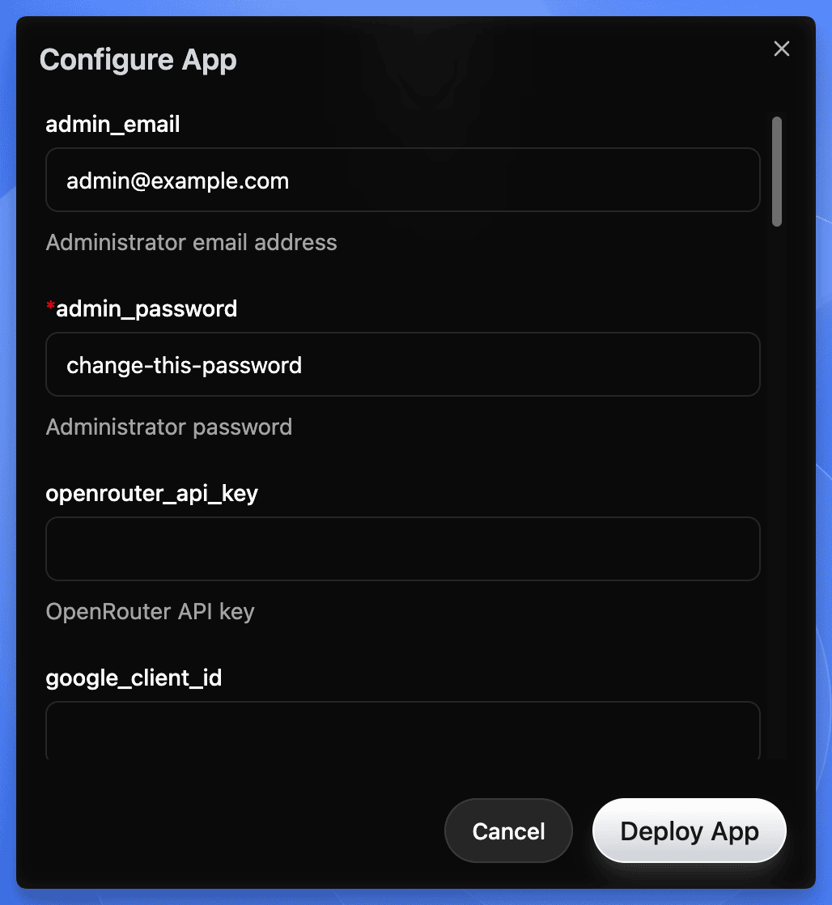
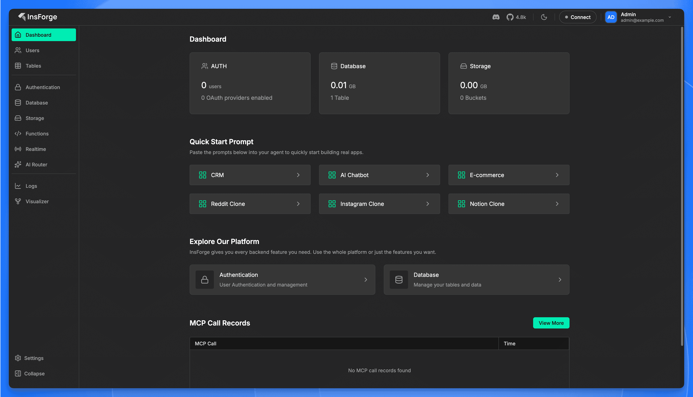

The backend landscape is quietly splitting in two. On one side, platforms built for developers who configure and operate everything by hand. On the other, platforms designed for AI agents that do the provisioning and wiring for you.

[Supabase](https://supabase.com) and [InsForge](https://insforge.dev) sit on opposite sides of that split. Both are open source. Both run on PostgreSQL. Both give you auth, storage, serverless functions, and auto-generated APIs. Where they differ: **who operates the backend, you or your AI agent?**

We host both types of workloads on [Sealos](https://sealos.io). We don't have a horse in this race. This is an honest breakdown to help you pick the right tool.

## TL;DR

| | Supabase | InsForge |
|---|---|---|
| Best for | Developers who configure the backend themselves | Developers whose AI agents handle backend operations |
| Core strength | Mature ecosystem, large community, proven at scale | Agent-native architecture, MCP-first, semantic backend context |
| Database | PostgreSQL with deep extension ecosystem (pgvector, pg_cron, etc.) | PostgreSQL with agent-readable schema and structured metadata |
| AI integration | pgvector + community MCP server (added later) | Built-in model gateway + foundational MCP server |
| Self-hosting | Docker Compose (~15 containers), well-documented | Docker Compose or one-click via [Sealos](https://sealos.io/products/app-store/insforge/) / Railway / Zeabur |
| Community | 99K+ GitHub stars, huge third-party ecosystem | Newer, growing, focused on agentic workflows |
| Pricing | Free → $25/mo Pro → $599/mo Team | Free → $25/mo Pro → Custom Enterprise |

Quick version:
- You use Cursor, Copilot, or Claude Code daily and want the agent to handle the backend? Try InsForge.
- You want a proven ecosystem with a massive community? Supabase.
- Not sure? Keep reading.

## What is Supabase?

[Supabase](https://github.com/supabase/supabase) is the open-source Firebase alternative. It's earned that reputation. PostgreSQL underneath, with a managed database, auto-generated REST and GraphQL APIs, auth with Row Level Security, object storage, Deno-based Edge Functions, and real-time subscriptions.

The developer experience is good. The dashboard works well. The docs are thorough. And the community is large: 99K+ GitHub stars, thousands of tutorials, a deep ecosystem of third-party integrations.

Supabase is a **human-centric** platform. You open the dashboard, write SQL, configure auth providers, set up storage buckets, wire things together. There's a CLI for automation, and an MCP server exists for AI tooling, but MCP was added on top of an architecture designed for humans.

If you want control over your backend and a platform people have been running in production for years, Supabase is hard to beat.

## What is InsForge?

[InsForge](https://github.com/insforge/insforge) is an open-source backend built for a different workflow, one where AI coding agents are the primary operators.

Same core primitives as Supabase: PostgreSQL, auth, S3-compatible storage, Deno-based edge functions, realtime. Plus a built-in model gateway (OpenAI-compatible API across multiple LLM providers) and native Stripe integration.

The architectural difference is the **semantic layer**. Instead of a dashboard designed for humans to click through, InsForge exposes structured, machine-readable context: schemas, permissions, logs, service state. All of this goes through a foundational MCP server. Your AI agent can fetch docs, inspect the current state, configure services, and make changes, all within one development loop.

In practice: you describe what you want, and your agent provisions the backend. No dashboard hopping, no manual wiring.

It's newer. Smaller community, fewer integrations, but moving fast. The premise is that the way we build software is changing, and the backend should change with it.

## A note on Firebase and Appwrite

If you're also looking at [Firebase](https://firebase.google.com) or [Appwrite](https://appwrite.io): both are solid, but they're a different conversation.

Firebase is Google's proprietary BaaS. Good for prototyping, but not open source, not self-hostable. Vendor lock-in is the main concern.

Appwrite is open-source, human-centric, dashboard-driven, with decent Docker-based self-hosting. No agent-native architecture or MCP integration.

Neither is built for the AI-agent workflow that makes the InsForge vs Supabase comparison interesting. We'll stick to those two.

## Head-to-head

### Database

Both run managed PostgreSQL with ACID compliance and PostgREST for auto-generated REST APIs.

Supabase has deeper PostgreSQL expertise. Rich extension ecosystem: pgvector for embeddings, pg_cron for scheduled jobs, PostGIS for geospatial data, and more. RLS is a first-class concept. The SQL editor is polished. If you're a Postgres power user, Supabase feels like home.

InsForge exposes schemas and metadata as structured, agent-readable context. When your agent needs to create tables, set up RLS, or check the current schema, it pulls that context through MCP and acts directly. PostgreSQL support is solid, but the extension ecosystem is smaller.

**Bottom line:** Writing SQL by hand and need deep Postgres features? Supabase. Agent handles schema work and needs full database context? InsForge.

### Authentication

Both do email/password, OAuth, JWT sessions.

Supabase is more mature. Wider range of auth methods: magic links, phone auth, SAML SSO. Row Level Security integration means auth policies live at the database level, and it's been running in production apps for years.

InsForge covers the essentials: email/password, OAuth (Google, GitHub, Discord, Microsoft, LinkedIn, X, Apple), session management. Designed to be configured by an agent in one prompt, with production-ready permissions on by default.

**Bottom line:** Supabase has more auth options and more production mileage. InsForge is faster to set up in agent-driven workflows.

### Storage

Both: S3-compatible object storage with buckets.

Supabase has more production track record here, plus image transformations and CDN integration.

InsForge has the same core capabilities with an agent-friendly API. Agents create buckets, set policies, manage files through MCP.

**Bottom line:** Similar features. Supabase has more production history and media processing.

### Serverless functions

Both use Deno runtimes for edge functions. Comparable.

The difference: InsForge functions are agent-provisionable through MCP. Supabase functions follow a traditional write-locally-deploy-via-CLI workflow.

### AI and agent integration

This is where the two platforms actually diverge.

Supabase has strong AI building blocks: pgvector for embeddings, integration with popular AI frameworks, and a community-maintained MCP server. But MCP was added on top of a human-centric architecture. Your agent calls Supabase APIs without deep context about backend state. It's using the same interface a human would, just faster.

InsForge treats MCP as the foundation. The semantic layer gives agents structured access to backend docs, current schemas and policies, service configuration, logs and state, and the ability to modify any service.

There's also a built-in model gateway: one OpenAI-compatible endpoint across providers (OpenAI, Anthropic, Gemini, Grok). No external API wiring.

InsForge also ships a CLI (`@insforge/cli`) with JSON output and CI-friendly auth. Running `insforge create` installs Agent Skills into your project (`.agents/skills/insforge/`), giving AI agents structured context about your specific backend without manual setup.

**A concrete example.** Tell your agent "add email authentication with 7-day sessions."

With Supabase: the agent generates client SDK code, but you still configure the auth provider in the dashboard, set session durations, and verify the integration.

With InsForge: the agent calls MCP, configures auth directly (provider, session duration, permissions), and confirms it's done. One prompt, no dashboard.

**Bottom line:** For workflows where the agent runs the backend, InsForge is ahead. For traditional development where you use AI as a helper, Supabase's ecosystem and pgvector are strong.

> InsForge reports 1.6x faster execution, 30% fewer tokens, and up to 70% higher Pass⁴ accuracy compared to Supabase MCP on the [MCPMark Postgres benchmark](https://insforge.dev/blog/mcpmark-benchmark-results). MCPMark is a [published benchmark](https://github.com/eval-sys/mcpmark) with a peer-reviewed paper. We haven't independently reproduced these numbers.

### Self-hosting and deployment

Both are open source, both self-hostable.

Supabase self-hosting means Docker Compose with roughly 15 containers: database, auth, storage, realtime, edge functions, API gateway. It works, it's documented, but it's complex. You need to understand the architecture.

InsForge self-hosting is simpler. Docker Compose, or one-click deploy on [Sealos](https://sealos.io/products/app-store/insforge/), Railway, or Zeabur. On Sealos the full stack (app, PostgreSQL 16.4, PostgREST, Deno) deploys in about 2 minutes. Zero YAML, automatic SSL, pay-as-you-go.

**Bottom line:** InsForge is easier to self-host, especially on Sealos. Supabase gives you more granular control if you need it.

### Pricing

Supabase: Free → Pro at $25/month per project → Team at $599/month → Enterprise. The Pro plan is solid (8 GB database, 100K MAUs, 250 GB egress), but real-world costs typically run $35-75/month once you add compute and bandwidth.

InsForge: Free → Pro at $25/month → Custom Enterprise. The free tier includes $1 in AI credits, 50K MAU, 500MB database, 5GB bandwidth, and 1GB storage. One catch: free projects pause after a week of inactivity. The Pro plan includes $10 in compute credits with usage-based billing beyond that.

On Sealos: pay-as-you-go for compute and storage. No platform fee.

**Bottom line:** Both Pro plans are $25/month. The real pricing difference shows up in self-hosting: on Sealos you pay only for the resources your instance consumes, which can be significantly less. InsForge's free tier is more limited (auto-pause after inactivity), while Supabase's free tier lets projects stay active.

### Community and ecosystem

This is Supabase's biggest advantage, and there's no point sugarcoating it.

Supabase has 99K+ GitHub stars. A huge community. Thousands of tutorials. A deep ecosystem of third-party integrations. If you run into a problem, someone has probably already solved it.

InsForge is newer. Smaller community, but focused and active. Discord is responsive, GitHub development is steady. Documentation covers the core well. Third-party content is still catching up, which is why articles like [our Claude Code + InsForge tutorial](/blog/build-fullstack-app-claude-code-insforge) exist.

**Bottom line:** If you need a proven ecosystem right now, Supabase. For the specific use case of agent-native development, InsForge's community may be more useful to you.

> **Honest caveats about InsForge (as of March 2026):**
> - Self-hosted Docker Compose has known rough edges (some users report `tsc: not found` and permission errors on fresh installs). The Sealos template avoids most of these.
> - If `ENCRYPTION_KEY` isn't set, the platform silently falls back to `JWT_SECRET` for encryption. Rotating `JWT_SECRET` later can break previously stored secrets. Set both explicitly.
> - The Sealos template pins v1.5.0 while upstream is at v2.0.1. Feature parity depends on template updates.
> - Default resource limits in the template are tight. Resize for anything beyond a demo.

## When to use which

This is what you're actually here for.

### Use Supabase when:

- You operate the backend yourself. You write SQL, configure auth, set up storage, and wire services manually. You want full control.
- You need a platform that's been running in production for years. Enterprise reliability, compliance, support.
- PostgreSQL extensions (pgvector, pg_cron, PostGIS) are central to what you're building.
- AI helps you write code faster, but you make the backend decisions yourself.
- You want Stack Overflow answers, YouTube tutorials, and battle-tested integrations.

### Use InsForge when:

- AI agents (Cursor, Copilot, Claude Code) are how you build, not just how you autocomplete. You want the agent to run the backend.
- You want to go from idea to working app as fast as possible. Minimal manual config.
- You prefer one-click self-hosting. Deploy on [Sealos](https://sealos.io/products/app-store/insforge/) without touching Kubernetes or YAML.
- You need a built-in model gateway for routing LLM requests.
- You're building MVPs and prototypes. Speed over ecosystem breadth.
- Budget is a factor. Self-hosting on Sealos means pay-as-you-go, which can be cheaper than either platform's managed pricing.

### Use both?

Honestly, this might be where a lot of teams end up.

Supabase for established production apps that need the mature ecosystem and proven reliability. InsForge for new agent-driven projects and rapid prototyping where speed matters most.

The two aren't competing. They're optimized for different workflows. A startup might prototype on InsForge in a week, validate the idea, and then decide whether to stay or migrate to Supabase for the long run. Both are reasonable paths.

## Try them yourself

Comparisons only tell you so much. The useful thing is to try both.

Supabase has a generous free tier. [Sign up at supabase.com](https://supabase.com) and spin up a project.

For InsForge, you can have a running instance in about 2 minutes on Sealos. [Deploy the template](https://sealos.io/products/app-store/insforge/), connect Claude Code via MCP, and build something. We wrote a full walkthrough: **[Build a Full-Stack App with Claude Code + InsForge](/blog/build-fullstack-app-claude-code-insforge)**.

No commitment. Build something and see which feels right.

<!-- Dev note: recommend adding Article + FAQ schema markup (JSON-LD) for this page -->

## Final verdict

There isn't a clean answer. It depends on how you build.

Two tracks are forming:

**Human-centric.** You read docs, write config, operate services, use AI to speed things up. Supabase is the best option on this track. Mature, widely adopted, big ecosystem.

**Agent-centric.** You define intent, review outcomes, and your AI agent handles the backend. InsForge is the leading open-source option here. Built from scratch for agent workflows.

Both tracks will coexist. The question is which one matches how you actually work today, and which direction you think things are going.

If you're already building primarily with Claude Code or Cursor, give InsForge a real try. If you need proven reliability and ecosystem depth right now, Supabase is the safe choice. Either platform deploys in minutes, so test with actual code instead of reading one more comparison article.

**[→ Try InsForge on Sealos](https://sealos.io/products/app-store/insforge/)** · **[→ Browse the Sealos App Store](https://sealos.io/products/app-store/)**

