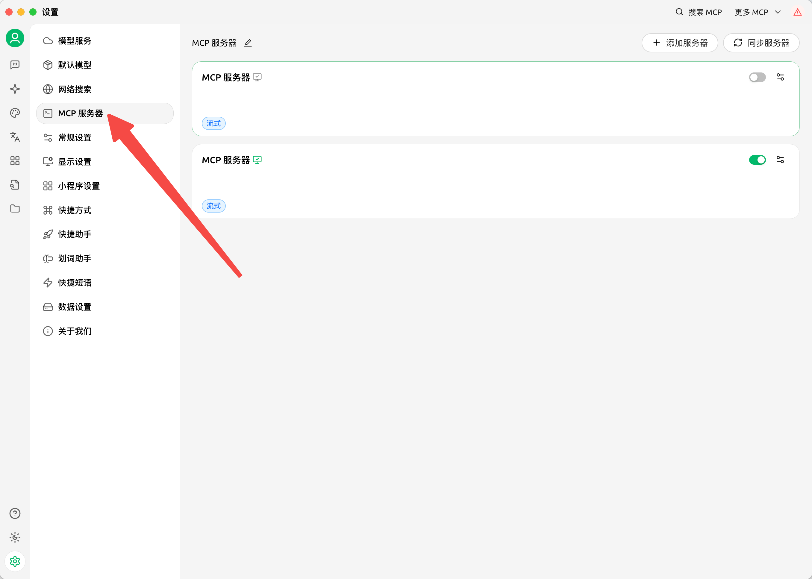
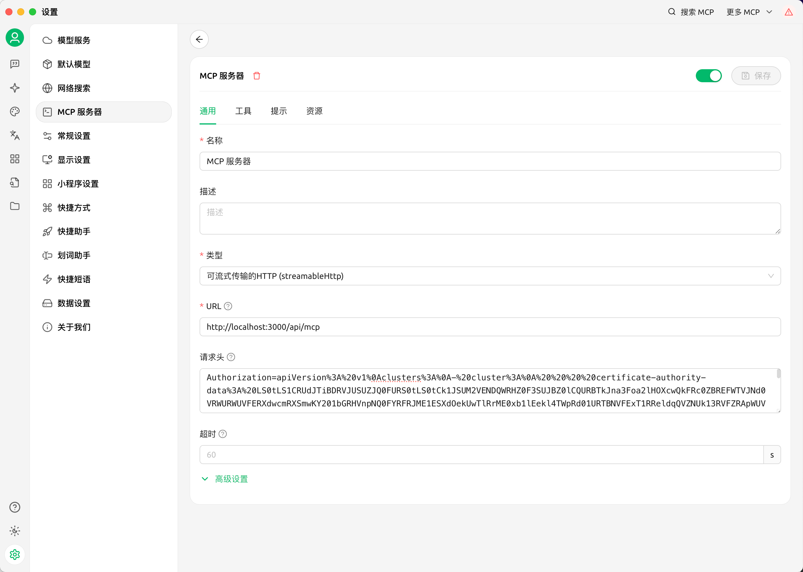
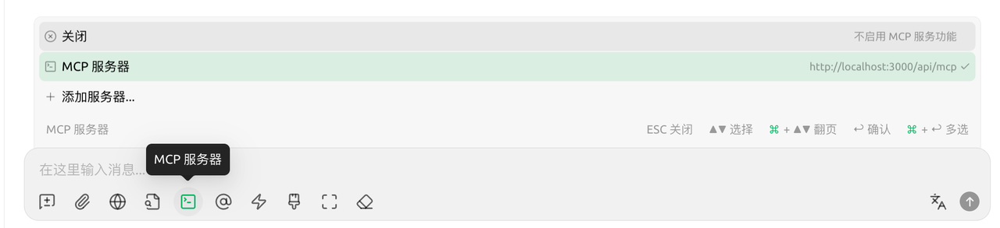
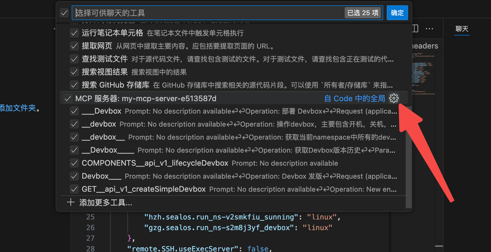
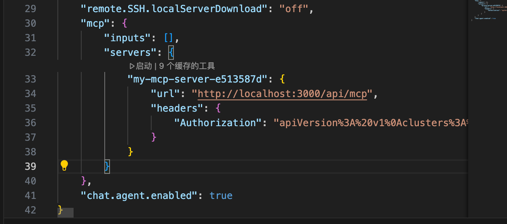
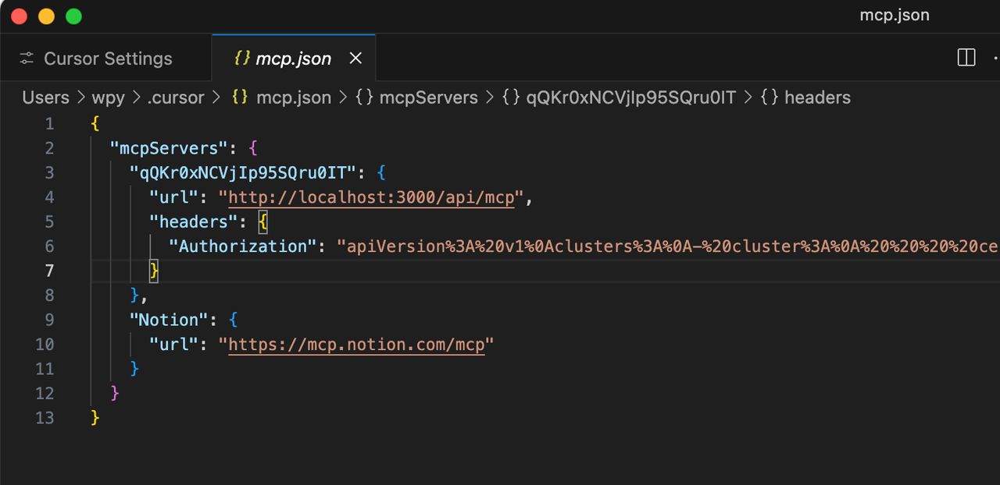
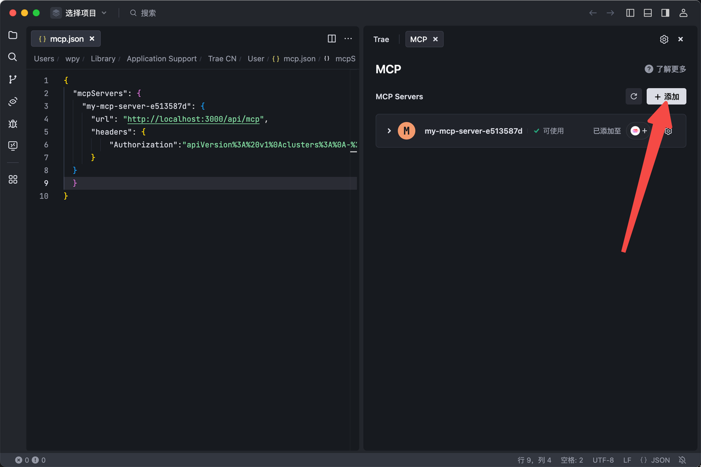
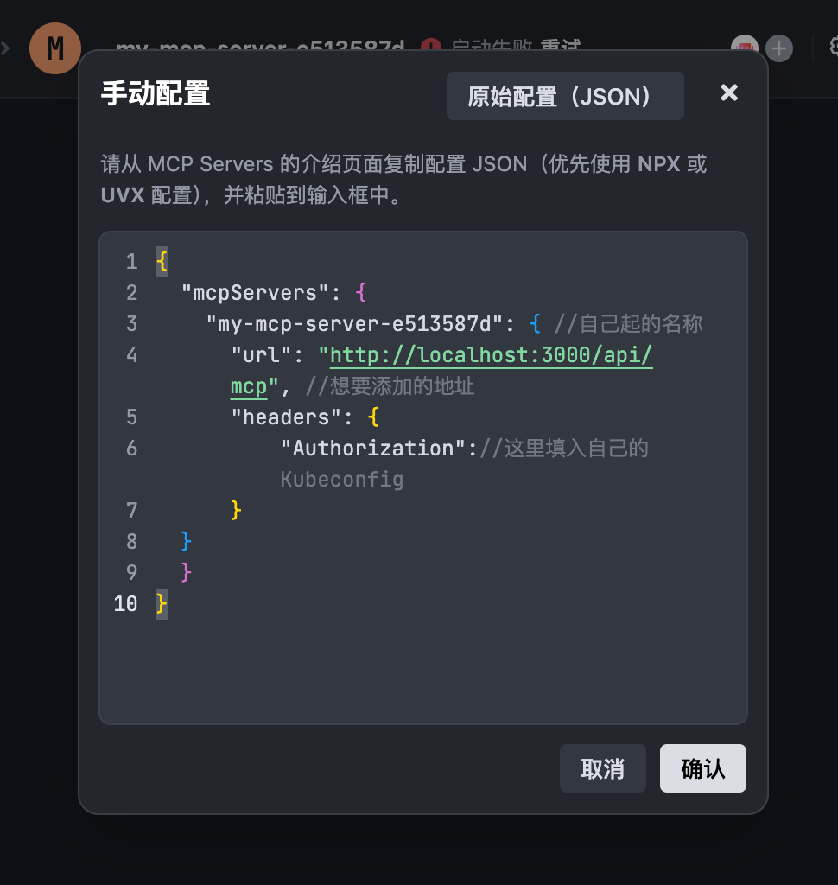

Sealos 为其平台上的各种能力配置了对应的 MCP Server。它们采用StreamableHttp作为通信方式，您可以轻松的在任何支持StreamableHttp的IDE中使用它。提升您在Sealos平台上的使用体验。

## 支持的服务

当前Sealos MCP支持DevBox，数据库，费用中心，可观测系统等多种不同的服务。Sealos各个可用区支持的MCP服务可以在网页上查看。不同可用区支持的服务和工具可能会略有差别。

## 认证与授权

Sealos MCP服务采用Header中的Authorization来确定您的身份。只需要在其中填写URL编码的KubeConfig，即可完成各个服务的认证。

# 在Cherry Studio中使用

在Cherry Studio中，点击设置-MCP服务器进行可视化配置。



选择添加服务器，进入具体的配置页面。

需要配置的内容有：

- 名称：自己给MCP Server起的名称
- 类型：可流式传输的HTTP(StreamableHttp)
- URL：MCP服务的地址，可通过上面的url查看。
- 请求头：用于认证授权的Header.格式如下：

Authorization=URL编码的kc

配置的示例如下：



点击右上角的绿色按钮即可启动MCP服务。

启用后，在对话时选择需要使用的MCP工具，即可开始使用了。如下图。



# 在VS code中使用

打开VS code，进入右侧的AI对话框，选择Agent模式，点击右侧工具，进入MCP配置。

点击后，会在最上面对话框出现当前已经有的MCP服务，任意选择一个，进入点击右侧的设置齿轮，进入设置页面。



进入后，直接在MCP下配置即可。

需要配置三个字段：

- 名称：自己给MCP Server起的名称
- URL：MCP服务的地址，可通过上面的url查看。
- 请求头：用于认证授权的Header.

最终的配置类似于：



配置完成之后，保存配置，就可以开始使用了。

# 在Cursor中使用

进入Cursor，点击右上方的设置齿轮，进入设置页面找到MCP服务器，点击进入

进入后点击New MCP Server，进入MCP Server编辑页面。

需要配置三个字段：

- 名称：自己给MCP Server起的名称
- URL：MCP服务的地址，可通过上面的url查看。
- 请求头：用于认证授权的Header.

最终的配置类似于：



保存配置即可开始使用。

# 在Trae中使用

进入Trae,选择右上角的齿轮，选择MCP,点击添加。



之后选择手动配置，将下面的结构复制到弹出的对话框中：

```JSON
{
  "mcpServers": {
    "my-mcp-server-e513587d": { //自己起的名称
      "url": "http://localhost:3000/api/mcp", //想要添加的地址
      "headers": {
          "Authorization"://这里填入自己的Kubeconfig
      }
  }
  }
}
```

配置完成后，点击确认即可使用。点击MCP Server的名称即可查看其支持的Tool列表。

