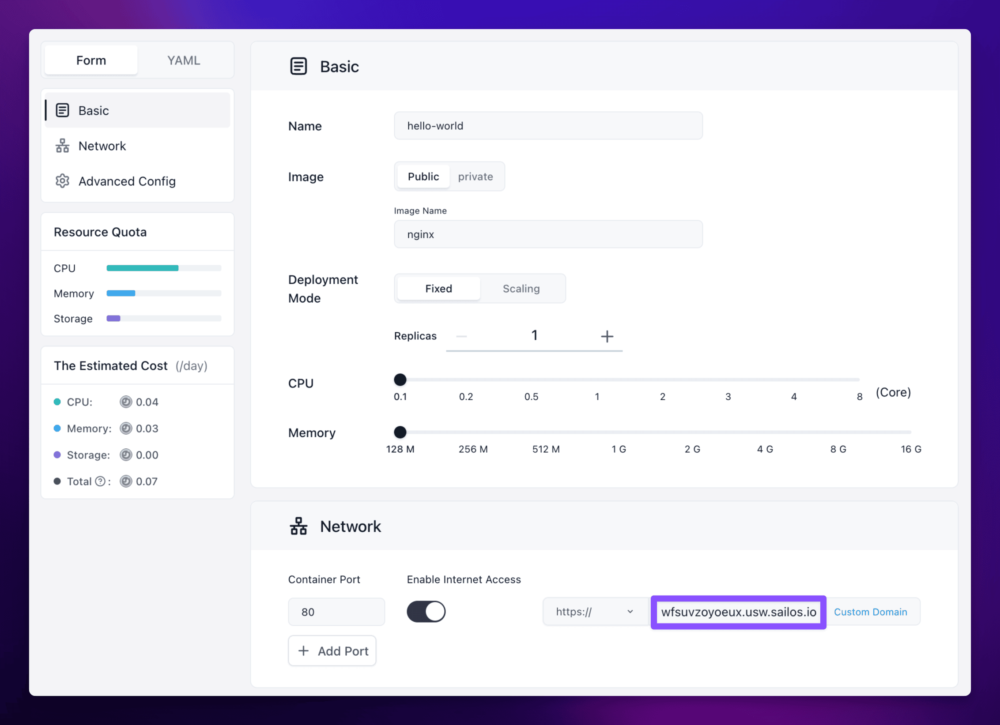
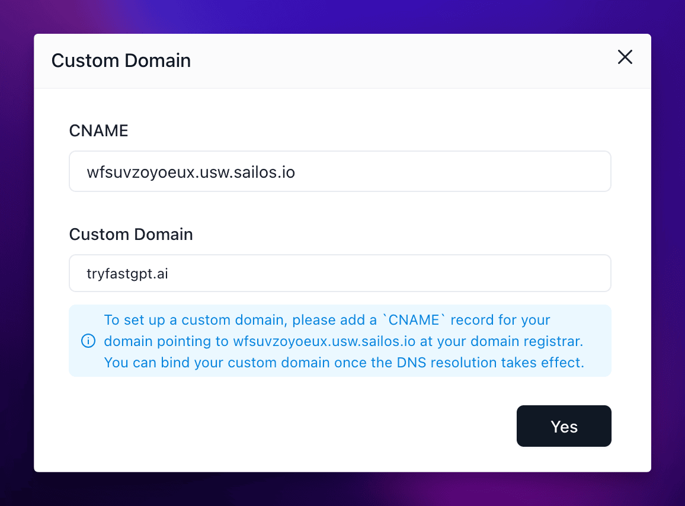

## When to use this

Use this page after your app already exists and you need a stable public address.

You might only need the Sealos-generated public URL, or you might need to attach your own domain after DNS is ready. This is the right page for both jobs.

## Before you change this

If your app is deployed in mainland China, make sure the custom domain can legally resolve in that region before you switch traffic to it.

If your domain requires filing or provider-specific ICP compliance, complete that first. You also need control of your DNS provider so you can create a `CNAME` record that points to the Sealos-generated address.

## Add Public Access during deploy or redeploy

1. Open the app create or change form in the App Launchpad UI.
2. Find the network section and enable **Public Access**.
3. Record the public address that Sealos generates for the app.
4. Finish the deploy or redeploy so the public endpoint becomes active.

If the app is already deployed, you can reopen the same settings from the app details page and enable **Public Access** there before saving the change.

## Attach a custom domain

1. Open your app details page and confirm the Sealos-generated public address is already available.
2. At your DNS provider, create a `CNAME` record that points your domain or subdomain to the Sealos-generated address.
3. Wait for DNS propagation before you continue.
4. Back in Sealos, open the **Custom Domain** action from the app details page.
5. Enter the domain you want to bind, then confirm and redeploy if Sealos asks you to apply the change.

If you are switching an existing production domain, keep TTL and rollback steps in mind before you update the DNS record.

## Verify

Use this checklist before you treat the change as complete:

- The app still shows a healthy `running` state after the change.
- The Sealos-generated public URL still opens the app.
- The custom domain resolves to the expected `CNAME` target.
- Opening the custom domain loads the same app content you expected to publish.

If this fails, see [Custom Domain and TLS Issues](/docs/guides/app-deploy/custom-certificates/).

## Related Tasks

- [Update and Redeploy](/docs/guides/app-deploy/update-apps/) if you need to reopen the app settings later for additional changes.
- [Ports and Networking](/docs/guides/app-deploy/expose-multiple-ports/) if the app needs more than one externally reachable endpoint.
