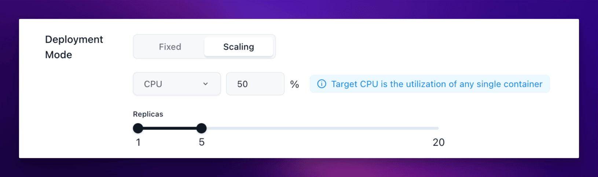

## When to use this

Use this page when the app already works with one instance but traffic or workload may change over time.

Scaling is a better fit for stateless or horizontally safe services than for apps that assume only one writer or one local filesystem.

## Before you change this

Scaling changes both capacity and cost.

Before you enable autoscaling, confirm the app can safely run on more than one instance and that shared state is stored outside the container if needed.

## Configure scaling

1. Open the app details page and reopen the settings with the **Update** or **Change** action.
2. Find the scaling section in the App Launchpad UI.
3. Set the minimum instance count (`min`) and maximum instance count (`max`).
4. Set the target CPU or memory threshold that should trigger scale decisions.
5. Save the change and redeploy the app.

## How Sealos reads usage

Sealos makes autoscaling decisions from average usage across running instances.

- If two instances use 60% CPU and 40% CPU, the average CPU value is 50%.
- The same idea applies to memory thresholds.
- If the average rises above the target, Sealos can add instances up to the configured max.
- If the average stays below the target, Sealos can reduce instances down to the configured min.

## Verify

Check the result after the change:

- The app returns to `running`.
- The saved scaling policy still shows the expected min and max range.
- The configured CPU or memory target is visible after you reopen the form.
- Under load, the app can increase instance count instead of staying fixed at one instance.

If you are not testing with real traffic yet, at least verify that the policy persists correctly and does not conflict with the app's current resource settings.

## Related Tasks

- [Update and Redeploy](/docs/guides/app-deploy/update-apps/) if you need to adjust image or resources together with scaling.
- [Persistent Storage](/docs/guides/app-deploy/persistent-volume/) if the app still writes important data inside the container and is not ready for multi-instance behavior.
