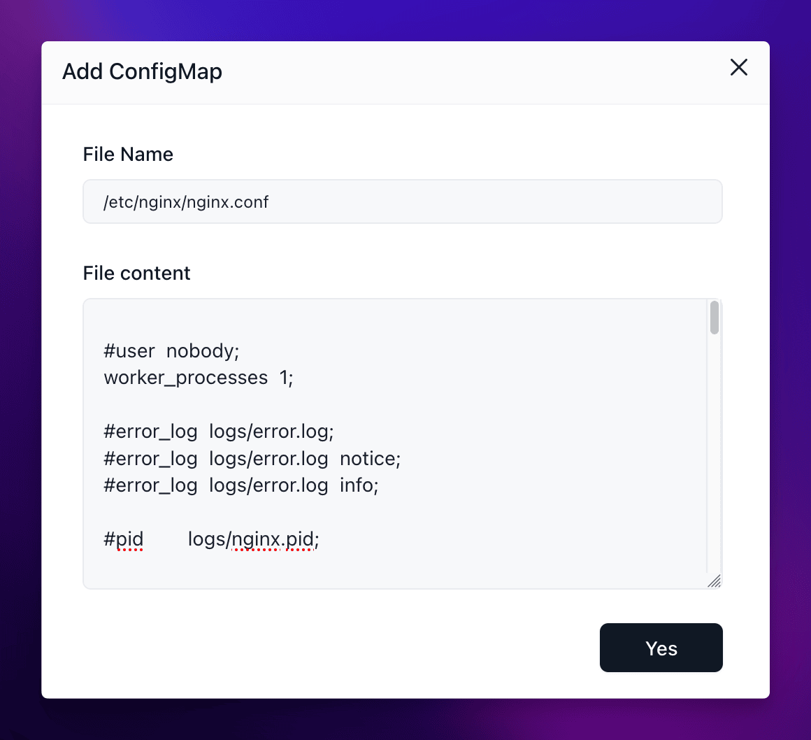

## When to use this

Use this page when your app expects a real file such as `nginx.conf`, a YAML config, a JSON settings file, or another structured config artifact inside the container.

Choose this approach when environment variables are too small or too awkward for the setting you need to change. In Sealos, this is usually implemented with a ConfigMap-backed file mount.

## Before you change this

Mount the exact target file path, not just a folder.

Sealos mounts a **single file** into the container. If you enter only a directory path, or if you choose the wrong file path, the app may start with the wrong config or fail to boot.

## Add a config file

1. Check the image documentation so you know the exact file path the app expects inside the container.
2. Prepare the file content locally first if the config is large or easy to break.
3. Open the app details page and choose the action that reopens the app settings.
4. Find the config file section in the App Launchpad UI.
5. Enter the full in-container file path and paste the file contents.
6. Save the change and redeploy the app.

For example, an Nginx container usually expects a file path such as `/etc/nginx/nginx.conf`. That is a single file path, not a directory.

## Verify

Confirm the config change after redeploy:

- The app reaches `running`.
- The new behavior matches the file you mounted.
- If the app exposes logs, the logs do not show a syntax or startup error caused by the new file.

If the app fails immediately after redeploy, compare the mounted file path and the pasted contents with the image documentation before you retry.

## Related Tasks

- [Environment Variables](/docs/guides/app-deploy/environments/) if the setting can be expressed more safely as key-value pairs.
- [Update and Redeploy](/docs/guides/app-deploy/update-apps/) if you are changing config files together with the image or resources.
