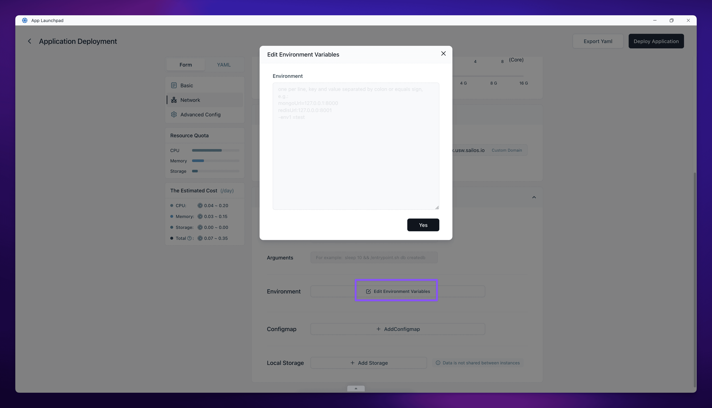

## When to use this

Use this page when your image is correct but the app still needs runtime settings such as ports, hosts, credentials, feature flags, or service endpoints.

Environment variables are the fastest way to change small pieces of configuration without rebuilding the image. If your app needs a full config file instead of key-value pairs, use [Config Files](/docs/guides/app-deploy/configmap/) instead.

## Update environment variables

1. Open the app details page for the running app.
2. Click the action that reopens the app settings. Depending on the current UI, this may be labeled **Update** or **Change**.
3. Find the environment variable input area.
4. Paste one variable per line, then review the values before you save.
5. Redeploy the app so the new environment variables are applied to the next running instance.



## Supported input format

Sealos accepts bulk input, so you can paste several variables at once.

These formats are interpreted correctly:

```shell
host=127.0.0.1
port:3000
name: sealos
- username=123
- password:123
# Comments like this line are ignored because they do not contain = or :
```

This format is risky because the inline comment becomes part of the value:

```shell
host=127.0.0.1 # This entire right side is treated as the value
```

Use plain key-value lines only. Do not rely on inline comments after the value.

## Verify

Check the result after the redeploy:

- The app returns to `running`.
- The changed settings still appear in the environment variable section when you reopen the form.
- The app behavior matches the new values, for example by connecting to the right host, binding the expected port, or enabling the intended feature.

If the app fails after the change, compare the pasted values with the expected application format before you try a larger rollback.

## Related Tasks

- [Config Files](/docs/guides/app-deploy/configmap/) if the app needs structured file content instead of simple key-value settings.
- [Update and Redeploy](/docs/guides/app-deploy/update-apps/) if you are changing the image or several runtime settings at the same time.
