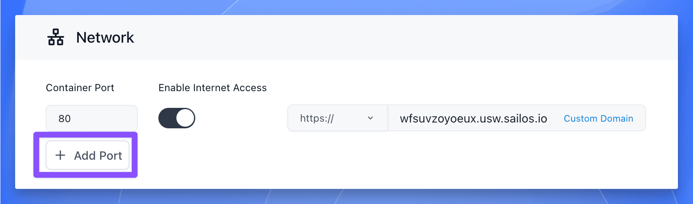

## When to use this

Use this page when one app needs more than one listener, for example HTTP plus HTTPS, an app port plus an admin port, or a public API plus a private metrics endpoint.

This is also the right page when you need to decide which ports stay internal and which ports should become public.

## Before you change this

Every public port creates another externally reachable endpoint.

Before you expose more ports, decide which ones should remain internal and which ones really need internet access.

## Add more than one port

1. Open the app details page and reopen the settings with **Update** or **Change**.
2. Go to the network section.
3. Use **Add Port** to create the first additional port mapping.
4. Enter the container port and decide whether that port should be public or internal only.
5. Repeat the same process for each required port.
6. Save the change and redeploy the app.

Common examples include:

- HTTP and HTTPS on separate ports
- A user-facing service plus an admin service
- A REST API plus a gRPC endpoint
- An app service plus a `/metrics` port that should stay private

If you expose a port publicly, Sealos assigns a separate externally reachable endpoint for that port, usually through its own sub-domain.

## Verify

Check the network result after redeploy:

- The app returns to `running`.
- Every required port appears in the current app configuration.
- Each public port receives the expected external address or sub-domain.
- Internal-only ports are not accidentally exposed to the public internet.

If a public endpoint opens the wrong service, re-check the port mapping before you change domains or application code.

## Related Tasks

- [Domains and Public Access](/docs/guides/app-deploy/add-a-domain/) if one of the public endpoints now needs a custom domain.
- [Update and Redeploy](/docs/guides/app-deploy/update-apps/) if you are changing image, env, or storage together with networking.
