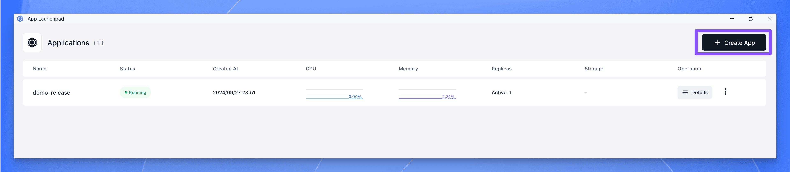
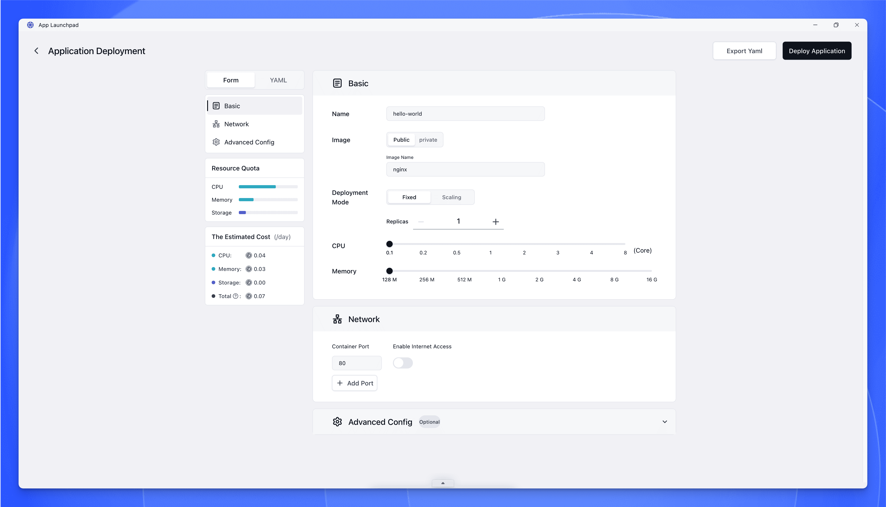
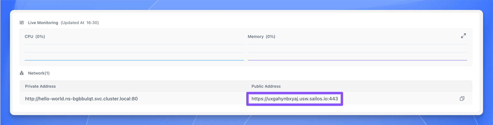

This is the start-here App Deploy tutorial for new users.

Follow this page when you want the shortest zero-to-one path to one public single-container web app on Sealos.

By the end of this guide, you will deploy `nginx:latest`, wait for the instance to reach `running`, and open its public URL in your browser.

## Before You Begin

Use this tutorial if all of the following are true:

- You can sign in to the Sealos console.
- You want one public single-container web app, not a multi-service setup.
- You will use the exact demo image `nginx:latest`.
- You will expose container port `80` to a public URL.

For this first deploy, skip startup commands, environment variables, config files, persistent storage, scaling rules, and multiple ports.

The goal here is first success, not full configuration coverage.

## What You Will Deploy

This tutorial uses one exact demo so you do not have to choose values along the way.

You will deploy a small Nginx container as a fixed one-instance app and verify that its welcome page opens from a browser.

| Field | Value |
| --- | --- |
| App name | `nginx` |
| Image | `nginx:latest` |
| Deploy mode | Fixed instances |
| Instance count | `1` |
| CPU | `0.1` |
| Memory | `128 MiB` |
| Container port | `80` |
| Public access | Enabled |

## Step-by-Step Deployment

### 1. Open the Sealos console

Open [Sealos Console](https://cloud.sealos.run) and sign in.

Then open the App Launchpad module from the workspace.

### 2. Start creating the app

Click the button or action that creates a new app.

After you submit that action, wait for the app creation form to open.

### 3. Fill the basic app information

Set the app name to `nginx`.

Set the image to `nginx:latest`.

Use the exact image value in this guide.

Changing the image means you may need different ports, commands, or config later.

### 4. Choose one fixed instance

Set deployment mode to a fixed number of instances.

Set the instance count to `1`.

Keep this tutorial on the simplest path.

Do not enable scaling yet.

### 5. Set small compute resources

Use a small resource allocation such as `0.1` CPU and `128 MiB` memory.

That is enough for the Nginx demo page in this walkthrough.

### 6. Configure networking

Add container port `80`.

Enable public access so Sealos can generate a public URL for the app.

Use port `80` exactly for this first deployment.

The verification step later assumes this port is the one exposed to the browser with public access enabled.

### 7. Leave optional sections empty

Do not set a startup command.

Do not add environment variables.

Do not add config files.

Do not add persistent storage.

Those fields matter for later jobs, but they are intentionally outside the happy path for this first deploy.

### 8. Deploy the app

Click the deploy action in the form.

After you submit the form, wait for the app detail page to open.

### 9. Wait for the app detail page to show a healthy instance

On the app details page, watch the instance list and status.

Wait until the instance state becomes `running`.

If this fails, see [App Does Not Reach Running](/docs/guides/app-deploy/app-does-not-reach-running/).

## Verify the Deployment

Use this checklist before you call the deployment complete:

- In Sealos, the instance status is `running`.
- The app details page shows a public URL.
- Opening the public URL loads the Nginx welcome page in your browser.
- The welcome page is the demo page for this tutorial, so you know the container is reachable from the public internet.

If this fails, see [Public URL Does Not Open](/docs/guides/app-deploy/public-url-does-not-open/).

For this walkthrough, the correct combination is container port `80` with public access enabled.

## Success

Your app is running.

Your first app is deployed on Sealos App Deploy.

The instance is healthy in Sealos, and the app is reachable through its public URL.

If you ever need the shortest App Deploy start-here path again, come back to this tutorial and reuse the same exact values.

## Next Steps

After your first successful deploy, move to one focused App Deploy job at a time:

- [Domains and Public Access](/docs/guides/app-deploy/add-a-domain/)
- [Environment Variables](/docs/guides/app-deploy/environments/)
- [Config Files](/docs/guides/app-deploy/configmap/)
- [Persistent Storage](/docs/guides/app-deploy/persistent-volume/)
- [Update and Redeploy](/docs/guides/app-deploy/update-apps/)
- [Scaling](/docs/guides/app-deploy/autoscaling/)
- [Ports and Networking](/docs/guides/app-deploy/expose-multiple-ports/)

This page is the canonical first deploy path.

After this point, use the guides above instead of reopening every deployment option at once.
