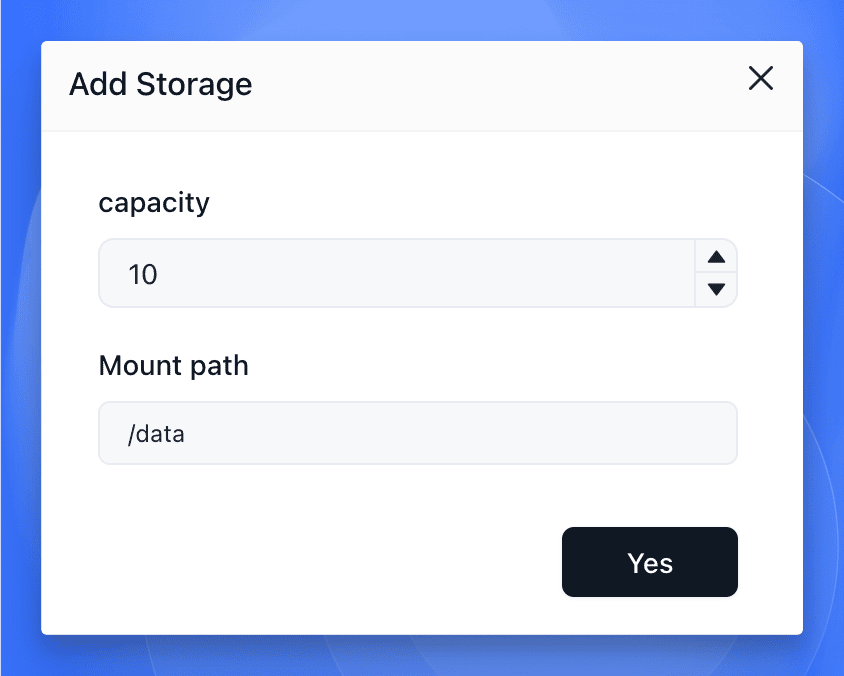

## When to use this

Use this page when your app writes data that must survive a restart, replacement, or redeploy.

Typical examples include uploaded files, databases, CMS content, and any app that stores user data inside the container filesystem.

## Before you change this

You need the exact in-container data path before you attach storage.

If you mount storage to the wrong location, the app may still start, but the real data path will remain ephemeral and your data will not survive a restart or redeploy.

## Attach persistent storage

1. Identify the path inside the container where the app stores durable data.
2. Open the app create form or reopen the app settings from the app details page.
3. Add a storage entry and enter the in-container mount path.
4. Set a storage size that matches the app's expected data growth.
5. Save the change and redeploy the app.

For example, a Nextcloud container usually stores durable content under `/var/www/html`. That is the path you would mount if you want user files and app data to survive replacement of the container.

## Verify

Check the result after the redeploy:

- The app returns to `running`.
- The storage mount still appears in the app configuration.
- Data written before a restart remains available after the app comes back.
- Data also remains available after a redeploy that replaces the container instance.

If the data disappears after a restart or redeploy, re-check the exact mount path before you increase storage size or change other settings.

## Related Tasks

- [Update and Redeploy](/docs/guides/app-deploy/update-apps/) if you need to reopen the app settings to change image, resources, or other runtime options at the same time.
- [Migrate from Docker Compose](/docs/guides/app-deploy/docker-compose-migration/) if you are translating existing volume mounts from a Compose stack.
