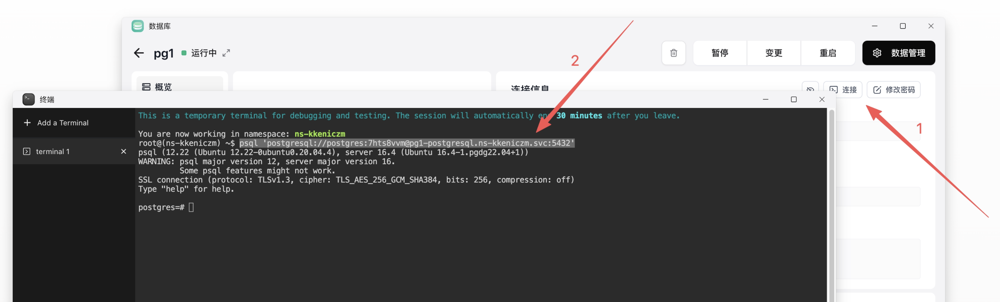

本指南将带你系统性地诊断和解决 Sealos 上由 KubeBlocks 管理的数据库问题。

## 1. 查看 Cluster 状态

KubeBlocks 核心设计：Cluster → Component → InstanceSet → Pod。Cluster 是最顶层的 CRD，它的 `status.phase` 是所有下层状态的聚合。

### Cluster 状态为 Running

说明 KubeBlocks 认为一切正常，问题可能在应用层（连接串写错、权限等）。检查能否连上数据库，能否执行命令（比如主从原因导致不可写入）。

#### 连接数据库

**方法 1：使用 kbcli**

```bash
kbcli cluster connect <cluster-name> -n <ns>
```

**方法 2：使用 kubectl**

**Step 1：获取信息**

```bash
# 获取 Service 名
kubectl get svc -n <ns>

# 获取密码
kubectl get secret -n <ns> | grep <cluster-name>
kubectl get secret <secret-name> -n <ns> -o jsonpath='{.data.password}' | base64 -d
```

**Step 2：连接**

进入 Pod 之后直接连接：

```bash
# 进入 Pod
kubectl exec -it <pod> -n <ns> -- bash

# 根据不同数据库使用不同连接命令
# MySQL
mysql -u root -p

# MongoDB
mongosh -u root -p

# Redis
redis-cli -a <password>

# PostgreSQL
psql -U postgres
```

或通过 Sealos 终端连接：



```bash
# MySQL
mysql -h <service>.<ns>.svc -P 3306 -u root -p<password>

# MongoDB
mongosh 'mongodb://root:<password>@<service>.<ns>.svc:27017'

# Redis
redis-cli -u redis://default:<password>@<service>.<ns>.svc:6379

# PostgreSQL
psql 'postgresql://postgres:<password>@<service>.<ns>.svc:5432'
```

### Cluster 状态非 Running

需要：

- Describe Cluster（查看 Events 和 Status）

```bash
kubectl describe cluster <cluster-name> -n <ns>
```

- 到**第 2 步**查看 Pod 状态

## 2. 查看 Pod 状态

- Pod **不 Running** 意味着问题在基础设施层——调度、存储、镜像、资源配额等。
- Pod **Running** 但业务不正常，说明基础设施没问题，问题在应用层——数据库自身的配置、权限、主从复制逻辑等。

### Pod 状态为 Running

查看数据库日志：

```bash
# 进入 Pod
kubectl exec -it mysql1-mysql-0 -n <ns> -- bash

# 查看数据库日志
cd /data/mysql/log
cat mysqld-error.log
```

不同数据库的日志路径：

| 数据库     | 日志路径                                                |
|------------|--------------------------------------------------------|
| MySQL      | `/data/mysql/log/mysqld-error.log`                     |
| MongoDB    | `/var/log/mongodb/mongodb.log`                         |
| PostgreSQL | `/home/postgres/pgdata/pgroot/pg_log/postgresql.log`   |
| Redis      | `/data/running.log`                                    |

### Pod 状态非 Running

**1. 通过 `describe` 和 `logs` 查看 Pod 为什么起不来：**

- **describe**：K8s 自己记录的事件。K8s 里每个资源都有 Events 列表，记录了控制器和 kubelet 对这个资源做的所有操作，比如调度失败、镜像拉取失败、磁盘挂不上等。作为定性原因。
- **logs**：容器的 stdout/stderr 输出，包括容器自己的报错以及数据库的一部分报错。作为详细日志。

```bash
# 查看上一次该容器退出前的标准输出，适用于容器频繁重启的情况
kubectl logs <pod> -n <ns> --previous
```

**2. 查看数据库自己的日志**

Pod 非 Running 的情况下，节点上 `/var/log/containers/` 下的容器日志会被轮转清理。但是数据库写到 PV 里的日志文件是持久化的。

**A. 查看 Pod 对应的 PVC 和 Node：**

```bash
# 查看 Pod 在哪个节点上
kubectl get pod -n <ns> -owide

# 查看 PVC
kubectl get pvc -n <ns> -owide
```

**B. 得到 PVC 和 Node 信息之后：**

I. SSH 连接上 Node：

```bash
ssh <node-name>
```

II. 通过 PVC 可以找到挂载目录以及分配/占用/剩余/占用比：

```bash
# 列出当前节点所有磁盘/挂载点的使用情况
df -h | grep <pvc-name>
```

III. 再根据挂载路径查看日志。

## 3. 查看 KB Controller

当 Cluster 状态异常、但 Pod 和数据库日志均无明显错误时，查看 KB Controller 日志。

获取 `kb-system` 命名空间下的 Pod，然后查看 Controller Pod 的日志：

- 如果 Controller Pod 本身 **Running** 没有崩溃，那么 `describe` 找不到有用信息。使用 `logs` 查看 Controller 内部业务逻辑。

```bash
kubectl logs <pod> -n <ns>
```

- 如果 Controller Pod 本身状态不正常，比如持续 **CrashLoopBackOff**：先 `describe` 看是什么类型的问题，再 `logs` 看具体日志。
