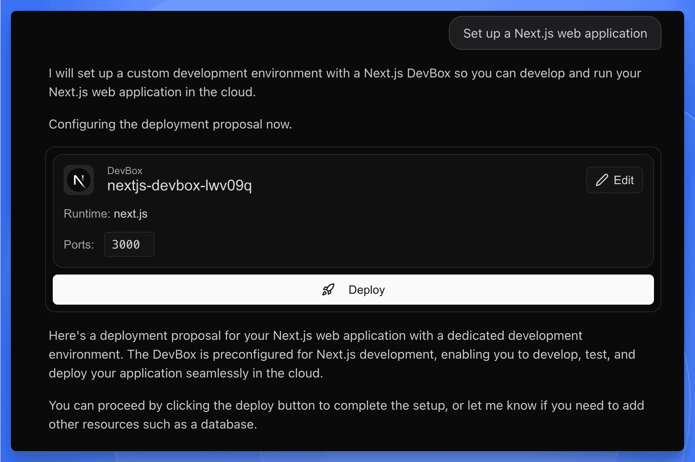
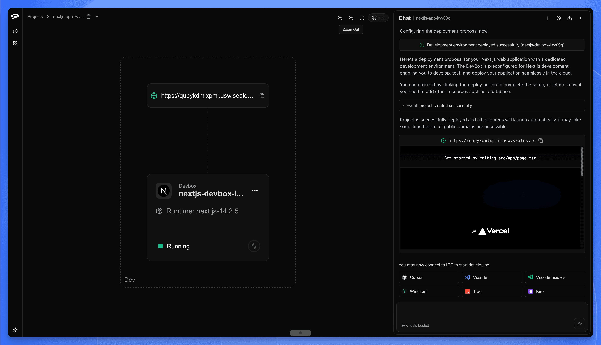

import { AppDashboardLink } from '@/components/docs/Links';

This guide will walk you through the steps to create a new project(development environment) using Sealos DevBox. With AI-powered project creation, you can simply describe what you want to build, and Sealos will automatically set up your development environment.

## Access Sealos DevBox

1. Sign up for [Sealos](https://os.sealos.io/signin) if you haven't yet.
2. In the [Sealos Dashboard](https://os.sealos.io/?openapp=system-brain%3Ftrial%3Dtrue), simply describe your requirements, and Sealos will automatically configure your development environment.

## Create a New Project

<h4>Describe Your Requirements</h4>

In the [Sealos Dashboard](https://os.sealos.io/?openapp=system-brain%3Ftrial%3Dtrue), describe what you want to build. For example:

- "I want to create a Go app"
- "Create a Python Flask API project"
- "Set up a Next.js web application"

Sealos will understand your intent and generate a development environment card with the recommended configuration.

<h4>Review the Development Environment Card</h4>

After you describe your requirements, Sealos will present a development environment card with the recommended configuration, including:

- **Name**: A suggested project name based on your description
- **Runtime**: The appropriate framework or language version (e.g., Go 1.23, Python 3.11, Next.js)

<h4>Customize or Deploy</h4>

You have two options:

- **Edit**: Click the "Edit" button to customize the project name or port settings
- **Deploy**: Click the "Deploy" button to create the development environment with the recommended settings

<h4>Access Your Project</h4>

Once deployed, Sealos will automatically provision your development environment and start the development server. You can:

- **Preview your application**: Click on the public URL link to view your running application in the browser
- **Connect via IDE**: Use the Cursor or VS Code integration to start coding immediately

## What Happens Next?

After your project is created, you'll have a fully configured development environment ready to use. The setup includes:

1. A running development server
2. A public URL for previewing your application
3. Pre-configured build and development scripts

Your project will appear in the Project List, where you can manage, pause, or modify it at any time.

## Next Steps

With your project created, you're ready to start developing. The next step is to connect to your project using an IDE and begin building your application. Refer to the "[Develop](./develop)" guide for detailed instructions on how to connect and start coding.
