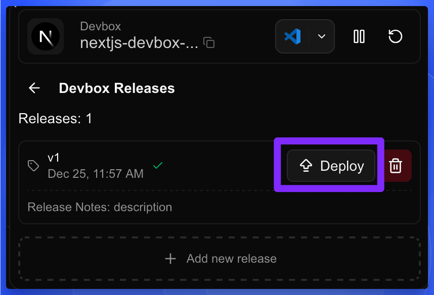
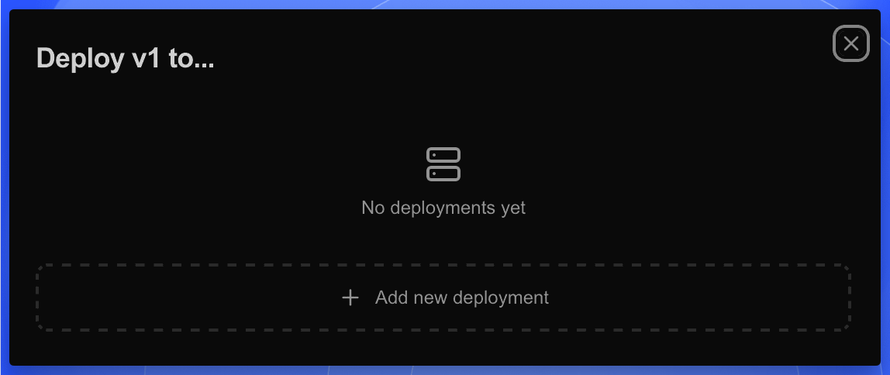
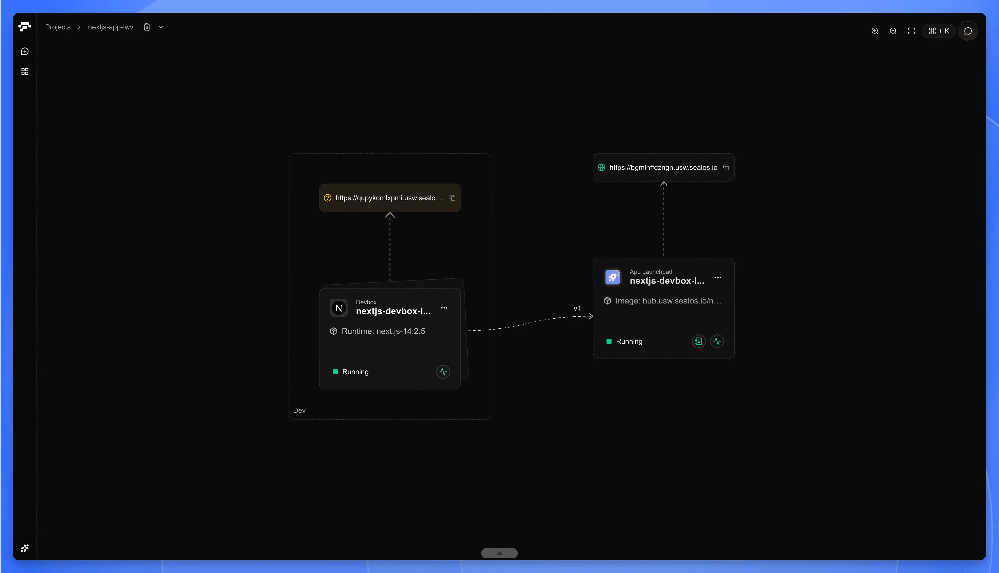
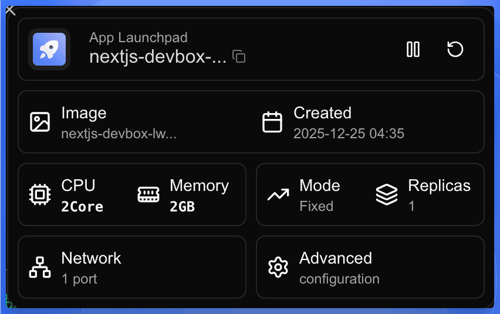

After releasing your application as an OCI image, you can deploy it directly to Sealos Cloud for production use with just a few clicks.

## Deploy Your Release

<h4>Access the Projects</h4>

Navigate to the Projects in your [Sealos Dashboard](https://os.sealos.io/?openapp=system-brain%3Ftrial%3Dtrue).

<h4>Open the Releases Panel</h4>

- Find your project in the Projects list and click on the project card to enter the project canvas.
- Click on the DevBox card to open the detail panel.
- In the detail panel, click the **Releases** tab.
- Find the release you want to deploy and click the **Deploy** button on the right side of the release row.

<h4>Add a New Deployment</h4>

A **Deploy to...** modal will appear. Click the **+ Add new deployment** button. The system will automatically start deploying your release with default configurations.

<h4>Wait for Deployment to Complete</h4>

Navigate back to your project canvas. You'll see the DevBox card connected to the newly deployed app instance with a dashed line indicating the version deployed (e.g., v1). Wait until the status changes to **Running**.

## View and Adjust Your Deployment

Once the deployment is complete, you can view and adjust your deployment settings.

<h4>Open the Detail Panel</h4>

Click on the app card in the project canvas to open the detail panel.

<h4>Adjust Deployment Settings (Optional)</h4>

In the detail panel, you can click on different buttons to modify the corresponding settings:

| Button | Description |
|--------|-------------|
| **CPU / Memory** | Adjust CPU cores and memory allocation |
| **Mode / Replicas** | Change deployment mode and scale the number of instances |
| **Network** | Configure port mappings and network settings |
| **Advanced** | Access additional configuration options like environment variables, volumes, and more |

<h4>Access Your Deployed Application</h4>

Click on the public URL shown at the top of the app card to access your deployed application in a new browser tab.

<Callout type="info">
  Remember that you can always update your application by creating a new release
  in DevBox and repeating this deployment process with the new version using app.
</Callout>

## Conclusion

You've successfully deployed your application from DevBox to Sealos Cloud. The entire workflow—from development to production—happens seamlessly within Sealos:

1. **Develop** in your cloud development environment
2. **Release** your code as an OCI image
3. **Deploy** directly to production with one click

Your deployed application is now running and accessible via its public URL. You can scale, update configurations, or redeploy new versions at any time from the project canvas.
