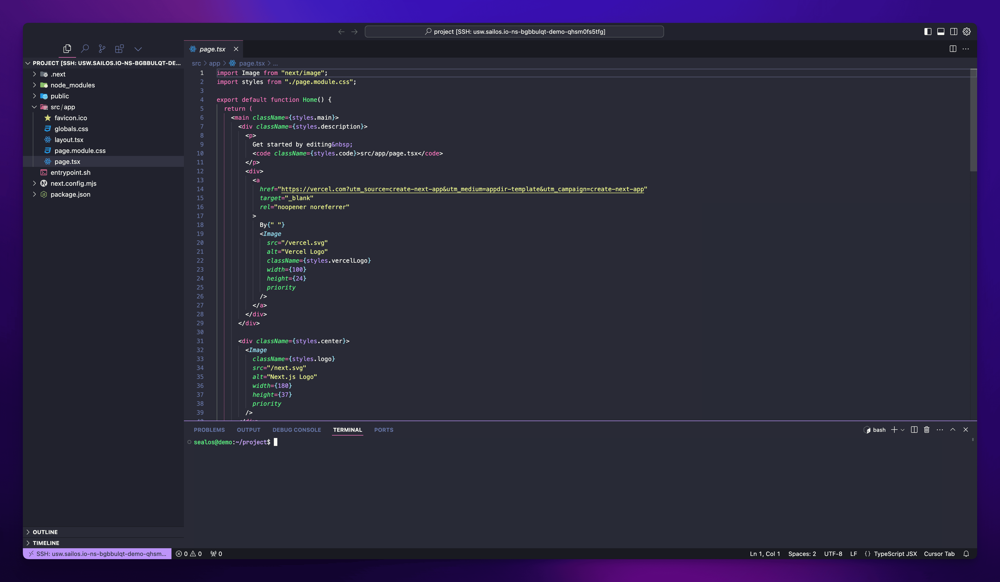
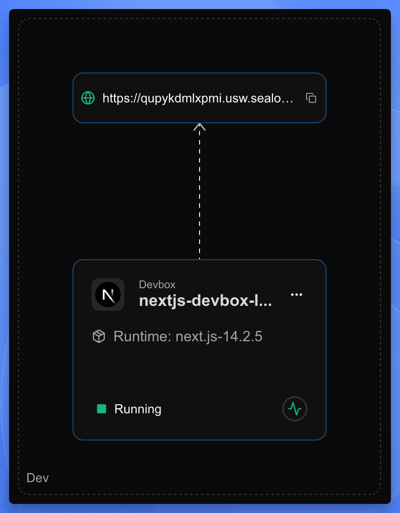
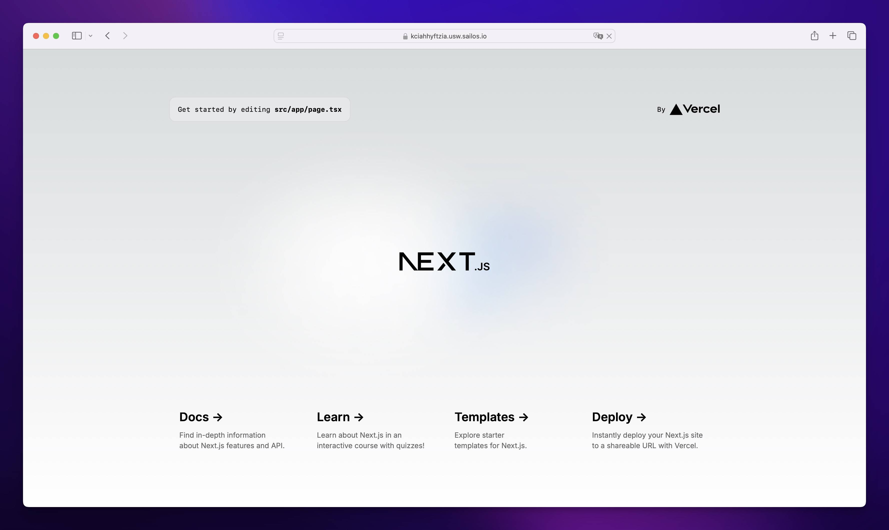

After creating your DevBox project in Sealos, you're ready to start development. This guide will walk you through the process of connecting to your development environment using Cursor IDE and running your application.

## Connect to Your Development Environment

<div className='fd-steps [&_h4]:fd-step'>

<h4>Access the Projects</h4>

Navigate to the Projects in your [Sealos Dashboard](https://os.sealos.io/?openapp=system-brain%3Ftrial%3Dtrue).

<h4>Connect with Cursor IDE</h4>

- Find your project in the Projects and click on the project card to enter the project canvas.
- Click on the DevBox card to open the detail panel.
- In the detail panel, click the dropdown arrow (▾) next to the IDE icon in the top-right corner.
- From the dropdown menu, select your preferred IDE (e.g., Cursor, VSCode, or Kiro).

<h4>Install the DevBox Plugin</h4>

- When you click on "Cursor", it will launch the Cursor IDE application on your local machine.
- A popup window will appear in Cursor, prompting you to install the DevBox plugin.
- Follow the instructions in the Cursor popup to install the DevBox plugin.
- Once installed, Cursor will establish a remote connection to your DevBox runtime.

</div>

<Callout type="info">
  You can switch between different IDE options (VSCode, Cursor, or Kiro) at any time by using the dropdown menu in the detail panel.
</Callout>

## Develop

Once connected, you'll be able to access and edit your project files directly within the Cursor IDE environment.



This remote connection offers several benefits:

- Your code runs in the DevBox runtime, ensuring consistency across development and production environments.
- You can access your project from anywhere, on any device with Cursor installed.
- Collaboration becomes easier as team members can connect to the same DevBox runtime.

## Run Your Application

<div className='fd-steps [&_h4]:fd-step'>

<h4>Open the Terminal</h4>

Open the terminal within Cursor IDE.

<h4>Navigate to Your Project Directory</h4>

If you're not already there, navigate to your project directory.

<h4>Start Your Development Server</h4>

Run the appropriate command to start your development server. For example, if you're using Next.js:

```bash
npm run dev
```

This command will start your application in development mode.

</div>

## Access Your Running Application

In the project canvas, you'll see the public URL card connected to your DevBox card. Simply click on the URL card to open your running application in a new browser tab.

<div style={{maxWidth: '300px'}}>

</div>



## Next Steps

As you continue developing your project, your next step is to configure how your application starts. Check out the [Entry Point](./entrypoint-sh) guide to learn how to set up `entrypoint.sh` for your application.

Once your entry point is configured, you can proceed to [Release](./release) your application as an OCI image, and then [Deploy](./deploy) it to production.
