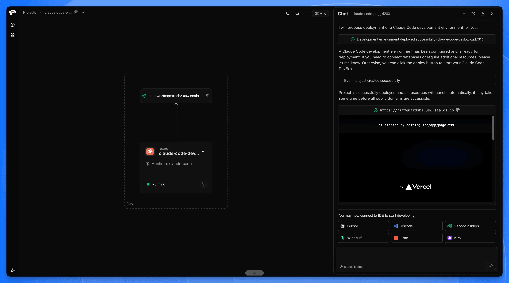
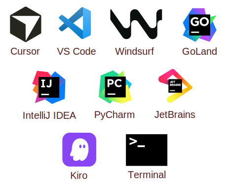

DevBox is a fully-managed cloud development environment built on Kubernetes. It provides consistent, production-ready workspaces accessible from any device, through your favorite IDE.

Unlike self-hosted solutions, DevBox is a SaaS offering—no infrastructure to manage. Just sign up, create a project, and start coding in seconds.

## IDE Support

Connect with the tools you already use:

- **Desktop IDEs**
  - [Cursor](https://cursor.sh/) – AI-powered coding with remote DevBox connection
  - [VS Code](https://code.visualstudio.com/docs/remote/ssh) – Full remote development via SSH
  - [JetBrains Gateway](https://www.jetbrains.com/remote-development/gateway/) – IntelliJ, GoLand, PyCharm, WebStorm, and more
  - And others
- **Browser-based access**
  - Web terminal for quick fixes
  - SSH access from any terminal client

## Why Remote Development?

Remote development offers significant benefits for both individual developers and teams:

- **Faster performance**
  - Server-grade hardware accelerates builds, tests, and heavy workloads like monorepos or AI model training.
- **Consistent environments**
  - Every developer gets the exact same setup—no more "works on my machine" debugging.
- **Dev/prod parity**
  - Development containers mirror production, reducing deployment surprises.
- **Enhanced security**
  - Source code stays on cloud infrastructure, not scattered across developer laptops.
- **Work from anywhere**
  - Access your full development environment from any device with an internet connection.

Explore how leading engineering teams are adopting cloud development environments on [our blog](/blog), the [Slack engineering blog](https://slack.engineering/development-environments-at-slack), or [from OpenFaaS's Alex Ellis](https://blog.alexellis.io/the-internet-is-my-computer/).

## Why DevBox?

DevBox differentiates itself from other cloud development platforms in several ways:

| Feature | DevBox | Traditional CDEs |
|---------|--------|------------------|
| Setup time | Seconds | Minutes to hours |
| Infrastructure management | Fully managed | Often self-hosted |
| Runtime options | 20+ pre-configured | Limited or BYO |
| Deployment | One-click to Sealos Cloud | Separate CI/CD required |
| Pricing | Simple subscription plans | Complex pay-per-use billing |

Key advantages:

- **Zero infrastructure overhead** – No Kubernetes expertise required. DevBox handles orchestration, scaling, and networking.
- **Integrated deployment pipeline** – Release as OCI images and deploy directly to Sealos Cloud with one click.
- **Predictable pricing** – Simple monthly subscriptions with fixed resources. No surprise bills.
- **Template marketplace** – Start from community templates or convert your projects into reusable templates.

## How Much Does It Cost?

Sealos uses simple subscription pricing with four tiers:

| Plan | Price | Resources |
|------|-------|----------|
| Starter | $7/month | 2 vCPU, 2Gi RAM, 1Gi Disk |
| Hobby | $25/month | 4 vCPU, 4Gi RAM, 10Gi Disk |
| Pro | $512/month | 16 vCPU, 32Gi RAM, 200Gi Disk |
| Team | $2,030/month | 64 vCPU, 128Gi RAM, 500Gi Disk |

No complex metering, no surprise bills. View the [pricing page](/pricing) for full details.

## How Does DevBox Work?

1. **Create a project** – Choose from 20+ pre-configured runtimes (Node.js, Python, Go, Java, Rust, etc.)
2. **Connect your IDE** – One-click connection from Cursor, VS Code, or JetBrains
3. **Develop** – Code in a cloud environment with production-grade resources
4. **Release** – Package your application as an OCI image with semantic versioning
5. **Deploy** – Push to Sealos Cloud with a single click

Your workspace persists between sessions. Stop and resume anytime without losing state.

## What DevBox Is Not

- **DevBox is not a local development tool**
  - Your code runs in the cloud, not on your machine. You need internet connectivity.
- **DevBox is not a CI/CD platform**
  - While you can build and deploy from DevBox, it's optimized for interactive development, not automated pipelines.
- **DevBox is not self-hosted**
  - DevBox is a managed service on Sealos Cloud. For self-hosted solutions, consider [Coder](https://coder.com/) or [Gitpod](https://gitpod.io/).
- **DevBox is not just an online IDE**
  - It's a full development environment. Connect your preferred local IDE via SSH—no browser required.

## Who Is DevBox For?

- **Solo developers** who want to code from any device without environment setup
- **Teams** that need consistent development environments across members
- **Startups** looking to ship faster without infrastructure overhead
- **Agencies** managing multiple client projects with different tech stacks
- **Educators** providing students with instant, reproducible dev environments

## Up Next

<Cards>
  <Card href="./create-a-project" title="Create a Project">
    Set up your first cloud development environment in under 2 minutes.
  </Card>
  <Card href="./develop" title="Start Developing">
    Connect your IDE and start coding.
  </Card>
  <Card href="./release" title="Release Your App">
    Package your application as an OCI image.
  </Card>
  <Card href="./deploy" title="Deploy to Cloud">
    Go live with one-click deployment.
  </Card>
</Cards>
