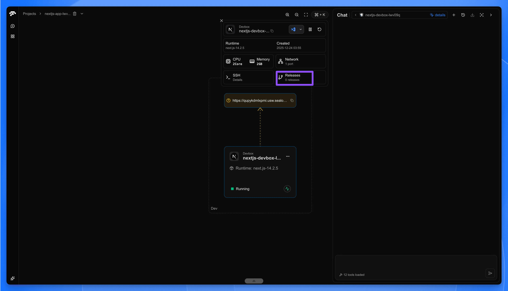
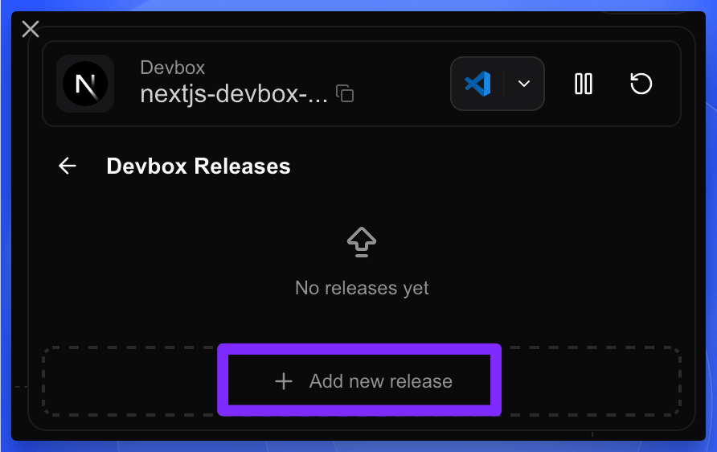
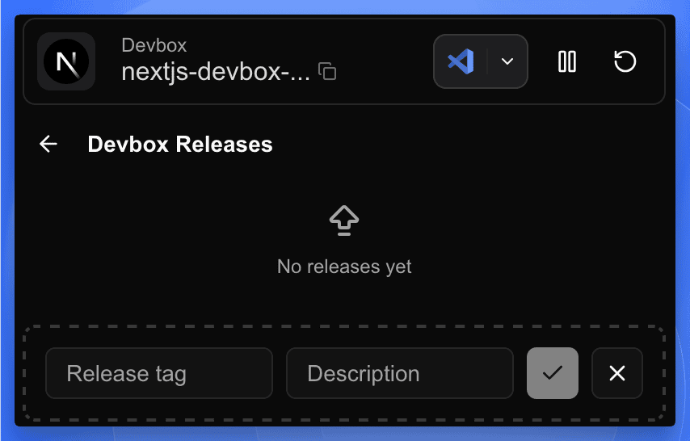
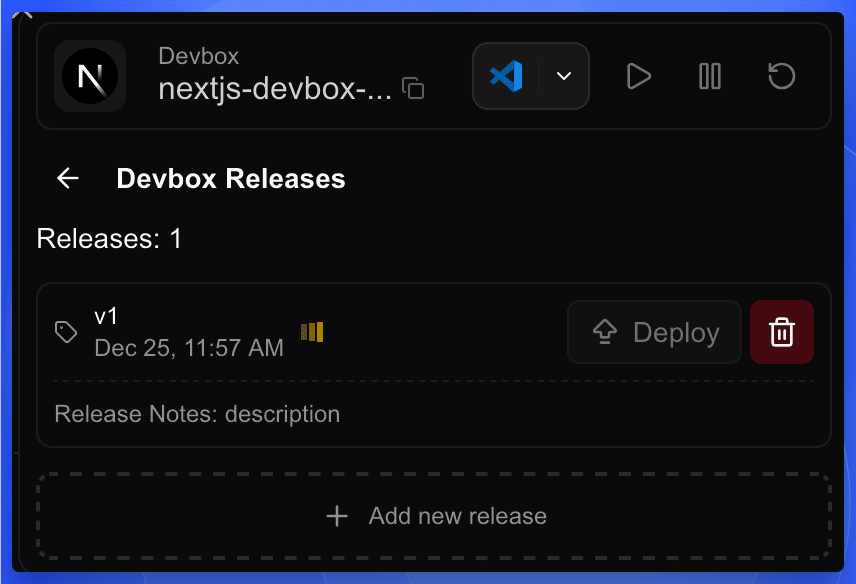

After you've developed and tested your application, the next step is to release it as an OCI (Open Container Initiative) image. This process allows you to version your application and prepare it for deployment.

## Prepare Your Application for Release

<h4>Open the Terminal in Cursor IDE</h4>

In the Cursor IDE terminal, navigate to your project directory if you're not already there.

<h4>Prepare Your Application (if necessary)</h4>

Depending on your project's language or framework, you may need to prepare your application for release. This step varies widely between different technologies:

- For compiled languages (e.g., Java, Go):
  Run your build command (e.g., `mvn package`, `go build`)
- For interpreted languages with build steps (e.g., TypeScript, some JavaScript frameworks):
  Run your build or transpilation command (e.g., `npm run build`, `tsc`)
- For interpreted languages without build steps (e.g., Python, Ruby):
  Ensure all dependencies are listed in your requirements file (e.g., `requirements.txt`, `Gemfile`)

If your project doesn't require any preparation, you can skip this step.

<h4>Review and Update entrypoint.sh</h4>

Each DevBox project has an `entrypoint.sh` file that defines the startup command for your OCI image. Before releasing, ensure this file correctly starts your application.

<Callout type="info">
  The `entrypoint.sh` file is crucial for your application's startup in the OCI image. For detailed configuration instructions, common scenarios, and best practices, see the [Entry Point](./entrypoint-sh) guide.
</Callout>

## Release as OCI Image

<h4>Access the Projects</h4>

Navigate to the Projects in your [Sealos Dashboard](https://os.sealos.io/?openapp=system-brain%3Ftrial%3Dtrue).

<h4>Open the Releases Panel</h4>

- Find your project in the Projects list and click on the project card to enter the project canvas.
- Click on the DevBox card to open the detail panel.
- In the detail panel, click the **Releases** tab.

<h4>Add a New Release</h4>

In the Releases panel, click the **+ Add new release** button.

<h4>Configure Release Details</h4>

A new input row will appear. Fill in the following information:
- **Release tag**: Enter a version tag for your release (e.g., v1, v1.0.0).
- **Description**: Provide a brief description of this release (e.g., "Initial release" or "Feature update: user authentication").

Then click the **✓** (checkmark) button on the right side to start building the image.

<h4>Wait for the Build to Complete</h4>

The system will start building your OCI image. You can monitor the build progress in the Releases panel. Once the build is successful, your release will be listed with:
- The tag you assigned
- The creation time
- The release notes you provided
- A **Deploy** button to deploy this version

## Best Practices for Releasing

1. **Semantic Versioning**: Consider using semantic versioning (e.g., v1.0.0) for your tags. This helps in tracking major, minor, and patch releases.

2. **Descriptive Releases**: Provide clear and concise descriptions for each release. This helps team members understand what changes or features are included in each version.

3. **Regular Releases**: Create new releases whenever you make significant changes or reach important milestones in your project. This practice helps in maintaining a clear history of your application's development.

4. **Pre-release Testing**: Always thoroughly test your application before creating a release. This ensures that the released version is stable and ready for deployment.

5. **Consistent Build Process**: Ensure your build process is consistent and reproducible. Consider using build scripts or Makefiles to standardize the build process across your team.

## Next Steps

After successfully releasing your application as an OCI image, you're ready to move on to the deployment phase. The OCI image you've created can be used for deployment or shared with other team members. 

Check out the "Deploy" guide for information on how to deploy your released application to a production environment.
