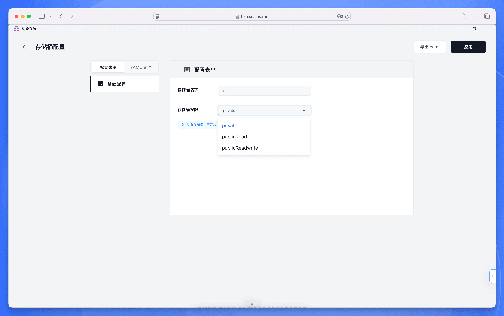
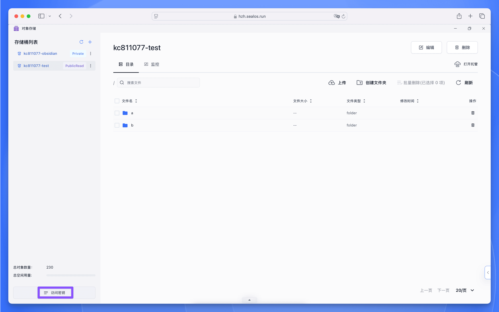
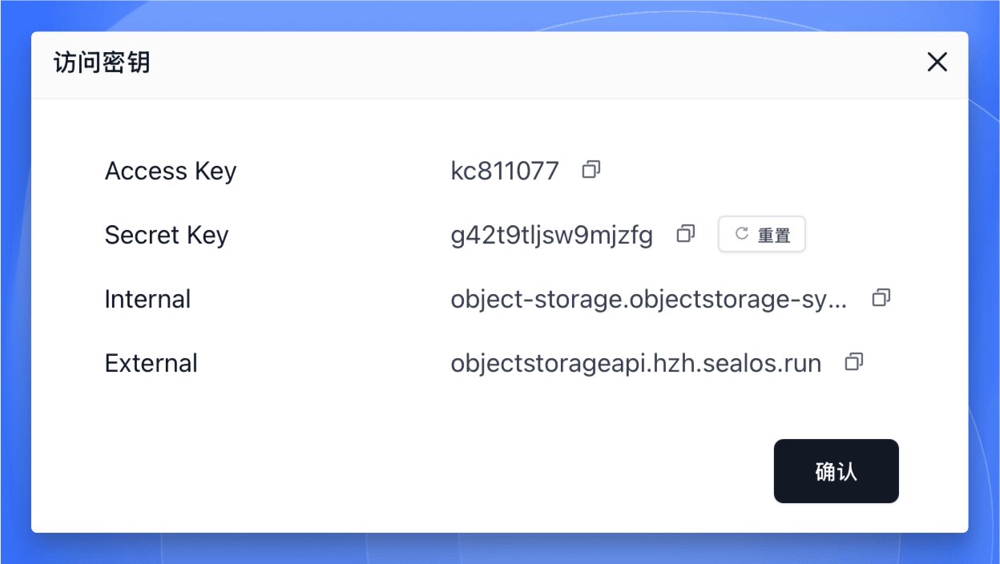

This is the start-here guide for Object Storage on Sealos.

On this page, you create a bucket, retrieve its credentials, upload your first
file, and confirm the upload succeeded -- all through the Sealos console.

By the end, you have a working bucket with one file stored in it and the four
credential values you need for any future programmatic access.

## What Object Storage Is

Object Storage is the Sealos service for storing and managing unstructured data
such as files, images, documents, and backups. It is S3-compatible and built on
MinIO, and Sealos manages the underlying infrastructure so you work with
buckets and files instead of servers.

At a high level, you use Object Storage to upload files into buckets, download
them when you need them, and control who can read or write each bucket through
access permissions. Every bucket also exposes endpoints and credentials that
work with MinIO-compatible SDKs when you are ready to integrate it into an
application.

## Create a Bucket

In this section, you create your first bucket and set its access permission.
The bucket is the container that holds your files, and its permission level
controls who can read or write its contents.

    <h4>Open the Object Storage app</h4>

    Sign in to the Sealos console and open the Object Storage app from the
    application launcher. The app lists any buckets you have already created
    and provides the entry point for creating a new one.

    <h4>Create a new bucket</h4>

    Use the bucket creation action in the app, enter a name for your bucket,
    and choose `private` as the access permission. Apply the change to create
    the bucket. The new bucket then appears in your bucket list.

<Callout type="info">
    Object Storage supports three permission levels. Choose `private` for your
    first bucket unless you have a specific reason to make it public.

    - **`private`**: only authenticated users can access bucket contents.
      Recommended for the first bucket and any bucket containing sensitive
      data.
    - **`publicRead`**: anyone can read objects without authentication; write
      operations still require credentials. Suitable for content delivery and
      static website hosting.
    - **`publicReadWrite`**: fully open read and write access. Use with
      caution; production environments should avoid this level.
</Callout>

## Get Your Credentials

In this section, you retrieve the four values needed to access the bucket
programmatically. The first upload in this guide uses the console, so you do
not paste these values anywhere right now, but having them on hand prepares
you for any future SDK or API access.

Select your bucket in the bucket list and use the access key action to open
the credential display. A popup shows four values tied to this bucket: the
Access Key, the Secret Key, the Internal endpoint, and the External endpoint.
Read the values directly from the popup when you need them.

<Callout type="tip">
    The two endpoints serve different access paths. Pick the one that matches
    where your client runs.

    - **Internal endpoint**: for services running inside Sealos. Traffic stays
      on the internal network, which gives lower latency and avoids external
      traffic charges.
    - **External endpoint**: for access from outside the Sealos environment,
      such as a local development machine or a service hosted elsewhere.
</Callout>
