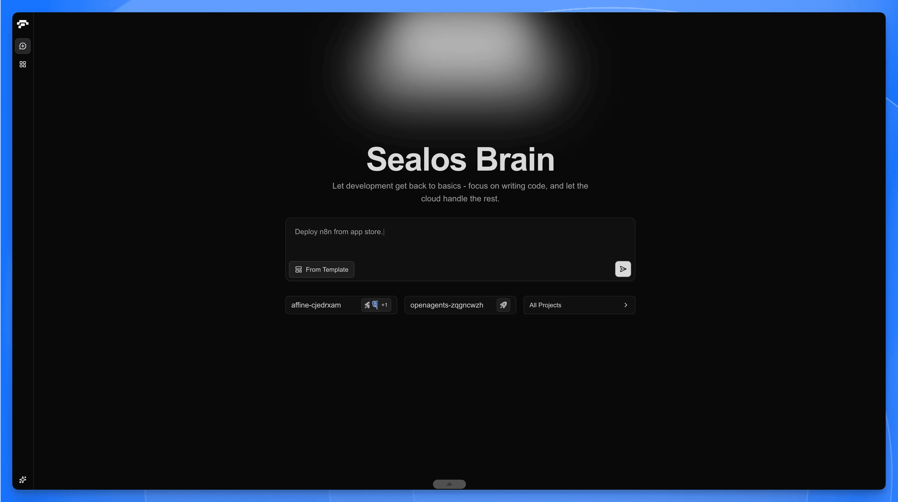
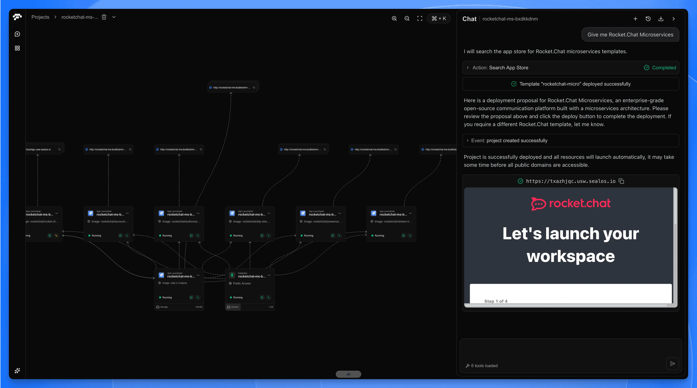
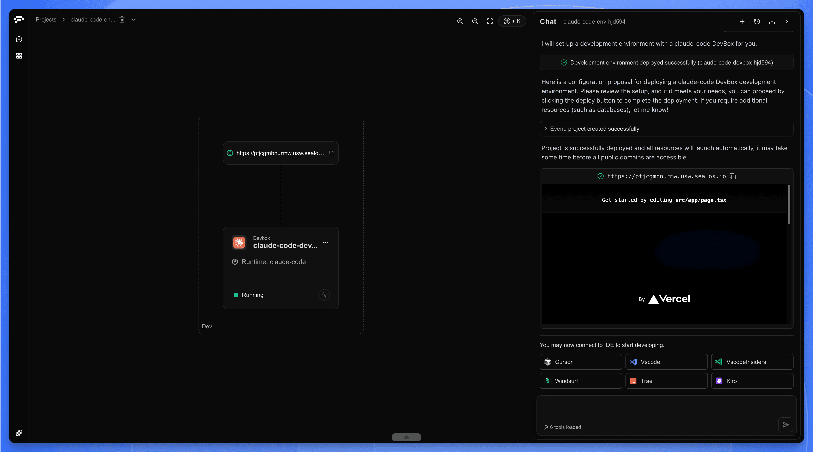
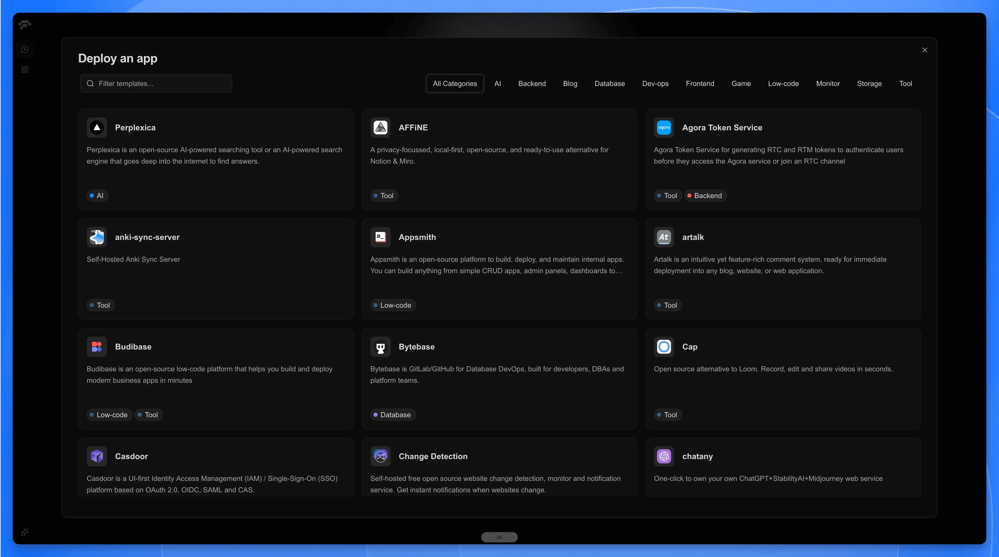
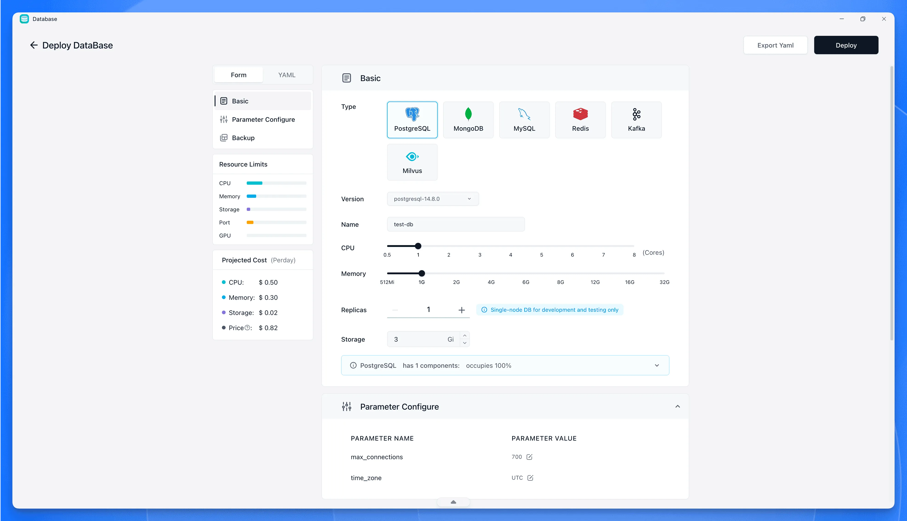
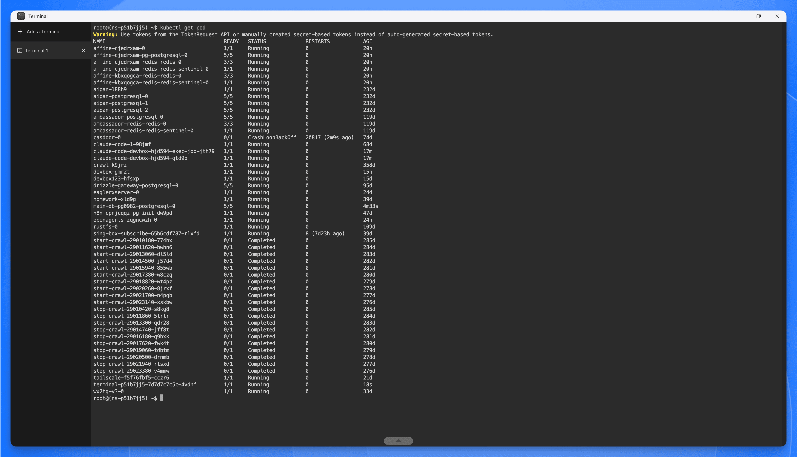
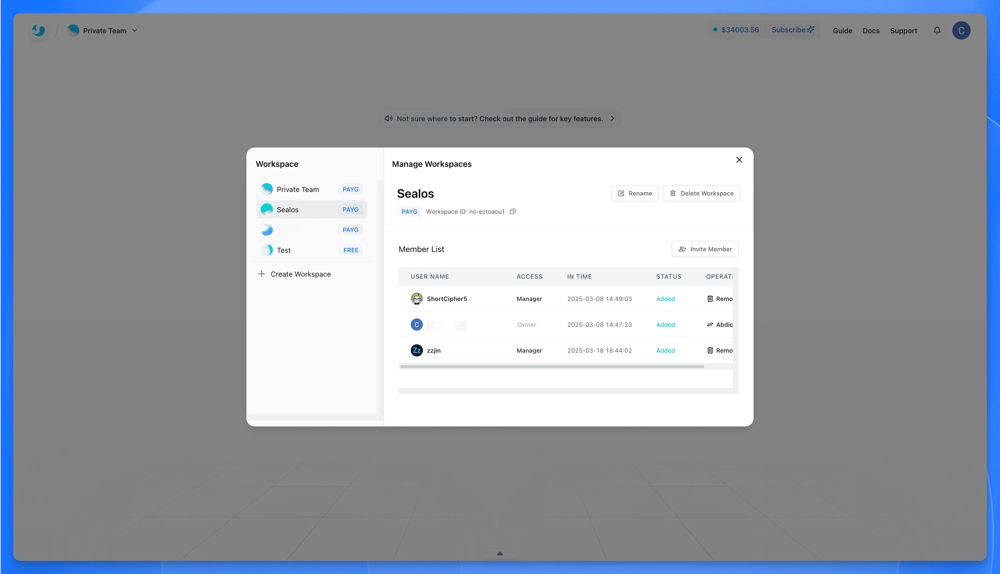

Sealos is an AI-native cloud development platform designed to unify the entire application lifecycle, starting with cloud development environments and one-click deployments, extending to managed databases and full Kubernetes power—all without the complexity.

## Everything You Need to Build and Scale

Unify the entire application lifecycle, from development in cloud development environments to production deployment and management.

### AI-Native Infrastructure

Build and scale modern AI applications simply by describing them.

### Cloud Development Environments

Zero-setup, collaborative development in the cloud. Eliminate local environment inconsistencies with DevBox.

- Connect with your favorite IDE (VS Code, JetBrains, Cursor)
- Pre-configured runtime environments for any language
- Instant collaboration with teammates

### Extensive App Store

Deploy complex applications with a single click. No YAML configuration, no container orchestration complexity—just point, click, and deploy.

- 100+ pre-built templates
- One-click deployment for popular applications
- Community-contributed app catalog

### Managed Databases & Storage

Production-ready databases and storage, fully managed with automated backups and high availability.

- **Databases**: PostgreSQL, MySQL, MongoDB, Redis
- **Object Storage**: S3-compatible, built-in
- High availability and automated backups

### Full Kubernetes Power

Access the full power of Kubernetes without the complexity. K8s-native from day one.

- Raw Kubernetes access when you need it
- Automatic container orchestration
- Native integration with cloud-native ecosystem

### Enterprise Multi-Tenancy

Workspace-based isolation with granular permissions for secure collaboration.

- Workspace-based resource isolation
- Granular RBAC controls
- Per-workspace resource quotas

---

## Getting Started

Ready to ship your first app?

<Cards>
  <Card href="/docs/quick-start" title="Quick Start">
    Deploy your first application in under 5 minutes.
  </Card>
  <Card href="/docs/guides/devbox" title="DevBox Guide">
    Set up a cloud development environment.
  </Card>
  <Card href="/docs/guides/databases" title="Databases">
    Launch a managed PostgreSQL, MySQL, or MongoDB.
  </Card>
</Cards>
